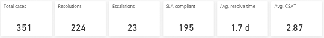
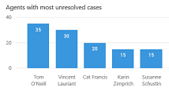
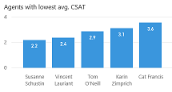

# Topic details dashboard

[!INCLUDE [public-preview](../includes/public-preview.md)]

> [!div class="mx-imgBorder"]
> 

The Topic details dashboard gives you a detailed overview of key performance indicators for a specific topic, including using artificial intelligence (AI) technology to show you the impact by product and channel on customer satisfaction scores and resolution time for the topic.

You can display the Topic details dashboard from one of the AI Insights charts in the [KPI summary](dashboard-kpi-summary.md), [Incoming cases](dashboard-incoming-cases.md), [Customer satisfaction](dashboard-CSAT.md), and [Case resolution](dashboard-case-resolutions.md) dashboards. To display the Topic details dashboard, right-click a topic name, hover over **Drillthrough**, and then select **Topic drillthrough**.

> [!div class="mx-imgBorder"]
> 

The Topic details dashboard includes a variety of charts with graphical views of key performance indicators for the topic. For information about each chart, click the link for the chart in the following list or scroll to locate the chart later in this topic.

* [Topic details KPI charts](#topic-details-kpi-charts)
* [Overall impact charts](#overall-impact-charts)
* [Agents with most unresolved cases](#agents-with-most-unresolved-cases-chart)
* [Agents with longest resolve time](#agents-with-longest-average-resolve-time-chart)
* [Agents with lowest average CSAT](#agents-with-lowest-average-csat-chart)
* [Topic case composition](#topic-case-composition-chart)
* [Customer satisfaction drivers (AI Insights)](#top-csat-impactors-chart)
* [Resolution time drivers (AI Insights)](#top-resolve-time-impactors-chart)

The Customer satisfaction drivers and Resolution time drivers charts use natural language understanding to group support cases as *topics* that are a collection of related cases. These charts show you the impact the topic's cases have had on customer satisfaction and resolution time, and the channels associated with the topic that are having the greatest impact on customer satisfaction and resolution time. This can help you identify areas for improvement that can have the greatest impact.

By default, the dashboard shows you key performance indicators for the last month, and for all products, channels, business units, and teams in your system. To change the time period, select a value from the **Time period** drop-down list at the top of the dashboard. You can select either last day, last week, or last month.

To filter data by product, channel, business unit, or team, select a value from the **Product**, **Channel**, **Business Unit**, or **Team** drop-down list. If you switch to a different dashboard, the filter you specify persists and is applied to the data on all dashboards. For more information on working with filters, see [Work with Customer Service Insights dashboards](use-dashboard-sample-data.md).

## Topic details KPI charts

> [!div class="mx-imgBorder"]
> 

The Topic details KPI charts display a variety of key performance indicators for the support cases during the specified time period that are associated with the topic.

Description | Details
----------- | -------
Total cases | New cases created within the specified time period plus rollover cases (including all rollover cases that are active, resolved or canceled within the specified time period)
Resolutions | All cases resolved within specified time period
Escalations | All cases escalated within specified time period
SLA compliant | Of the total cases, the cases that are SLA compliant (including rollover cases and new cases that are SLA compliant)
Average resolution time | The average resolution time of all cases resolved within specified time period
Average CSAT | The sum of CSAT scores divided by the count of resolved cases that have CSAT values

## Overall impact charts

> [!div class="mx-imgBorder"]
> 

The Overall impact charts summarize the impact on customer satisfaction and resolution time during the specified time period of support cases that are associated with the topic.

Description | Details
----------- | -------
Overall average CSAT impact | 1 – (Average CSAT score not including the current topic divided by overall average CSAT score for all topics)
Overall average resolve time impact | 1 – (Average resolution time not including the current topic divided by overall average resolution time for all topics)

## Agents with most unresolved cases chart

> [!div class="mx-imgBorder"]
> 

The Agents with most unresolved cases chart shows the number of unresolved support cases for each agent for the topic in the specified time period.

Description | Details
----------- | -------
Agents with most unresolved cases | Number of unresolved cases in descending order by agent

## Agents with longest average resolve time chart

> [!div class="mx-imgBorder"]
> 

The Agents with longest resolve time chart shows the average resolution time for each agent for the topic's support cases in the specified time period.

Description | Details
----------- | -------
Agents with longest average resolve times | Average resolution time in descending order by agent

## Agents with lowest average CSAT chart

> [!div class="mx-imgBorder"]
> 

The Agents with lowest average CSAT chart shows the average customer satisfaction score for each agent for the topic's support cases in the specified time period.

Description | Details
----------- | -------
Agents with lowest average CSAT | Average CSAT score in descending order by agent

## Topic case composition chart

> [!div class="mx-imgBorder"]
> 

The Topic case composition chart shows the path of the topic's support cases during the specified time period from the support channel where they were opened, and whether they were escalated, to their status at the end of the specified time period.

Description | Details
----------- | -------
Topic case composition | Sankey diagram showing the flow of support cases by support channel

## Customer satisfaction drivers chart

> [!div class="mx-imgBorder"]
> 

The Customer satisfaction drivers chart uses artificial intelligence technology to show the top customer satisfaction impactors for the topic during the specified time period by support channel and product.

Description | Details
----------- | -------
Channel | A support channel associated with the topic's support cases
Product | A specific product associated with this topic's support cases
Average resolution time | Average resolution time for the specified channel and product
Average CSAT | Average CSAT score for the specified channel and product
Impact | 1 – (Average CSAT score not including support cases for the specified channel and product divided by average CSAT score for all cases associated with the topic)

The chart displays the impact as a red or blue bar. The midpoint is the overall average customer satisfaction score (CSAT). A red bar indicates that the CSAT score is lower than the average CSAT score. A blue bar indicates that the CSAT score is higher. Improving customer satisfaction for the top CSAT impactors topics in red will have the greatest impact on improving overall customer satisfaction.

## Resolution time drivers chart

> [!div class="mx-imgBorder"]
> 

The Resolution time drivers chart uses artificial intelligence technology to show the top resolution time impactors for the topic during the specified time period by support channel and product.

Description | Details
----------- | -------
Channel | A support channel associated with the topic's support cases
Product | A specific product associated with this topic's support cases
Average resolution time | Average resolution time for the specified channel and product
Average CSAT | Average CSAT score for the specified channel and product
Impact | 1 – (Average resolution time not including support cases for the specified channel and product divided by average resolution time for all cases associated with the topic)

The chart displays the impact as a red or blue bar. The midpoint is the overall average case resolution time. A red bar indicates that the topic's resolution time is longer than the average case resolution time, resulting in a negative impact on overall case resolution performance. A blue bar indicates that the resolution time is shorter, resulting in a positive impact on overall case resolution performance. Improving case resolution time for the top resolve time impactor topics in red will have the greatest impact on improving overall resolution time.
