# Topics dashboard

[!INCLUDE [public-preview](../includes/public-preview.md)]

> 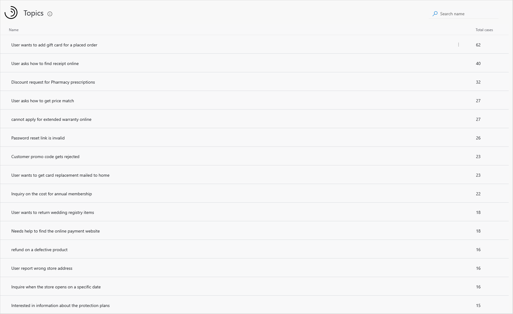

The Topics dashboard uses artificial intelligence technology to group related support cases as topics and display them in order of the number of cases associated with each topic. You can then view and manage the topics and associated support cases in a variety of ways, including:

* [Filtering the topic list](#filtering-the-topic-list)
* [Viewing support cases for a topic](#viewing-support-cases-for-a-topic)
* [Renaming a topic](#renaming-a-topic)

You can also control the scope of how Customer Service Insights generates support topics by adjusting topic granularity settings. For more information, see [Set the scope of how Customer Service Insights generates customer service topics](granularity.md).

Customer Service Insights automatically refreshes the data displayed on dashboards daily. You can trigger a refresh on demand without waiting for next daily refresh when you make any of following changes in your workspace:

* Update data mapping settings
* Change case title cleansing settings
* Change topic granularity settings
* Rename a topic

For more information on triggering a refresh of your dashboard data, see [Trigger a refresh of your Customer Service Insights dashboard data](trigger-refresh.md).

For more information on updating data mapping settings, see [Map your data to custom entities and fields](map-data.md).

For more information about cleansing support case titles, see [Improve data quality by cleansing support case titles](settings.md).

For more information about changing topic granularity settings, see [Set the scope of how Customer Service Insights generates customer service topics](granularity.md).

## Filtering the topic list

You can narrow down the list of topics displayed on the Topics dashboard by searching for a specific keyword in the **Search** box in the upper right corner of the dashboard.

For example, to find topics related to login issues, enter *login* in the **Search** box. Customer Service Insights narrows down the list to topics that include the word *login*.

> 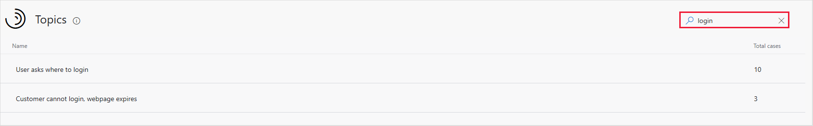

To restore the original topic list, clear the search box by selecting the close icon.

> 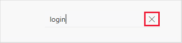

## Viewing support cases for a topic

You can view the support cases associated with a topic by selecting it in the Topics list. For example, to view the support cases associated with the *Password reset link is invalid* topic, select it in the list.

> 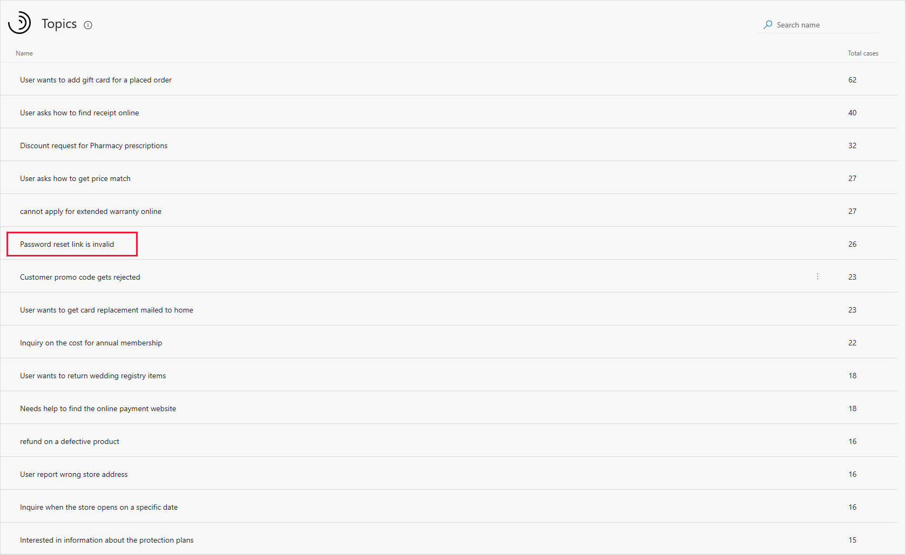

Customer Service Insights displays a list of the support cases associated with the topic.

> 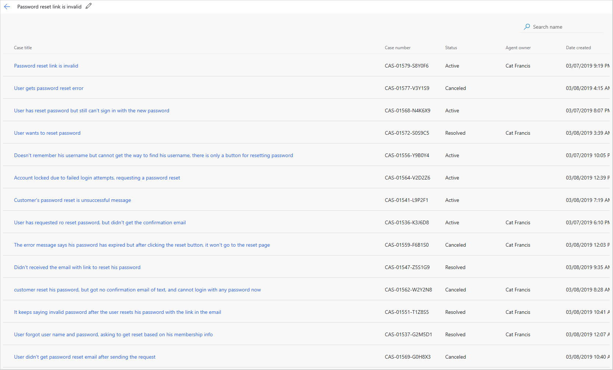

Note that the many of the titles of the support cases associated with the *Password reset link is invalid* topic include variations of phrases related to password reset problems. Based on these similarities, Customer Service Insights uses artificial technology to group the cases together in a single topic.

The Customer Service Insights artificial intelligence technology also includes cases that include related terms. For example, the *Password reset link is invalid* topic includes topics related to *login* issues.

> 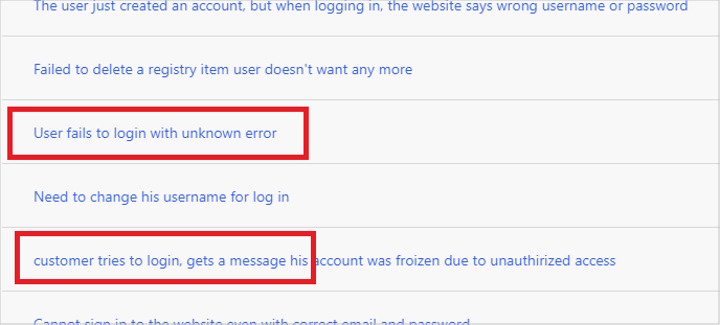

To view the details of a support case, click the case title in the list.

> 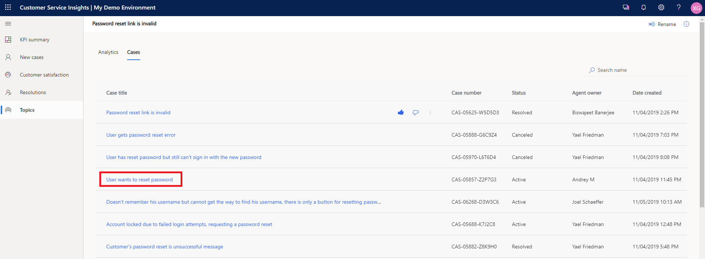

Customer Service Insights opens the support case details in Dynamics 365.

> 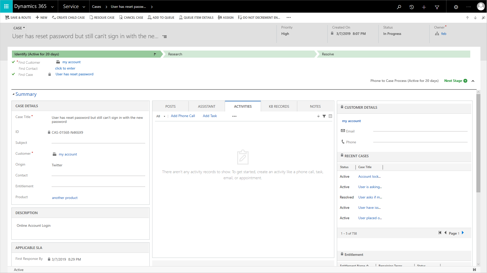

## Renaming a topic

When Customer Service Insights groups support cases into topics, it automatically uses the title of the most relevant support case as the name of the topic. However, you may want to rename the topic. For example, you may want a topic name that is shorter or more clearly describes the underlying support issue.

You can rename a topic either in the Topics list or in the list of the support cases associated with the topic.

## To rename a topic in the Topics list

1. Hover over the topic and select the elipses to the left of the Total cases number for the topic.

   > 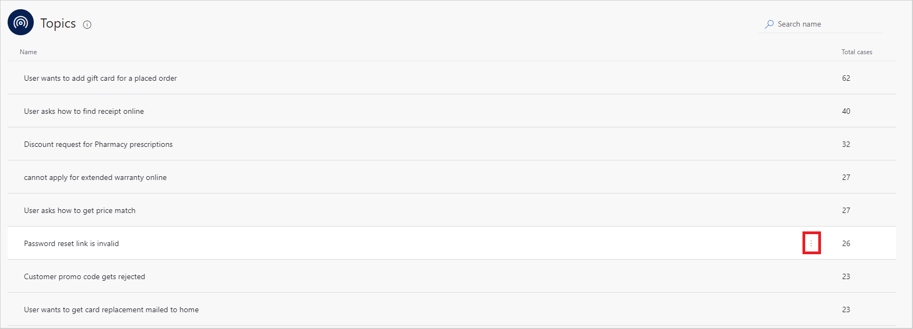

2. Select **Rename**.

   > 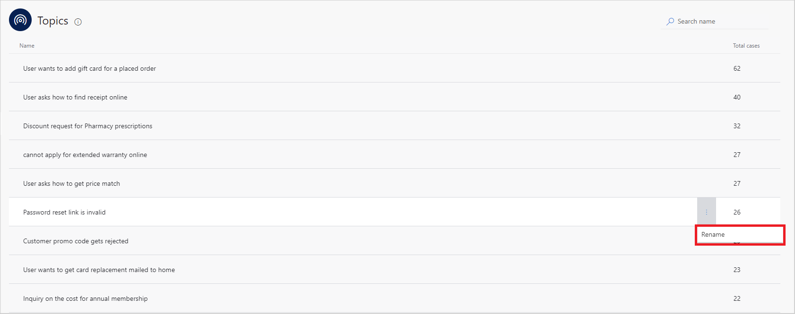

3. In the **Rename** dialog box, enter the updated name and then select **Save**.

   > 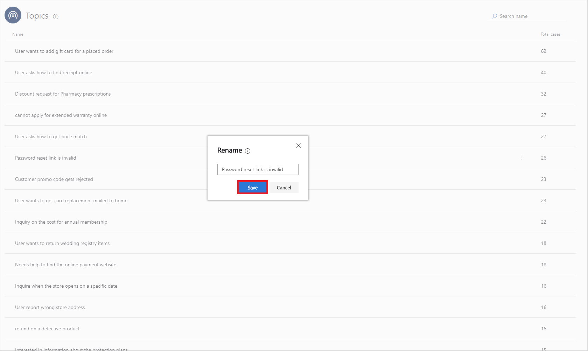

4. Customer Service Insights updates the topic's name in the Topics list and gives you an opportunity to refresh your workspace.

   > 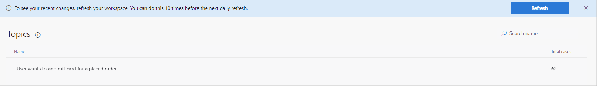

5. To refresh your workspace, select **Refresh**.

   > 

## To rename a topic in the list of the support cases

1. Select the edit icon next to the topic name at the top of the list.

   > 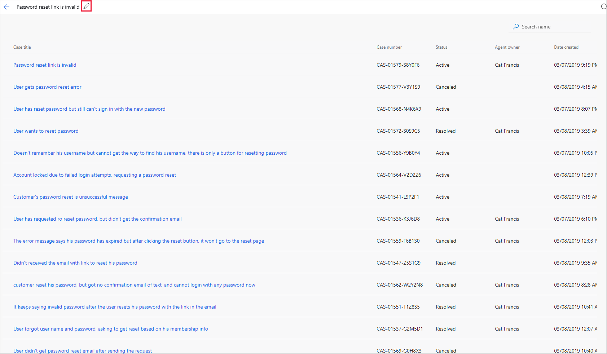

2. Enter the updated name.

   > 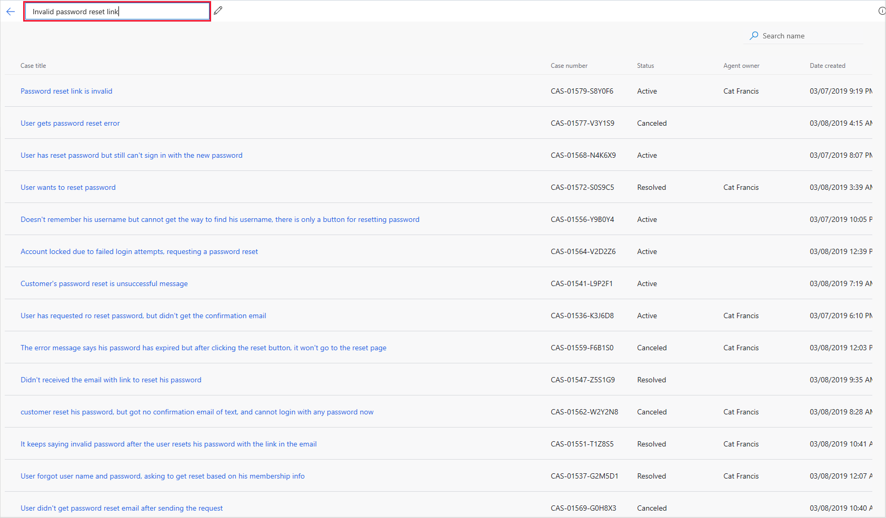

4. Customer Service Insights updates the topic's name and gives you an opportunity to refresh your workspace.

   > 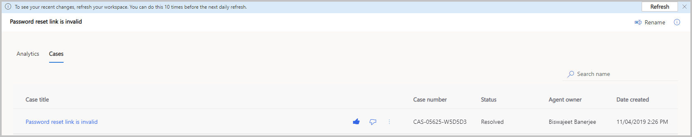

5. To refresh your workspace, select **Refresh**.

<!-- ## Fine-tuning the way cases are grouped into topics

You can fine-time the way Customer Service Insights artificial intelligence technology groups support cases into topics by rating the placement of cases within topics. By rating the placement, you can help the Customer Service Insights artificial intelligence learn and improve case grouping.

To rate the placement of a topic's support cases, select the topic in the Topics dashboard's Topics list to displays the list of cases associated with the topic. Then hover over the case title to display the **Thumbs up** and **Thumbs down** ratings icons.

> 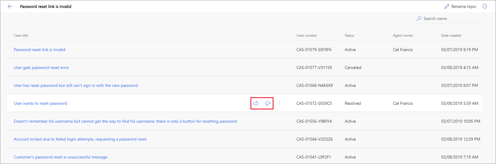

Select the **Thumbs Up** icon to indicate the case has been placed correctly within the topic. Select the **Thumbs Down** icon to indicate the case was not placed correctly.

-->