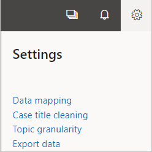
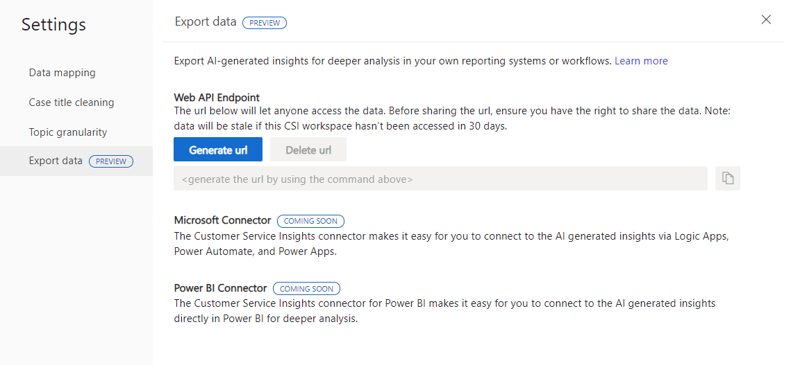

# Export data from Dynamics 365 Customer Service Insights

[!INCLUDE[cc-beta-prelease-disclaimer.md](../includes/cc-beta-prerelease-disclaimer.md)]

Dynamics 365 Customer Service Insights enables you to export your data to a web API endpoint where you can then query it for additional insights that go beyond the dashboards that come with the application. 

1. Go to **Settings**.

    

2. Select **Export data**. You see the Export data window where you choose the export method.

    

3. Select **Generate URL** to create a new web API endpoint for the exported data. Note that you can use the copy button to copy the URL to the clipboard. 

**Delete URL** disables any previously generated URL. Note that you can generate a new URL after deletion. 

## Exported data fields 

The web API endpoint includes the data fields listed here if they are available in your workspace. It's possible that some workspaces won't have all the fields listed if they aren't applicable or are mapped incorrectly. 

More information: [Map your data to custom entities and fields](https://docs.microsoft.com/dynamics365/ai/customer-service-insights/map-data)

**Case data**
 - Case title
 - Created date
 - Modified date
 - Resolved date
 - Escalated on date
 - Is escalated
 - Business unit
 - Priority
 - State
 - Assigned agent name
 - Team
 - Product
 - CSAT score (1-5 scale)
 - Origin channel
 - Resolve by SLA
 - Case number

**Generated data**
- Topic
- Is topic popular
- Topic ID
- Relevance score

More information: [Dynamics 365 Customer Service entities used by Customer Service Insights](https://docs.microsoft.com/dynamics365/ai/customer-service-insights/customer-service-entities)

## Considerations
* Before sharing the exported data with others, verify that you and the people you're sharing with have the correct permissions. 

* The exported data is refreshed daily, following the typical workspace refresh schedule. When workspace refresh is temporarily paused due to inactivity after 30 days, exported data is also not refreshed. 

* If you suspect the URL has been inappropriately shared, delete the URL and generate a new one. This action disables the old URL and prevents it from being used. 

* Rate limits for accessing the API for every IP address are: 
  * 5 times per minute
  * 20 times per hour
  * 100 times per day

