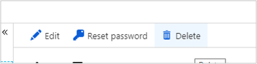
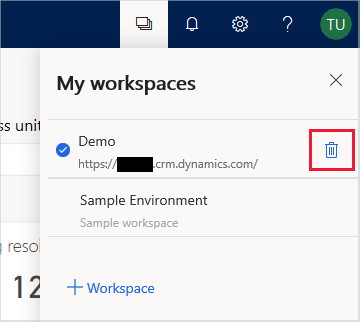

# Respond to requests to delete data from Customer Service Insights

The right to removal of personal data from an organization’s customer data is a key protection in the General Data Protection Regulation (GDPR). Removing personal data includes removing all personal data and system-generated logs, except audit log information.

Dynamics 365 Customer Service Insights includes the following capabilities for deletion of personal data for a specific user:

* Delete customer data (tenant admin)
* Delete a user (tenant admin)
* Delete a workspace (user)

## Delete data 

A tenant administrator follows these steps to delete a user's personal data:

1. Send email to ccinsightadmins@microsoft.com specifying the user’s Azure Active Directory (Azure AD) objectId in the request.

   An administrator from the Dynamics 365 Customer Service Insights team will send an email to the address registered in the Azure AD user account, asking for confirmation to delete data.

2. Acknowledge the confirmation to delete the data. When the deletion is complete, the tenant admin receives a confirmation.

## Delete a user 

A tenant administrator follows these steps to delete a user:

1. Sign in to the [Azure management portal](https://ms.portal.azure.com).

2. Navigate to [https://portal.azure.com/?feature.usorIntimite=true#blade/Microsoft_Azure_Policy/PolicyMenuBlade/Privacy](https://portal.azure.com/?feature.usorIntimite=true#blade/Microsoft_Azure_Policy/PolicyMenuBlade/Privacy) to open the Privacy blade.
  
    

<<<<<<< HEAD
### Delete customer data – Telemetry (Tenant admin)

A tenant administrator can follow these steps to delete data:

1. Sign in to the [Azure management portal](https://ms.portal.azure.com).

2. Navigate to [https://portal.azure.com/?feature.usorIntimite=true#blade/Microsoft_Azure_Policy/PolicyMenuBlade/Privacy](https://portal.azure.com/?feature.usorIntimite=true#blade/Microsoft_Azure_Policy/PolicyMenuBlade/Privacy) to open the Privacy blade.

    > [!div class="mx-imgBorder"]
    > 

3. Select **Go to Azure AD to delete user**.

4. Select the user that you want to delete. 

    > [!div class="mx-imgBorder"]
    > 

5. Select **Delete**.

    > [!div class="mx-imgBorder"]
    > 

### Delete customer data (Self)
=======
3. Select **Go to Azure AD to delete user**.
>>>>>>> 9038288590d9c0ede6e36a98eef443aa9aa336f1

4. Select the user that you want to delete. 

     

5. Select **Delete**.
   
    

## Delete a workspace (user)

Users follow these steps to delete a workspace from Customer Service Insights:

1. Navigate to [https://csi.ai.dynamics.com/](https://csi.ai.dynamics.com/).

2. Select the **Workspaces** icon on the Customer Service Insights title bar to open the **My workspaces** pane.

3. Hover over the workspace you want to delete to display the **Delete** icon, and then select the icon.

   
