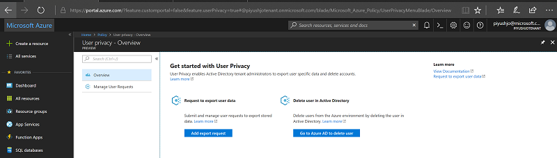
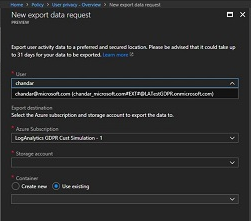
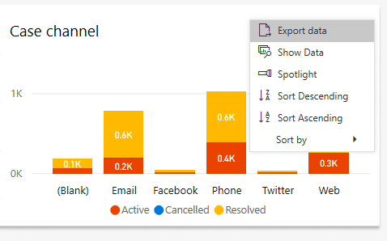

# Responding to GDPR data subject export requests for Dynamics 365 Customer Service Insights

[!INCLUDE [public-preview](../includes/public-preview.md)]

As part of our commitment to partner with you on your journey to the General Data Protection Regulation (GDPR), we’ve developed documentation to help you prepare. The documentation not only describes what we’re doing to prepare for the GDPR but also shares examples of steps you can take today with Microsoft to support GDPR compliance when using Dynamics 365 Customer Service.

## Manage export requests

The right of data portability allows a data subject to request a copy of their personal data in an electronic format (that’s a “structured, commonly used, machine readable, and interoperable format”) that may be transmitted to another data controller.

Dynamics 365 Customer Service Insights offers the following experiences to find or export personal data for a specific user:

* Export customer data – Telemetry (Tenant admin)
* Export customer data – Other (Tenant admin)
* Export customer data – Other (Self)

### Export customer data – Telemetry (Tenant admin)

A tenant administrator can follow these steps to export data:

1. Sign in to the [Azure management portal](https://ms.portal.azure.com).

2. Navigate to [https://portal.azure.com/?feature.usorIntimite=true#blade/Microsoft_Azure_Policy/PolicyMenuBlade/Privacy](https://portal.azure.com/?feature.usorIntimite=true#blade/Microsoft_Azure_Policy/PolicyMenuBlade/Privacy) to open the Privacy blade.

    > [!div class="mx-imgBorder"]
    > 

3. Create a request to export and delete user data by providing following details:

> [!div class="mx-imgBorder"]
> 

After the export runs successfully, you will see the data in your storage container.

### Export customer data – Other (Tenant admin)

A tenant administrator can follow these steps to export data:

1. Send email to ccinsightadmins@microsoft.com specifying the user’s Azure Active Directory (Azure AD) objectId in the request.

    An administrator from the Dynamics 365 Customer Service Insights team will send an email to the address registered in the Azure AD user account, asking for confirmation to export data.
2. Acknowledge the confirmation to export the data and make it available to the requestor.

### Export customer data – Other (Self)

You can follow these steps to export data from a chart on an Customer Service Insights dashboard:

1. Navigate to [https://csi.ai.dynamics.com/](https://csi.ai.dynamics.com/).
2. Click on the ellipses in the upper right corner of the chart, and then click **Export data**.

> [!div class="mx-imgBorder"]
> 
