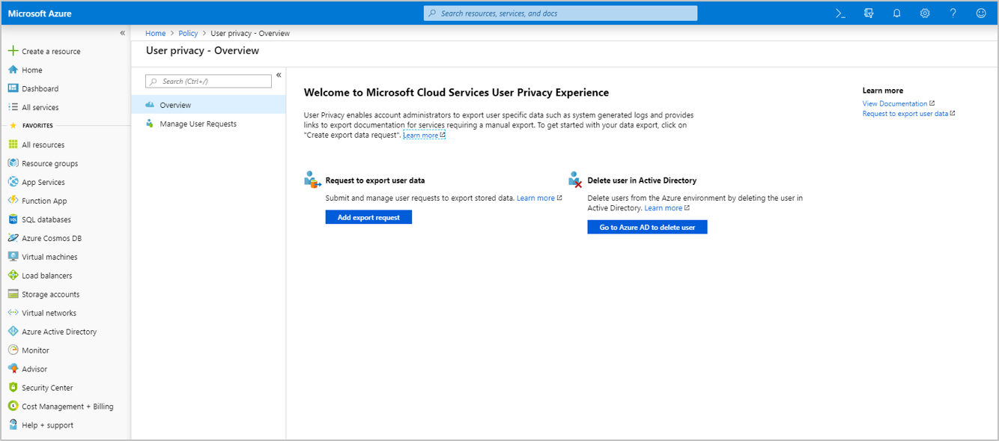
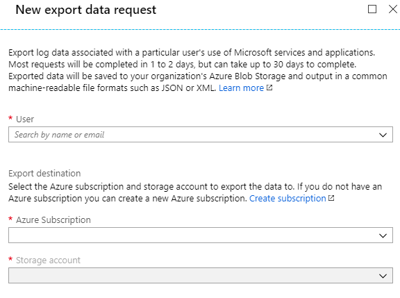
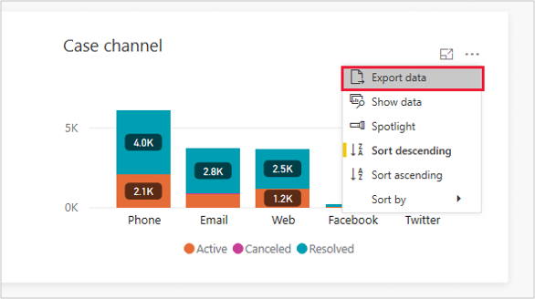

# Export data to respond to GDPR Data Subject Requests (DSR) for Dynamics 365 Customer Service Insights

The right of data portability allows a data subject to request a copy of their personal data in an electronic format (defined as a “structured, commonly used, machine readable, and interoperable format”) that may be transmitted to another data controller.

Dynamics 365 Customer Service Insights offers the following capabilities to find or export personal data for a specific user:

* Export customer data – Telemetry (tenant admin)
* Export customer data – Other (tenant admin)
* Export customer data – Other (user)

### Export customer data – Telemetry (Tenant admin)

A tenant administrator follows these steps to export data:

1. Sign in to the [Azure management portal](https://ms.portal.azure.com).

2. Navigate to [https://portal.azure.com/?feature.usorIntimite=true#blade/Microsoft_Azure_Policy/PolicyMenuBlade/Privacy](https://portal.azure.com/?feature.usorIntimite=true#blade/Microsoft_Azure_Policy/PolicyMenuBlade/Privacy) to open the Privacy blade.

    

3. Create a request to export user data by providing following details:

    

After the export runs successfully, you see the data in your storage container.

### Export customer data – Other (Tenant admin)

A tenant administrator follows these steps to export data:

1. Send email to ccinsightadmins@microsoft.com specifying the user’s Azure Active Directory (Azure AD) objectId in the request.

   An administrator from the Dynamics 365 Customer Service Insights team sends an email to the address registered in the Azure AD user account, asking for confirmation to export data.
    
2. Acknowledge the confirmation to export the data, and make the data available to the requestor.

### Export customer data 

Users follow these steps to export data from a chart on an Customer Service Insights dashboard:

1. Navigate to [https://csi.ai.dynamics.com/](https://csi.ai.dynamics.com/).
2. Select the ellipses in the upper corner of the chart, and then choose **Export data**.

    > 
