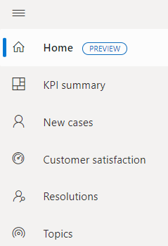
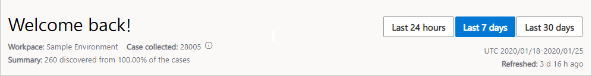
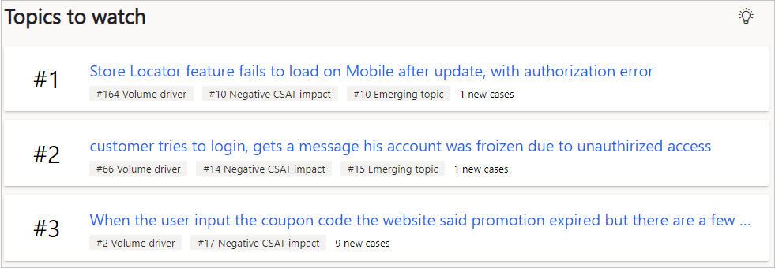
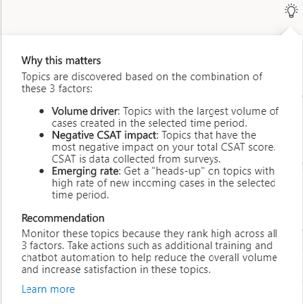
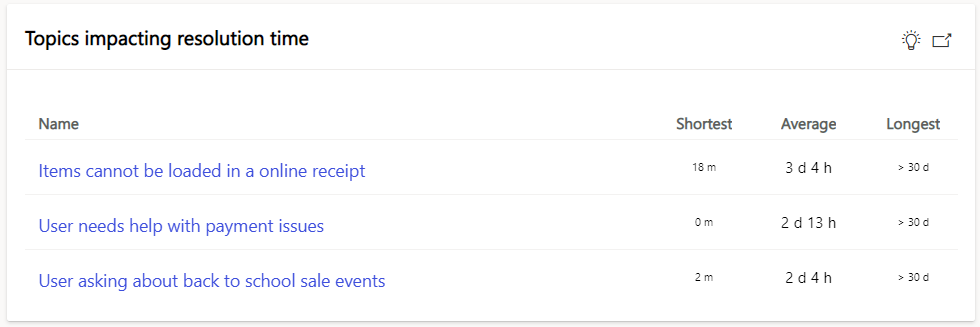
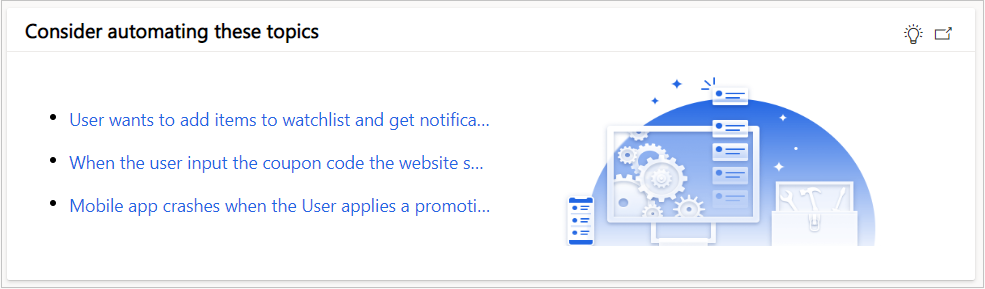
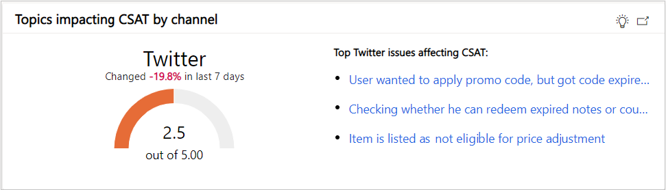

# Discover key insights from your customer service data

The homepage (preview) of Dynamics 365 Customer Service Insights presents insights from your customer service data in a visually rich way, making it easier to discover topic issues to focus on and why they are suggested. 

This is a new landing page experience when you open Customer Service Insights, it's also accessible in the left navigation as a new option in addition to the existing 4 dashboards and Topics list page. 

At the top of the homepage, you can find workspace information on nubmer of case data imported, number of topics discovered, and percentage of cases that were successfully clusterd to find the topics. 

* **Workspace:**  name of your environment with your customer service data.
* **Case collected:** number of total cases imported into this workspace, using the method of all cases created in the last 60 days or up to 1 million cases, whichever's great. See more details around limits [here](https://docs.microsoft.com/dynamics365/ai/customer-service-insights/service-limits).
* **Topics:** number of topics discovered from percentage of total imported cases that were successfully clustered based on semantic similarity. If no topics are discovered, it could be caused by multiple reasons such as not enough case data in the workspace, or clustering is still in progress. Find more troubleshooting details [here](https://docs.microsoft.com/dynamics365/ai/customer-service-insights/topics-page#troubleshooting-empty-topics-page).
* **Time period selectors:** enable comparison between the selected time period and the previous period to see how KPIs are changing over time as well as across different time ranges. The default selection is "Last 7 days", based on the creation date of cases imported since the last refresh. 
  * Last 24 hours
  * Last 7 days
  * Last 30 days
* **Time period range:** based on the selected time period, this shows the time range (in UTC time zone) of the imported cases that were used to discover topic issues shown on the page.  
* **Refreshed date:** this timestamp indicates when the workspace was last refreshed, cases created up until the last refresh date are imported to the workspace, which are used to calculate AI and BI insights. 

## Topics to watch 

Topics ranked high across these 3 key areas are shown in **Topics to watch** to make it easier for customer service managers to discover top issues:
  
  * **Volume driver:** Topics with the largest volume of cases created in the selected time period.
  * **Negative CSAT impact:** Topics that have the most negative impact on your total CSAT score. CSAT is data collected from surveys.
  * **Emerging rate:** Get a "heads-up" on topics with high rate of new incoming cases in the selected time period.

Clicking on the light bulb icon will display a quick inline explanination on the reason behind showing these topics, as well as recommendations on possible actions to take. 

### Topics with longest average resolution time

Focusing on average resolution time (time difference between when the case is created to resolved), these topic issues are based on similar cases taking a long time to resolve. Shortest and longest resolution times are also shown to compare with the average resolution time for understanding the whole picture. 

The light bulb icon is here to provide an explaination inline, the link icon will take you directly to the **Resolutions dashboard** for more topics and metrics around resolution time.

### Consider automating these topis

Chatbot is a great solution to automate incoming cases that are easy to resolve and high in volume, the topics suggested here are based on these factors, meant to be used with your chatbot solution. If you are using Power Virtual Agents, the topic automation process is easily integration, learn how to automate a topic from CSI to PVA [here](https://docs.microsoft.com/dynamics365/ai/customer-service-insights/automate-topics).

### Topics impacting CSAT by channel

Customer satisfaction score is crucial for using data to determine how satisfied your customers are. Given there are various channels where the topics can come in, the channel with the lowest CSAT score is shown here, along with top topic issues affecting the low CSAT score the most. 

### Peak time with high case volume

Here you can find when's the peak time (in UTC time zone) of new incoming cases, the topic issues the occur during this time period is shown here to ensure the staffing schedule is aligned to the peak hour and issues faced. 

