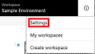
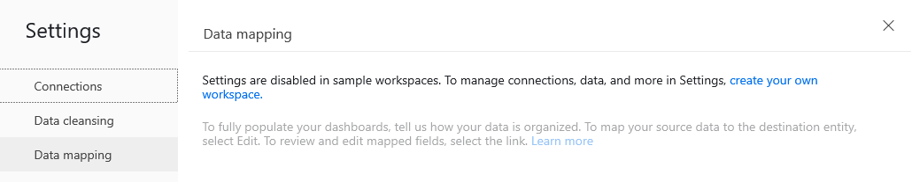
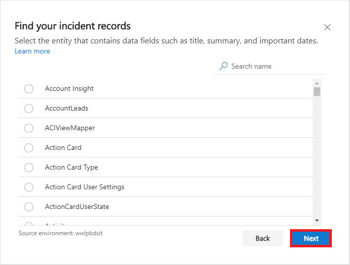

# Generate insights by mapping your data to custom data entities and fields

While Dynamics 365 Customer Service Insights works out of the box with data stored in default Dynamics 365 entities and data fields, you may want to generate insights by mapping to data from custom entities and fields in Common Data Services (CDS). Mapping to data from custom entities and fields in Common Data Services can be useful in the following cases:

* You are not a Dynamics 365 for Customer Service customer.
* You are a Dynamics 365 for Customer Service customer, but your service solution is customized and you use custom CDS entities and fields to store support case data.
* You want to use a custom field other than the support case title in your Dynamics 365 Customer Service Insights dashboards.

You can map to data from custom entities and fields by specifying Data mapping settings.

## Support case data used in Dynamics 365 Customer Service Insights

Customer Service Insights provides a set of built-in dashboards that give you interactive charts and actionable insights, including insights in support topics that are generated by automatically grouping cases using natural language understanding.

If you are a customer for Dynamics 365 for Customer Service, case data is stored by default primarily in the Incident (case) entity and several other related entities in Common Data Service. When you create a Customer Service Insights workspace, you connect with a Dynamics 365 environment. Customer Service Insights then loads data from the Dynamics 365 Customer Service data entities to populates the Customer Service Insights dashboards.

For more information on the entities used by Customer Service Insights, see [Dynamics 365 for Customer Service entities used by Customer Service Insights](customer-service-entities.md).

For more information on connecting to an environment, see [Use workspaces to connect to different customer service environments](use-workspaces.md).

Here some things to keep in mind when you are working with case data in Customer Service Insights:

* Customer Service Insights loads data from multiple entities, including Incident (case), BusinessUnit, Product, SystemUser and Team. The Incident entity is the primary entity that stores case data. It contains several data fields with the Lookup attribute type that look up data from the primary field of other entities. For example, by default the OwningUser field looks up agents’ full names from the SystemUser entity since FullName is the 's primary field. Similarly, the ProductId field looks up product names from the Product entity, the OwningBusinessUnit field looks up business unit names from the BusinessUnit entity, and the OwningTeam field looks up team names from the Team entity.
* Several data fields in the Incident entity are pick lists, including the PriorityCode, CaseOriginCode, ResolveBySLAStatus and CustomerSatisfactionCode fields. Picklist is an attribute type in Common Data Service that allows the selection of multiple options. Each option consists of a numeric value and a string label:
  * For PriorityCode (which is used to specify a case’s priority) and CaseOriginCode (which indicates the support channel where the case originated), Customer Service Insights supports any custom values and labels defined in these fields.
  * ResolveBySLAStatus indicates whether a case is compliant with the service-level agreement (SLA). You can define multiple different values for compliant cases. Customer Service Insights only uses the value 4 to identify noncompliant cases.  
  * The pick list values defined in CustomerSatisfactionCode indicates the customer satisfaction score (CSAT). Customer Service Insights reads value from 1 to 5 to calculate the average CSAT.

## To specify mapping from custom entities and fields

1. Select the **Settings** button on the Customer Service Insights title bar and then select **Settings**.

   > 

   AI for Customer Service Insights displays the Settings page.

2. Select **Data mapping** to display the Data mapping pane. If you have not created a workspace, Customer Service Insights prompts you to create one.

   > 

   For more information about creating a workspace, see [Use workspaces to connect to different customer service environments](use-workspaces.md).

3. If you are connected to a workspace, select the Incident destination entity to display the **Find your incident records** pane. Select the entities that contain your custom fields, and then select **Next**.

   > 

## Tips and tricks for data mapping

Here are several tips and tricks to help you get the most from data mapping:

* If your case data is stored in an external data source, add your data to an entity in Common Data Service for Apps by using Power Query. Once the data is imported, you can create a Customer Service Insights workspace for your case data using data mapping.
* Data mapping provides an additional way to improve your AI-generated topic results. By default, Customer Service Insights applies language understanding to the support case Title field to generated topic lists. If you have another data field in Incident entity -- for example, the Subject or Description field -- that provides a better summary of support issues, you can use data mapping to generate topics from that field instead of the Title field.
* Data mapping requires that your custom fields attribute types are compatible with the entities used by Customer Service Insights.