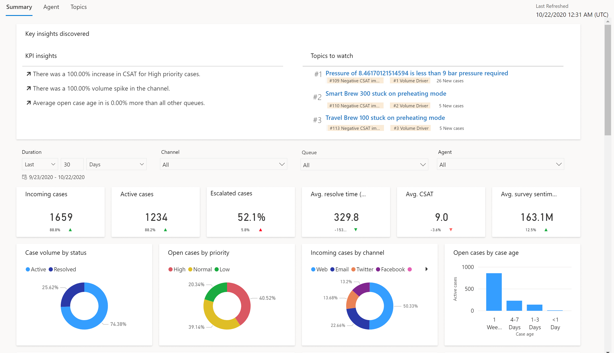

# Customer Service Insights overview

Dynamics 365 Customer Service Insights helps both agents and customer service managers make better decisions and proactively improve customer satisfaction by using artificial intelligence (AI) and analytics capabilities for Customer Service and Omnichannel. You can empower your teams with insights into customer satisfaction–boosting analytics and AI-powered features to spend less time searching and more time engaging with customers.

The premium AI capabilities in Customer Service Insights use advanced AI technology in natural language understanding and natural language generation to help your service team resolve cases efficiently and guide them to success.

 Agents can use real-time similar cases and knowledge article suggestions that are customized for their current context. The AI-driven technology empowers agents to help solve customer issues faster, thereby improving resolution rates and customer satisfaction.

These capabilities are deeply embedded into the core agent and manager experiences in Customer Service and Customer Service Omnichannel. 

## Customer Service Insights across your organization

Customer Service Insights connects with your Dynamics 365 Customer Service and Omnichannel for Customer Service data to provide your support organization with out-of-the-box AI and BI capabilities, such as customer service analytics and similar case suggestions. Different applications will surface slightly different feature sets, as explained in this topic.

### Customer Service applications

Customer Service Insights is now embedded in Customer Service. After it is enabled, this experience allows you to see historical analytics directly within the Customer Service environment, with several out-of-the-box dashboards that can be viewed by by your management team.

For details on the customer service offerings, see the following topics:

- Customer Service historical analytics

- Topic clustering for cases

- Customer Service Analytics in Power BI

- Knowledge search analytics

- AI suggestions for similar cases and knowledge articles

## Omnichannel for Customer Service

Customer Service Insights for Omnichannel for Customer Service brings many of the key operational metrics and features into your daily contact center operations. Real-time customer sentiment analysis, combined with contextual AI suggestions for similar cases and knowledge articles helps agents reduce customer frustration and case resolution times. With the sentiment analysis dashboard, you can use real-time sentiment data to gain a better understanding of how customer interactions drive KPIs and satisfaction scores.

For details on Customer Service Omnichannel offerings, see the following topics:

- Introduction to Omnichannel Insights dashboard

- View smart assist suggestions for similar cases and knowledge articles using AI

- Analyze real-time customer sentiment

> [!Important]
> If you are a customer who uses the Customer Service Insights standalone web application, your current working environments will be terminated and inaccessible by December 8, 2021. You will no longer be able to use the standalone service after this date. The embedded Customer Service Insights features in the core applications will continue to be available and supported. For users who hold Customer Service Enterprise licenses, you will no longer be able to create new workspaces, but you'll retain access to existing ones. In the interim, the [standalone app guide](quickstart.md) contains documentation for the web application.

[!INCLUDE[footer-include](../includes/footer-banner.md)]
