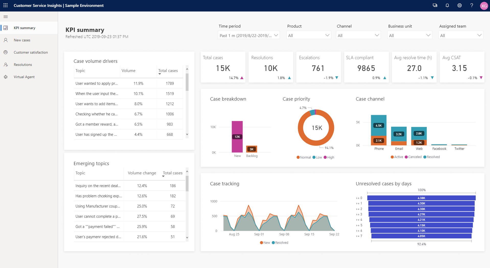

# Customer Service Insights overview

Dynamics 365 Customer Service Insights ([https://csi.ai.dynamics.com](https://csi.ai.dynamics.com)) gives you actionable insights into critical performance metrics, operational data, and emerging trends from your customer service system. Built-in dashboards, interactive charts, and visual filters provide views into support operations data across channels, and highlight areas for improvement that can have the greatest impact, helping you quickly evaluate and respond to key performance indicators (KPIs) and customer satisfaction levels.

Customer Service Insights uses artificial intelligence to automatically group your cases into topics using natural language understanding. Topics enable you to discover and adapt to current and emerging trends, improve brand sentiment, and identify problem areas. By pinpointing and fixing issues before they impact customers, you can deliver better customer service experiences.

The AI-driven technology empowers informed decision making about how to improve resolution rates, reduce wait times, and decrease customer service costs. You can use case resolution insights, backlog trends, and historical comparisons to evaluate agent performance and business impact, and address inefficiencies in your system.

For a walkthrough of how to connect to your customer service data to gain insights into your customer support system, see [Quickstart - Get immediate insights into your customer service system's performance](quickstart.md).

For more information about using workspaces to work with different sets of customer service data, see [Use and manage workspaces to connect to different customer service environments](use-workspaces.md).

For more information about how to use the dashboards and sample data, see [Work with Customer Service Insights dashboards](use-dashboard-sample-data.md).

For more information and examples of how to use the Customer Service dashboards to help you identify areas of improvement, see [Identify areas for improvement in your customer service system](improve-system.md).

For details on the Customer Service Insights dashboards, see the following topics:

* [KPI summary dashboard](dashboard-kpi-summary.md)
* [New cases dashboard](dashboard-incoming-cases.md)
* [Resolutions dashboard](dashboard-case-resolutions.md)
* [Customer satisfaction dashboard](dashboard-CSAT.md)
* [Topic details dashboard](dashboard-topic-details.md)

For information about improving the results shown by AI Insights charts on the dashboards, see [Improve your AI Insights data by cleansing support case titles](settings.md).

Customer Service Insights also includes a Topics page. Customer Service Insights uses artificial intelligence technology to group related support cases as topics and display them on the Topics page in order of the number of cases associated with each topic. You can display the Topics page by selecting **Topics** in the navigation pane. For information on working with the Topics page, see [Manage and improve artificial intelligence grouping of support cases as topics](topics-page.md).
