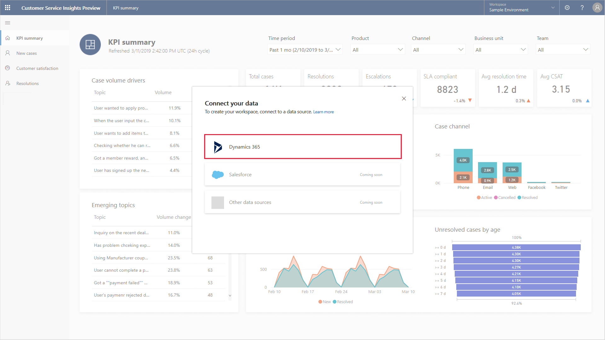
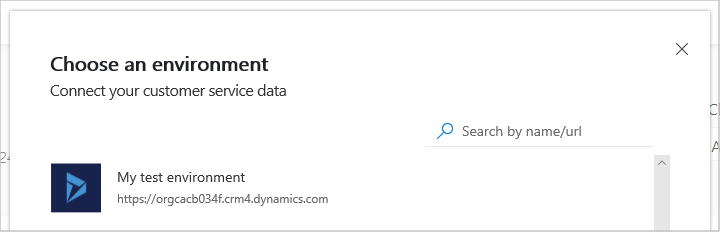
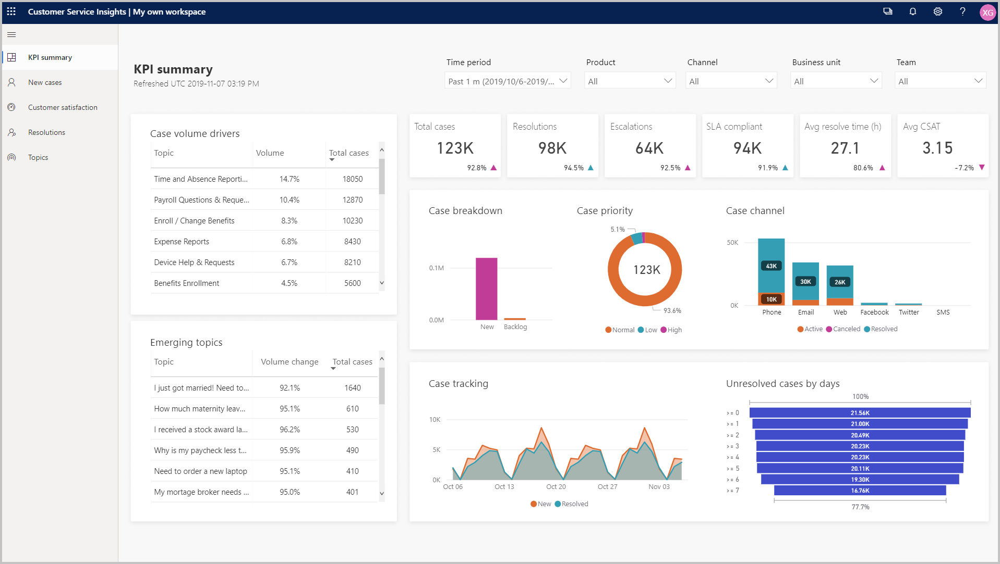
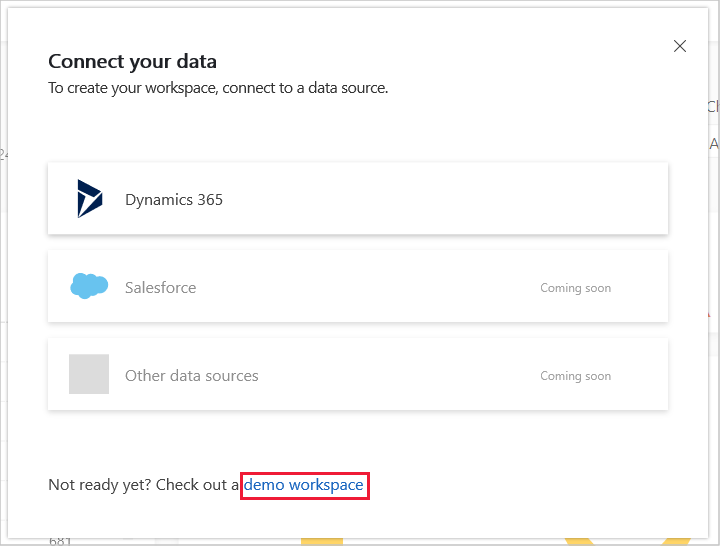

# Quickstart - Get immediate insights into your customer service system's performance

Dynamics 365 Customer Service Insights lets you quickly connect to your existing Dynamics 365 customer service data to gain immediate insights into your system's performance. You can also explore with sample data.

## To connect to your customer service data

1. Navigate to [https://csi.ai.dynamics.com](https://csi.ai.dynamics.com) in your browser to open Customer Service Insights. Customer Service Insights supports Microsoft Edge, Internet Explorer 11, and Chrome browsers.

   On the **Connect your data** screen, select the data source for your customer service data.

   

2. On the **Get customer service data** screen, create a Customer Service Insights workspace by selecting the customer service environment you want to use.

   

   For more information on working with workspaces, see [Use and manage workspaces to connect to different customer service environments](use-workspaces.md).

   Customer Service Insights configures the workspace to use the environment you selected and displays the environment's customer service data in the KPI Summary dashboard.

   

You can gain a variety of insights from the Customer Service Insights dashboards. For example, AI Insights charts help you identify support cases that have the most impact on your system.

If you want to explore working with the dashboards using sample data before connecting to live data, use the Customer Service Insights built-in demo workspace. To open the demo workspace, select **demo workspace** on the **Connect your data** screen.

For more information about how to use the dashboards and sample data, see [Work with Customer Service Insights dashboards](use-dashboard-sample-data.md).

For more information and examples of how to use the Customer Service Insights dashboards to help you identify areas for improvement, see [Identify areas for improvement in your customer service system](improve-system.md).

For details on the Customer Service Insights dashboards, see the following topics:

* [KPI summary dashboard](dashboard-kpi-summary.md)
* [New cases dashboard](dashboard-incoming-cases.md)
* [Resolutions dashboard](dashboard-case-resolutions.md)
* [Customer satisfaction dashboard](dashboard-CSAT.md)
* [Topic details dashboard](dashboard-topic-details.md)

For information about improving the results shown by AI Insights charts on the dashboards, see [Improve data quality by cleansing support case titles](settings.md).

Customer Service Insights also includes a Topics page, which uses artificial intelligence technology to group related support cases as topics and display them in order of the number of cases associated with each topic. For information on working with the Topics page, see [Manage and improve artificial intelligence grouping of support cases as topics](topics-page.md).
