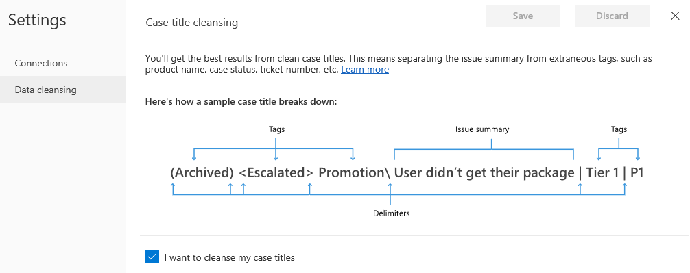
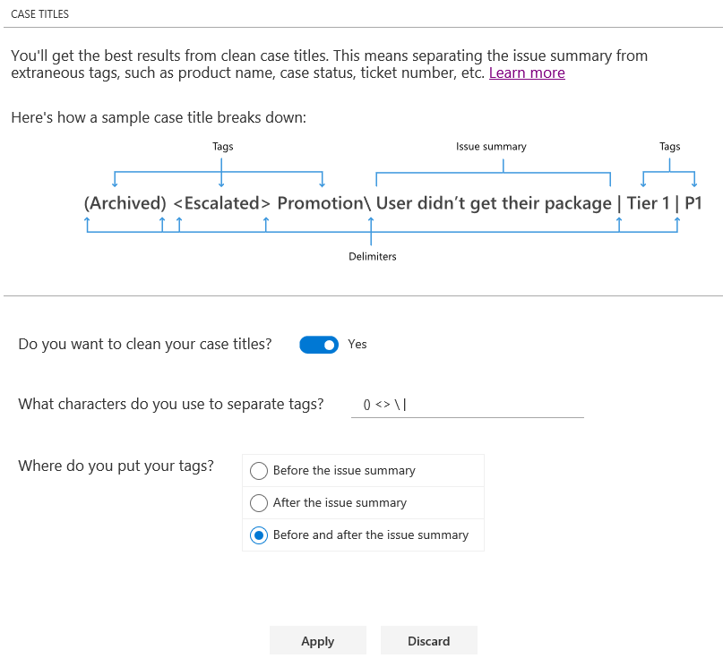

# Improve data quality by cleansing support case titles

AI for Customer Service Insights uses artificial intelligence technology to give you insights into your customer service data by grouping support cases as *topics* that are a collection of related cases. This can help you identify areas for improvement that can have the greatest impact on system performance.

The AI Insights charts displayed on the AI for Customer Service Insights dashboards are generated by applying language understanding artificial intelligence technology to the titles of support cases. However, the results can be misleading if the titles include extraneous information such as product name, case status, or ticket number tags. You can improve the quality of the results displayed in AI Insights charts by specifying Data Cleansing settings to disregard tags in titles when they are grouped into topics.

## To cleanse support case titles

1. Select the **Settings** button on the AI for Customer Service Insights title bar and then select **Settings**.

   > [!div class="mx-imgBorder"]
   > 

   AI for Customer Service Insights displays the Settings page.

2. Select **Data cleansing** to display the Case Title pane, and then select the check box next to **Do you want to clean your case titles?**

<!--from editor: The check box in this image says "I want to cleanse my case titles". The "Do you want to clean ..." box is in the image in step 3.-->

   > [!div class="mx-imgBorder"]
   > 

3. Specify any delimiter characters you use to separate tags from each other or from the issue summary, and whether you place tags before or after the summary, or both. Then select **Apply**.

   > [!div class="mx-imgBorder"]
   > 

4. Check the results generated by the AI Insights charts, and fine-tune your **Data cleansing** settings as necessary. The settings take effect when you refresh the workspace.
