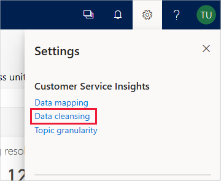
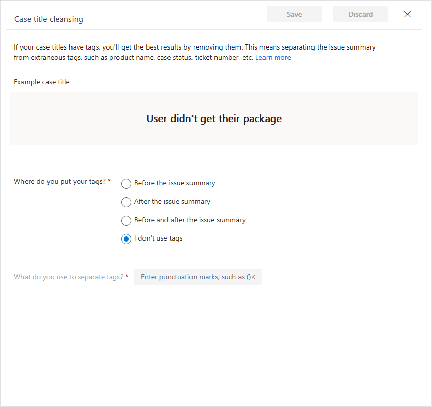
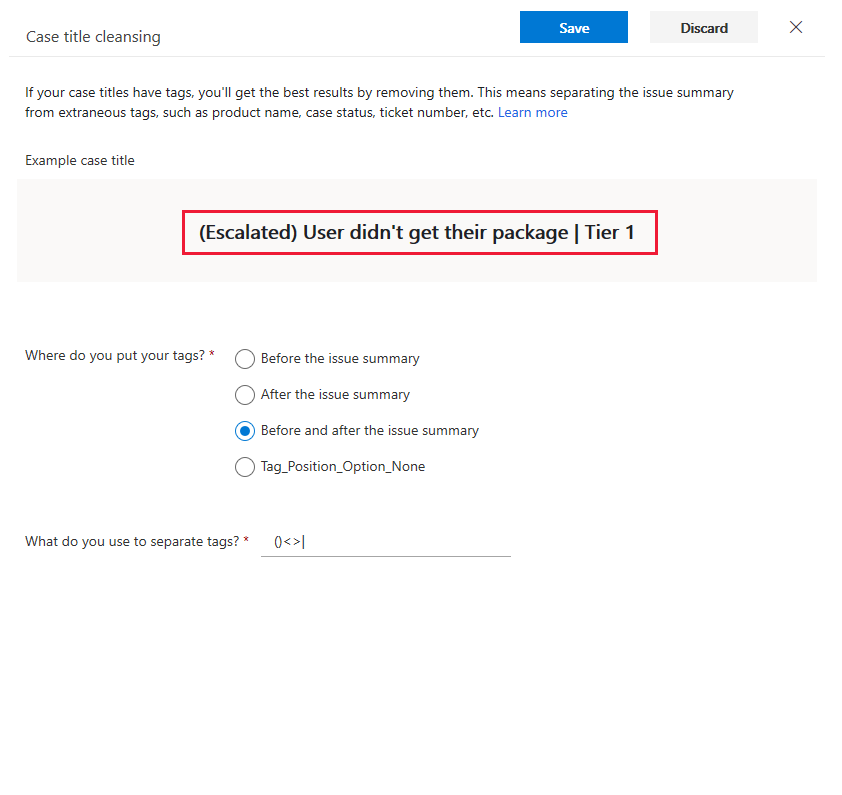
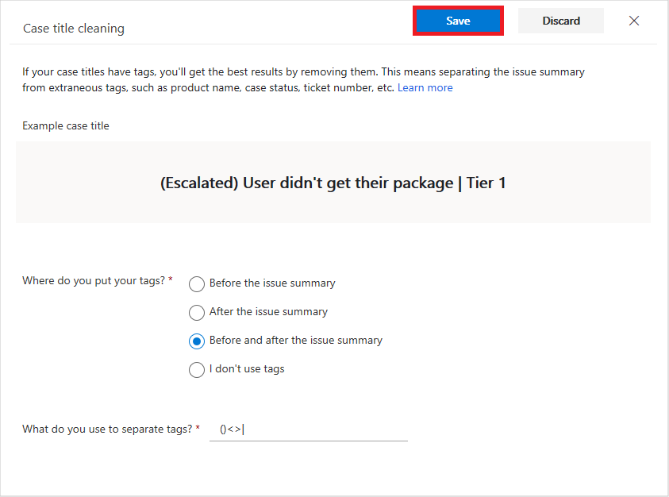

# Improve data quality by cleansing support case titles

Customer Service Insights uses artificial intelligence technology to give you insights into your customer service data by grouping support cases as *topics* that are a collection of related cases. This can help you identify areas for improvement that can have the greatest impact on system performance.

The AI Insights charts displayed on the Customer Service Insights dashboards are generated by applying language understanding technology to the titles of support cases. However, the results can be misleading if the titles include extraneous information such as product name, case status, or ticket number tags. You can improve the quality of the results displayed in AI Insights charts by specifying Data Cleansing settings to disregard tags in titles when they are grouped into topics.

## To cleanse support case titles

1. Select the **Settings** button on the Customer Service Insights title bar and then select **Data cleansing**.

   

   Customer Service Insights displays the Case title cleansing page.

   

2. If your case titles include tags, specify where you put them and any punctuation marks you use to separate them. Customer Service Insights display an example of how the cleansing settings will be applied to titles.

   

   Then click **Save**.

   

3. Customer Service Insights gives you the option of refreshing your workspace. The settings take effect when you refresh the workspace. Select **Refresh** to refresh the workspace.

   

Check the results generated by the AI Insights charts, and fine-tune your **Data cleansing** settings as necessary.
