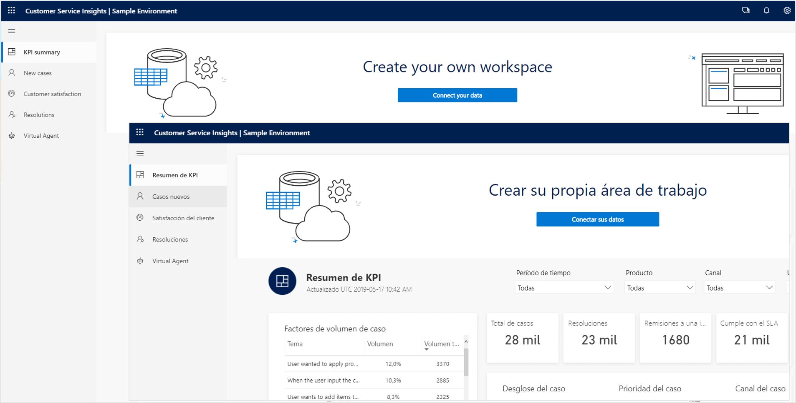
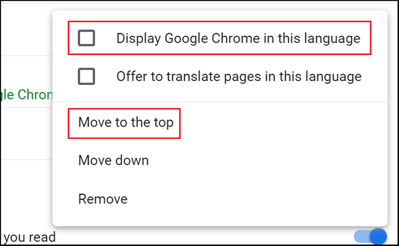
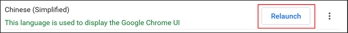

# Supported languages for Customer Service Insights

The languages shown in the product is based on the language preferences on your computer and your browser settings. This article lists supported languages for Dynamics 365 Customer Service Insights and details on how to update the language preferences. In addition, it explains the language support for case grouping as topics using artificial intelligence.

## Languages for Customer Service Insights

|   |  |
| ------------- | ------------- |
|Basque |euskara |
|Bulgarian |Български |
|Catalan |català |
|Chinese (Simplified) |中文(简体) |
|Chinese (Traditional) |中文(繁體) |
|Croatian |hrvatski |
|Czech |čeština |
|Danish |dansk |
|Dutch |Nederlands |
|English |English |
|Estonian |eesti |
|Finnish |suomi |
|French |français |
|Galician |galego |
|German |Deutsch |
|Greek |Ελληνικά |
|Hindi |हिंदी |
|Hungarian |magyar |
|Indonesian |Bahasa Indonesia |
|Italian |italiano |
|Japanese |日本語 |
|Kazakh |Қазақ |
|Korean |한국어 |
|Latvian |latviešu |
|Lithuanian |lietuvių |
|Malay |Bahasa Melayu |
|Norwegian (Bokmål) |norsk (bokmål) |
|Polish |Polski |
|Portuguese (Brazil) |Português |
|Portuguese (Portugal) |português |
|Romanian |română |
|Russian |Русский |
|Serbian (Cyrillic) |српски |
|Serbian (Latin) |srpski |
|Slovak |slovenčina |
|Slovenian |slovenski |
|Spanish |español |
|Swedish |svenska |
|Thai |ไทย |
|Turkish |Türkçe |
|Ukrainian |українська |
|Vietnamese |Tiếng Việt |

## What's translated

Customer Service Insights will use your language preference to display elements like the menu, dashboard label text, and messages in your preferred language. 

Because the dashboard is connected to your data, the following items remain in their original language:

- Your case titles
- Topics generated by AI based on the case titles
- Your environment name

## Choose your language settings  

Customer Service Insights detects your language based on the language preferences on your computer. The way you access and change these preferences may vary depending on your operating system and browser. 

### Microsoft Edge

For details about changing languages in Windows 10 and Edge, see [Change the display language in Microsoft Windows 10 and Microsoft Edge](https://support.microsoft.com/help/4496404/windows-10-manage-the-input-and-display-language#display_language).

### Google Chrome

1. Open the menu in Chrome and select **Settings**.
2. Select **Show advanced settings**.
3. Under **Languages**, add your desired language. For additional details, see [Change languages in Google Chrome](https://support.google.com/chrome/answer/173424).
4. Open the menu for the desired language.
   
5. Select the checkbox **Display Google Chrome in this language**, then select **Move to the top**.
   
6. Select the **Relaunch** button to bring up your preferred language in Chrome.
   

## Language support for case grouping as topics

Customer Service Insights uses natural language understanding and other artificial intelligence technology to discover actionable insights by automatically grouping similar support cases into topics. It comes with a general language model that can discover topics with your cases written in any languages. In addition, it also includes 4 models optimized for specific languages (English, French, German, and Spanish). Each language model also has the capability to process English cases, in addition to the other language it’s optimized for.

> [!NOTE]
> This feature is currently in public preview.  

The language-specific models enable better language understanding capability for the corresponding languages. When Customer Service Insights refreshes your workspace and processes the case data, it will automatically detect the primary languages used in your cases. If more than 70% of the cases are in languages supported by a specific language model, that model will be used to discover topics from all of your cases; otherwise, the general model is used. For example, if you have more than 70% of cases detected in English, the English language model will be used to process all of your cases. If more than 70% of your cases detected in Spanish, or most in Spanish with some English cases (since all language models have the capability to process English), the Spanish model will be used to process all of your cases. 

If you have questions, find issues, or have general inquiries, please refer to our [forum](https://community.dynamics.com/365/aicustomerservice/f/dynamics-365-customer-service-insights).
