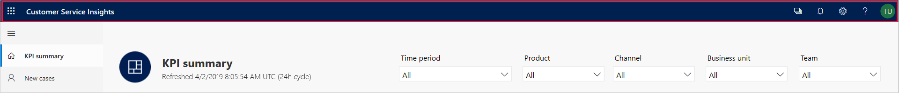
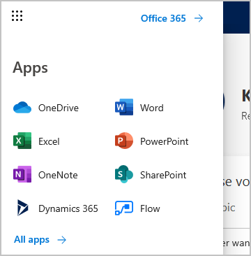
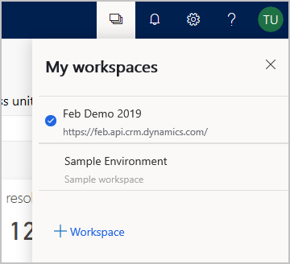
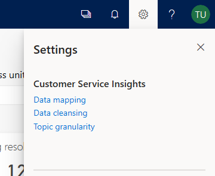

# Use the Customer Service Insights title bar

[!INCLUDE [public-preview](../includes/public-preview.md)]

The Customer Service Insights title bar gives you quick access to apps and key information for working with your customer service data. You can easily access:

* A variety of apps, including Dynamics 365 and Flow.
* The Workspaces pane, where you can create and manage your Customer Service Insights workspaces.
* The Settings pane, where you can specify data mapping, data cleansing, and topic granularity settings.

> 

## Access your apps

You can access your Office 365 apps by selecting the **Access your Office 365 apps** icon on the title bar.

> 

Customer Service Insights displays the Apps pane, giving you quick access to your Office 365 apps.

> 

## Access the Workspaces pane

You can access your Workspaces pane, where you can create and manage your Customer Service Insights workspaces, by selecting the **Workspaces** icon on the title bar.

> 

Customer Service Insights displays the Workspaces pane, where you can switch between workspaces or create a new workspace.

> 

For more information about working with workspaces, see [Use workspaces to connect to different customer service environments](use-workspaces.md).

## Access the Settings pane

You can access the Settings pane by selecting the **Settings** icon on the title bar.

> 

Customer Service Insights displays the Settings pane, where you can specify data mapping, data cleansing, and topic granularity settings.

> 

For more information about data mapping, see [Map your data to custom entities and fields](map-data.md).

For more information about data cleansing, see [Improve data quality by cleansing support case titles](settings.md).

For more information about topic granularity, see [Set the scope of how Customer Service Insights generates customer service topics](granularity.md).