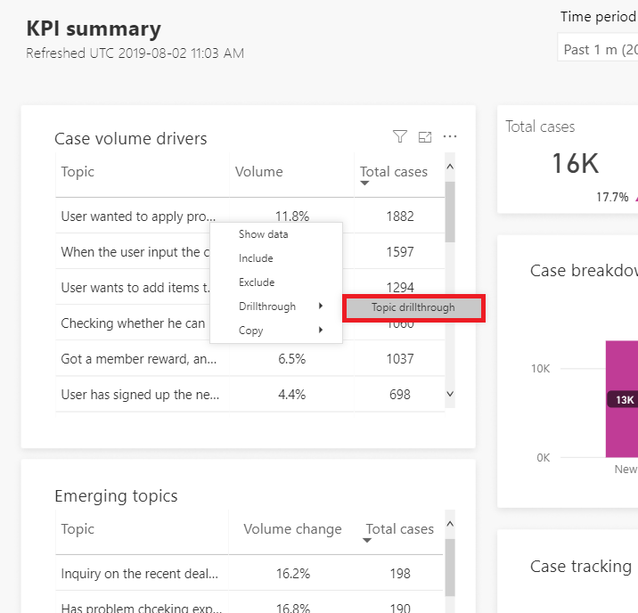
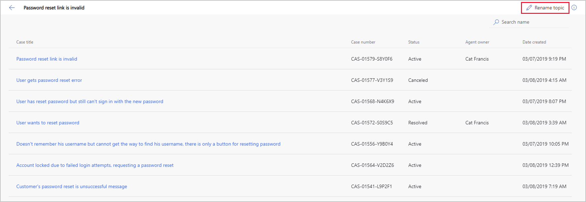

# Manage and improve artificial intelligence grouping of support cases as topics

You can manage and improve the artificial intelligence grouping of support cases as topics by using the Topics page. You can display the Topics page by selecting **Topics** in the navigation pane.

Customer Service Insights automatically detects the language used in your support cases. It comes with natural language understanding models that can understand text sementics and intent from your cases. Each language model also has the capability to process English cases, in addition to the other language it’s optimized for. For more information about the supported languages, see [Language support for case grouping as topics](supported-languages.md#language-support-for-case-grouping-as-topics).

> [!NOTE]
> The Topics page is not available in the sample environment. To make the Topics page available, create your own Customer Service Insights environment.

Customer Service Insights uses artificial intelligence technology to group related support cases as topics and display them on the Topics page in order of the number of cases associated with each topic. The Topics page shows all topics that contain three or more cases.

You can then view and manage the topics and associated support cases in a variety of ways, including:

* [Searching for a topic](#searching-for-a-topic)
* [Viewing analytics for a topic](#viewing-analytics-for-a-topic)
* [Viewing support cases for a topic](#viewing-support-cases-for-a-topic)
* [Providing feedback to fine-tune the way cases are grouped into topics](#providing-feedback-to-fine-tune-the-way-cases-are-grouped-into-topics)
* [Moving cases to another topic](#moving-cases-to-another-topic)
* [Renaming a topic](#renaming-a-topic)
* [Controlling the granularity of how support topics are generated](#controlling-the-granularity-of-how-support-topics-are-generated)
* [Refreshing the data displayed on the Topics page](#refreshing-the-data-displayed-on-the-topics-page)

If your Topics page doesn't show any topic, see [Troubleshooting empty Topics page](#troubleshooting-empty-topics-page).

## Searching for a topic

You can narrow down the list of topics displayed on the Topics dashboard by searching for a specific keyword in the **Search** box in the upper right corner of the dashboard.

For example, to find topics related to login issues, enter *login* in the **Search** box. Customer Service Insights narrows down the list to topics that include the word *login*.

To restore the original topic list, clear the search box by selecting the close icon.

## Viewing analytics for a topic

You can view the analytics of a topic through the Topic details analytics dashboard by selecting the topic in the Topics list. For example, to view the analytics for the *Password reset link is invalid* topic, select it in the list.

 You can also display the Topic details analytics dashboard from one of the AI Insights charts in the [KPI summary](dashboard-kpi-summary.md), [Incoming cases](dashboard-incoming-cases.md), [Customer satisfaction](dashboard-CSAT.md), and [Case resolution](dashboard-case-resolutions.md) dashboards. To display the Topic details analytics dashboard from AI Insights charts, click the link icon in **Details** column accoresponding to the topic you want to drill through. 

The Topic details dashboard gives you a detailed overview of key performance indicators for a specific topic, including using artificial intelligence (AI) technology to show you the impact by product and channel on customer satisfaction scores and resolution time for the topic. For more information about the Topic details anlytics dashboard, see [Topic details dashboard](dashboard-topic-details.md).

## Viewing support cases for a topic

You can view the top 200 most relevant support cases associated with a topic by selecting it in the Topics list, then select **Cases** tab on the page. For example, to view the support cases associated with the *Password reset link is invalid* topic, select it in the list, then select **Cases** tab.

Customer Service Insights displays a list of the support cases associated with the topic. Based on the case title similarities, Customer Service Insights uses artificial intelligence technology to group the cases together in a single topic. In addition to text similarity, it also groups cases with similar semantics meaning. For example:

* Cases related to *promo code* and *coupon* are included in the same topic.
* Cases related to *reset password* and *login issue* are included in the same topic.

To view the details of a support case, click the case title in the list.

Customer Service Insights opens the support case details in Dynamics 365.

## Providing feedback to fine-tune the way cases are grouped into topics

You can fine-tune the way Customer Service Insights artificial intelligence technology groups support cases into topics by rating the placement of cases within topics. By rating the placement, you can help the Customer Service Insights artificial intelligence learn and improve case grouping.

To rate the placement of a topic's support cases, select the topic in the Topics page's Topics list to displays the list of cases associated with the topic. Then hover over the case title to display the **Thumbs up** and **Thumbs down** ratings icons.

Select the **Thumbs Up** icon to indicate the case has been placed correctly within the topic. Select the **Thumbs Down** icon to indicate the case was not placed correctly.

For every new topic discovered in Customer Service Insights, the **Thumbs up** icon is automatically selected for the very first case title. You can change it if needed. When you change it, or select the rating icons for any other case title in the same topic, the AI model will record all the feedback to improve the topic generation results in future refreshes.

## Moving cases to another topic

If you find support cases grouped in a topic that should be grouped in a different topic on the Topics page, you can move them between topics. When a case is moved to another topic, Customer Service Insights uses that action as implicit feedback to tune its artificial intelligence model. For example, the model will determine whether a similar case should also belong to the other topic. As a result, Customer Service Insights improves its topic generation results in next workspace refresh.

To move a support case, hover over the case in a topic's case list, select the ellipses to display the **Move** option, and then select **Move**.

Select the destination topic from the **Move case title** pane and then select **Move**.

## Renaming a topic

When Customer Service Insights groups support cases into topics, it automatically uses the title of the most relevant support case as the name of the topic. However, you may want to rename the topic. For example, you may want a topic name that is shorter or more clearly describes the underlying support issue. A renamed topic name will send a signal to Customer Service Insights to improve grouping of cases for a topic. The next workspace refresh will include the name change to improve how topics are generated.

You can rename a topic either in the Topics list or in the list of the support cases associated with the topic.

### To rename a topic in the Topics list

1. Hover over the topic and select the pencil icon to the left of the Total cases number for the topic and select **Rename topic**.

   

3. In the **Rename topic** dialog box, enter the updated name and then select **Save**.

   

4. Customer Service Insights updates the topic's name in the Topics list and gives you an opportunity to refresh your workspace.

   

5. To refresh your workspace, select **Refresh**.

   

### To rename a topic in the list of the support cases

1. Select **Rename topic** at the top of the list.

   

2. Enter the updated name and select **Save**.

   

3. Customer Service Insights updates the topic's name and gives you an opportunity to refresh your workspace.

   

4. To refresh your workspace, select **Refresh**.

## Controlling the granularity of how support topics are generated

You can control the scope of how Customer Service Insights generates support topics by adjusting topic granularity settings.

For more information, see [Set the granularity of how Customer Service Insights generates customer service topics](granularity.md).

## Refreshing the data displayed on the Topics page

Customer Service Insights automatically refreshes the data displayed on the Topics page daily. However, you can trigger a refresh on demand without waiting for next daily refresh.

For more information on triggering a refresh of your data, see [Trigger a refresh of your Customer Service Insights dashboard data](trigger-refresh.md).

## Troubleshooting empty Topics page

There are multiple reasons when your Topics page is empty:

* Your workspace has just been created and the data is still being processed. If this is the case, wait until the workspace is fully provisioned. You will receive an email when the workspace is fully ready for you to use. 
* No data is loaded in your workspace. When this happens, you will also see that the charts on the dashboards are blank. You can try the following options:
  * If your case data are not stored in Case entity, you can [map your data to custom entities and fields](map-data.md). For more information on which data entities and fields are used by default, see [Dynamics 365 Customer Service entities used by Customer Service Insights](customer-service-entities.md).
  * Customer Service Insights only loads data created in the last 60 days. Check the creation date of your case records to make sure the data is created inside of the 60-day window. See [Service limits in Dynamics 365 Customer Service Insights](service-limits.md) for more details. 
* The Topics page only shows topics that group 3 or more cases. For topics that have fewer than 3 cases, they may still show up in the AI Insights chart in other dashboards, but the Topics page doesn't display them. Try the following options when this happens:
  * [Set the granularity of how Customer Service Insights generates customer service topics](granularity.md) to discover topics at a more general scope.
  * Bring more case data to your workspaces, so that each topic may include more relevant cases.

  If the problem still exists after you've tried these options, refer to our [forum](https://community.dynamics.com/365/aicustomerservice/f/dynamics-365-customer-service-insights).

