# Use external data sources in Customer Service Insights to get AI insights

Customer Service Insights can work with external data outside of Dynamics 365. Whether your customer service data lives in Salesforce, Zendesk, or other sources, you can leverage the same artificial intelligence (AI) model offered by Customer Service Insights to identify top trends and emerging topics for your organization. 

## Common Data Service 
Customer Service Insights is designed to get data from the Common Data Service (CDS), which is a secure and cloud-based storage option for your data. It’s straightforward to set up a data integration project to pull data from your external data sources to CDS, and then you’ll be ready to use Customer Service Insights to connect to your data in CDS. 
The following image describes how other data sources, such as Salesforce or Zendesk, go through a data integration process that then ingests the data into CDS.
  
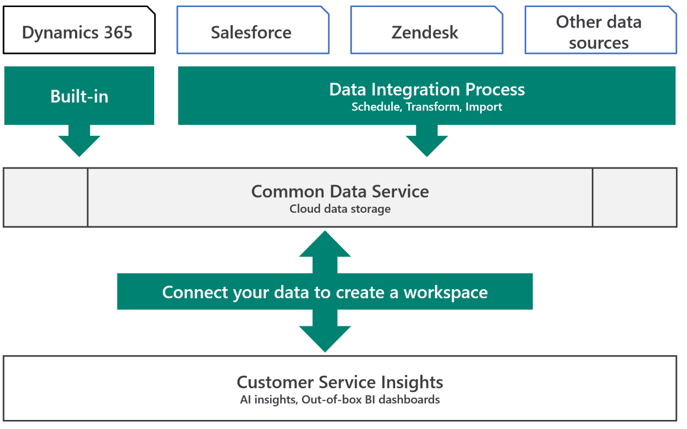

 

## Set up and use external data sources
There are four parts to connecting and using external data sources:
1.	[Set up a Common Data Service database in PowerApps](#set-up-a-common-data-service-database-in-powerapps)
2.	[Create a custom entity in PowerApps](#create-a-custom-entity-in-powerapps)
3.	[Import your data from an external source in PowerApps](#import-your-data-from-an-external-source-in-powerapps)
4.	[Map your data for AI insights in Customer Service Insights](#map-your-data-for-ai-insights-in-customer-service-insights)  

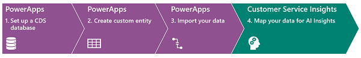
 

### Set up a Common Data Service database in PowerApps
What you’ll need: 
>[!div class=”checklist”]
> * A PowerApps account. If you don’t have one, [sign up](https://powerapps.microsoft.com/pricing/) for a free trial account at powerapps.com.
> * An environment in PowerApps where you are the **admin**. If you already have an environment, skip to the next section “[Create a custom entity in PowerApps](#create-a-custom-entity-in-powerapps)”, otherwise, you can create an environment by following the instructions in the [Create a Common Data Service database](/power-platform/admin/create-database) topic at the PowerApps documentation library.

### Create a custom entity in PowerApps
Entities are used to model and manage business data. CDS has two types of entities:
-	[Standard entities](https://docs.microsoft.com/dynamics365/ai/customer-service-insights/customer-service-entities) (CSI uses the standard incident entity by default)
-	[Custom entities](https://docs.microsoft.com/powerapps/maker/common-data-service/create-edit-entities-portal) that you can make (given incident is a restricted entity available only for those with a Dynamics 365 Customer Service license, you’ll need to create one of these to use external data sources)

This section will show you how to create a custom entity that you can use to import data from an external source.

>[!NOTE]
>You will need a database in your PowerApps account, where you have a security role of either a **System Administrator** or **System Customizer** to create custom entities. You can read more about how to do this in the [database security topic for Power Platform](/power-platform/admin/database-security).

To create a custom entity:
1.	In the [PowerApps Portal](https://make.powerapps.com/), select **Data**, then **Entities** in the navigation pane.

    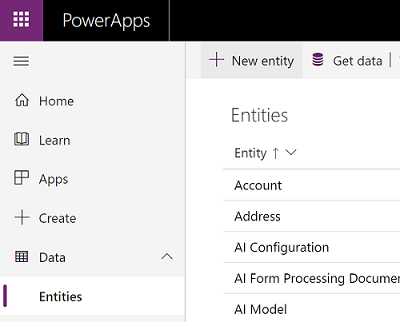
 
2.	Select **+ New entity** in the menu bar to open the **New entity** panel:
    1. Enter *my cases* in the first **Display name** field; the **Plural display name** and **Name** fields will be filled out automatically.
    2. Enter *Case Number* in the **Display name** field under the **Primary Field** section. The **Name** field will be filled out automatically.
    3. Click **Create** to create the entity. The entity will be automatically selected.

    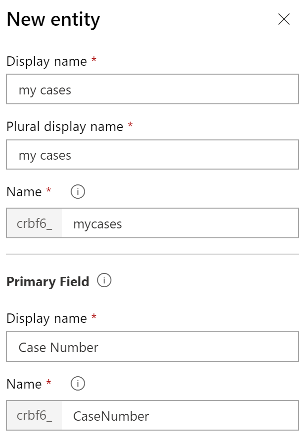
 
3.	Go to the **Keys** tab, and select **+ Add key**:
    1.	Enter **Case number** as the **Display name**, and select the **Case number** check box.
    
    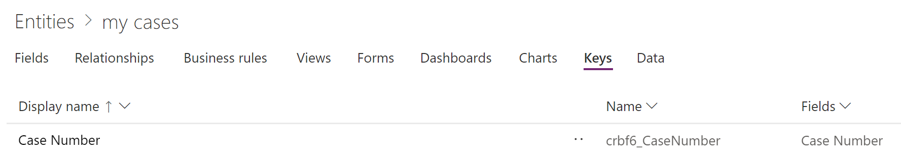 
 
4.	Go back to the **Fields** tab and click **+ Add field** to add each of the fields listed in the following table. 

<!-- Need to use html for complex lists inside table below -->

Field name|Field type|Required|Description
---|---|---|	---
*Case Number* |**Text**|	**Yes** |	The ticket number (or combination of characters and digits) you use to track cases. This should be unique and will be used as the primary key of the dataset.  Note: if your dataset has two separate fields for uniquely identifying each case the display number of each case (for example, *case id* and *case number*), it’s possible to create two separate fields for data import, and set the unique *case id* as the primary key, then map *case number* as the display field (shown in the next section)
*Case title* |	**Text** (single line) or **Multiline Text** (multi line) |	**Yes**|	A summary of the customer support issue. The AI will use this field to cluster similar cases based on semantic meaning.  Edit **Maximum length** under **Advanced options** to fit your data (for example, *500*). This is measured in characters allowed in the field.
*Source created date* |**Date and Time**|	**Yes** |	The date and time the case was created in common UTC time zone format.
*Resolved date* |	**Date and Time**|	**No** |	The date and time the case was last modified in common UTC time zone format.
*Is escalated* |	**Two Options** (Boolean)|	**No** |	True if the case has been escalated, otherwise False.
*Escalated date* |	**Date and Time**|	**No** |	If a case was escalated, the date and time the case was escalated in common UTC time zone format.
*Priority* |	**Option set** (Picklist)|	**No**|	Priority of the case, numeric values that indicate case urgency or severity.  Item name: <ul><li>High</li><li>Normal</li><li>Low</li></ul> In the **Option set** dropdown, select **+ New option set** to enter the labels. The value of each item can be edited later in the [classic solution explorer](#classic).
*Temp status* |	**Text**|	**No**|	The case status. Customer Service Insights uses the following values to identify case:<ul><li>Active</li><li>Inactive</li></ul> This is for storing the status data temporarily, see the section on [mapping data to expected outputs](#map-your-data-for-ai-insights-in-customer-service-insights) for further information and examples.
*Case origin channel* | **Option set** (Picklist)	| **No**|	The support channel where the case originated, input text values of channels your organization uses. For example: <ul><li>Phone</li><li>Email</li><li>Web</li><li>Facebook</li><li>Twitter</li></ul>
*SLA status* |	**Option set** (Picklist)	| **No**|	The status of the resolution time for the case according to the terms of the service level agreement (SLA).  A value of *4* indicates a noncompliant case. Other values indicate the case complies with the SLA. Customer Service Insights currently only reports on whether the case is compliant or not, for now it is only necessary to set *4* for noncompliant cases for dashboards to work, though having other values in the dataset will not affect the reporting. Item: <ul><li>In progress: 1</li><li>Nearing noncompliance: 2</li><li>Succeeded: 3</li><li>Noncompliant: 4</li></ul> You can set the numeric values in the [classic solution explorer](#classic).
*CSAT* |	**Option set** (Picklist) |	**No**|	The customer's level of satisfaction with the handling and resolution of the case. Customer Service Insights uses the following values to indicate the level of satisfaction: Item: <ul><li>Very dissatisfied: 1</li><li>Dissatisfied: 2</li><li>Neutral: 3</li><li>Satisfied: 4</li><li>Very satisfied: 5</li></ul> You can set the numeric values in the [classic solution explorer](#classic).
*Owning user* |	**Lookup**	or **Text**|**No**|	*Owning user* refers to the agents handling the case, it can be mapped to either a text string field that store your agent names directly, or a lookup of the *Owning user* field from the [**System user** entity](/powerapps/developer/common-data-service/reference/entities/systemuser).   Note for using a lookup field: *User*, *Team* and *Business unit* have a special relationship in the Common Data Service, see the [user team entities](/powerapps/developer/common-data-service/user-team-entities) topic for more information. . As long as your agent data is in the [**System user** entity](/powerapps/developer/common-data-service/reference/entities/systemuser), each case can be associated with an *agent ID* in your case entity, and Customer Service Insights will use the ID to look up the agent names from the [**System user** entity](/powerapps/developer/common-data-service/reference/entities/systemuser).
*Product* |	**Text**|	**No**|	While *Product* is a Dynamics 365 only lookup field, Customer Service Insights allow this field to be mapped to a text string field directly.  
*Business unit* |	**Lookup** or **Text**|	**No**|	*Business unit* can be mapped to either a text string field that store your business units directly, or a lookup of the *Owning business unit* field from the [**Business unit** entity](/powerapps/developer/common-data-service/businessunit-entity).   Note for using a lookup field: *User*, *Team* and *Business unit* have a special relationship in the Common Data Service, see the [user team entities](/powerapps/developer/common-data-service/user-team-entities) topic for more information. *Business unit* is a lookup from the [**Business unit** entity](/powerapps/developer/common-data-service/businessunit-entity), which is associated with your user data. Customer Service Insights will look up the *Business unit* for each agent from the [**Business unit** entity](/powerapps/developer/common-data-service/businessunit-entity).
*Team* |	**Lookup** or **Text**|	**No**|	*Team* can be mapped to either a text string field that store your teams directly, or a lookup of the *Owning team* field from the [**Team** entity](/powerapps/developer/common-data-service/reference/entities/team).   Note for using a lookup field: *User*, *Team* and *Business unit* have a special relationship in the Common Data Service, see the [user team entities](/powerapps/developer/common-data-service/user-team-entities) topic for more information.  *Team* is a lookup from the [**Team** entity](/powerapps/developer/common-data-service/reference/entities/team), which is associated with your user data. Customer Service Insights will look up the *Team* for each agent from the [**Team** entity](/powerapps/developer/common-data-service/reference/entities/team).

 
To change the value of an **Option set** item, select **Solutions** in the navigation pane, then select **Switch to classic** to open the Classic Solution Explorer.

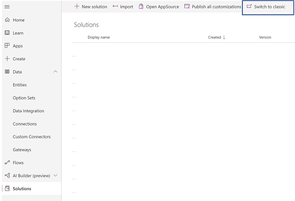

In the Classic Solution Explorer, select **Common Data Services Default Solution**, which will open a new window. 

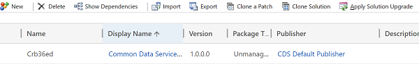

 In the Common Data Services Default Solution explorer, select **Option Sets** to see all the option sets you just created above. Double click on an item to edit.
 
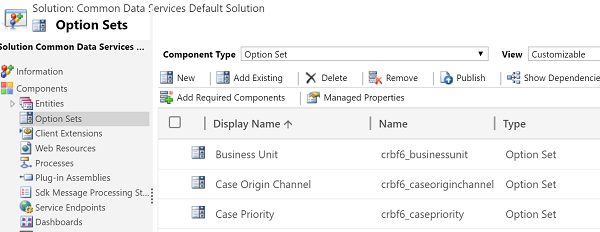
   
 In the **Option sets** window, change the **Value** field to the expected numeric value stated in the table above. Ignore any warnings that appear. 

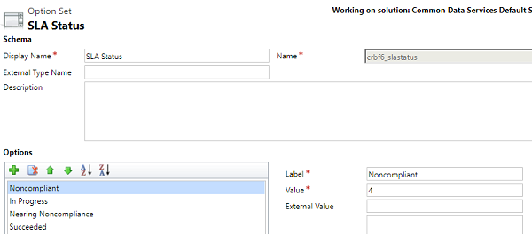

Repeat this for the option sets for each of the fields **CSAT** and **SLA Status**.

### Import your data from an external source in PowerApps
Now that you have created the associated entity within CDS, you will need to set up the data import process to populate the entity created. 

1.	In the [PowerApps Portal](https://make.powerapps.com/), select **Data**, then **Entities** in the navigation pane.

    

1.	In the **Power Query** window, select the type of data source that you want to import data from, and enter the appropriate connection URL and settings You should be able to obtain this from the external product’s configuration. 
    > [!NOTE]
    > You may need to disable any adblockers to let a new window to show up.  

1.	Once the data is loaded, you can use the built-in Power Query functionalities to transform the data further to match the expected values from the fields previously created. 

    For example, if your data has status listed in a text format, it’s possible to add a conditional column to transform the data into numeric values. In the following example you’d do this by adding a conditional column under the **Add column** button on the top navigation bar. Then, for each status, you’d map the string value to the number value, such as *Active* as *0*.

    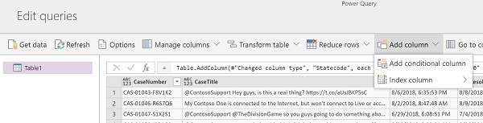

    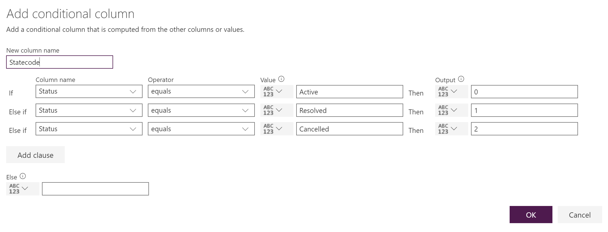
1.	In the **Map entities** window, choose the entity previously created, and use your data fields as the source to map to the entity’s destination fields.

    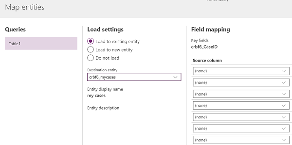

1. Lastly, the **Temp status** field needs to be mapped to the system **Statecode** field.  Open the [Power Platform Admin center and go to Data Integration](https://admin.powerplatform.microsoft.com/ext/DataIntegration).

1. Find the project you just created, usually named as **Project #**, and select it to access details for the project.
1.	Find the item for **Temp status**, click on the **destination field** to open a window for changing the destination field to **Statecode**.
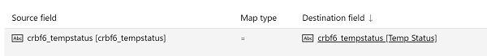
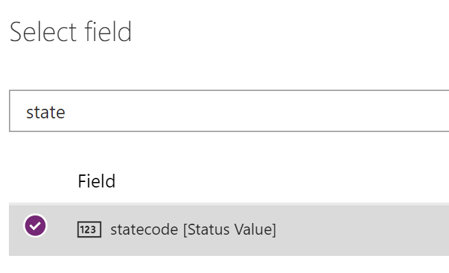
1.	Once done, click **Save** and then **Run project**. 
1.	Use the **Execution history** to confirm there are no errors for the last run, and now the data is ready in CDS to be used in Customer Service Insights.

> [!TIP]
> - Each project can be edited to either transform the data or remap old/new fields, go to the Data Integration section in PowerApps to find your project to edit.
> - Each job can be scheduled to run on a regular basis, this can also be configured for each Data Integration project.
> - The Admin center of PowerApps shows the detailed progress and status of each project execution run. You can use this to explore for more information or to conduct investigation into the project’s history.

### Map your data for AI insights in Customer Service Insights
Now you can map your data in Customer Service Insights. 

Go to [Customer Service Insights](https://csi.ai.dynamics.com/) to create a workspace connected to your CDS data, as described in the [Map data topic](/dynamics365/ai/customer-service-insights/map-data) 

As an example, your entity and fields mapping should look like the following screenshots.

1.	Under the **Find case records** section, select your entity

    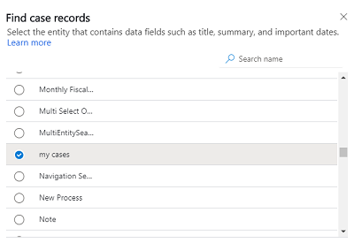

 
2.	Under the **Map case records** section, choose your fields

    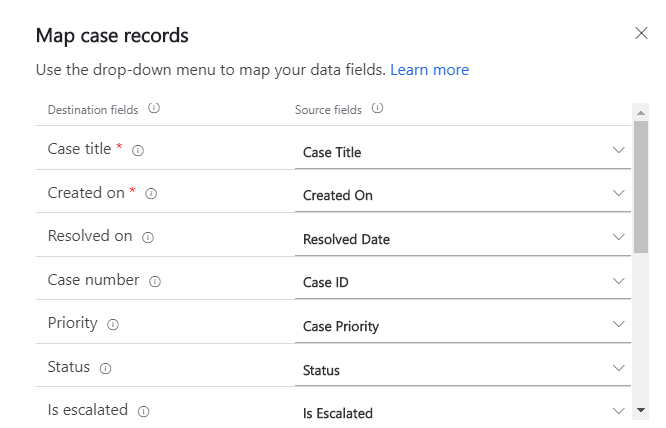
 

Once done, your workspace with external data imported in [Import your data from an external source in PowerApps](#import-your-data-from-an-external-source-in-powerapps) should be ready with topics identified by AI.
>[!TIP]
> - **KPI Summary**: use **Case Volume Drivers** and **Emerging Topics** to see areas for your cases, click on each topic to see how each affect the resolution, priority, incoming channel, and so on.
> - **New Cases:** find out which topics have the most new cases and emerging.
> - **Customer Satisfaction**: find out the topics that impact CSAT the most.
> - **Resolutions**: see which topics impact your resolution time both positively and negatively.
> - **Topics**: this is where you can manage topics and cases belonging to each topic, you can provide AI feedback to further influence how future AI clustering will work. 
> - You can right click on each topic and use **Drillthrough** to see a detailed dashboard for a topic.

