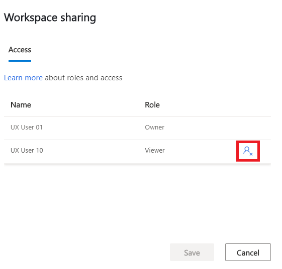

# Use and manage workspaces to connect to different customer service environments

When you work with the dashboards in Dynamics 365 Customer Service Insights, you have a choice of connecting to a live customer service environment or exploring the dashboards using sample data in the demo workspace. You can then create additional workspaces to gain insights into different customer service environments and switch between the workspaces.

You can use and manage workspaces in a variety of ways, including:

* [Creating a workspace](#creating-a-workspace)
* [Opening the demo workspace](#opening-the-demo-workspace)
* [Switching between workspaces](#switching-between-workspaces)
* [Sharing a workspace](#sharing-a-workspace)
* [Deleting a workspace](#deleting-a-workspace)

## Creating a workspace

To launch Customer Service Insights, navigate to [https://csi.ai.dynamics.com](https://csi.ai.dynamics.com) in your browser. Customer Service Insights opens the **Connect your data** screen so you can create a workspace by connecting to a data source.

Each workspace displays customer service data from a specific customer service data environment. To connect to a Dynamics 365 Customer Service Insights environment, select **Dynamics 365** to display the **Choose an environment** screen.

You can gain insights into multiple sets of customer service data by creating workspaces that each connect to a different environment. For example, you could create different workspaces for environments containing customer support information for specific areas, such as beauty products, retail, or banking.

To configure the workspace, select the environment you want to use. Customer Service Insights opens the workspace and displays that environment's customer support data in the dashboards.

You can also create a new workspace by selecting the **Workspaces** icon on the Customer Service Insights title bar and then selecting **+Workspace**.

  

## Opening the demo workspace

By default, Customer Service Insights displays sample customer support data in a demo workspace. To open the demo workspace, select **demo workspace** on the **Connect your data** screen, or close the **Connect your data** screen.

## Switching between workspaces

Once you have created one or more workspaces, you can easily switch between workspaces, including the demo workspace.

To switch to a different workspace, select the **Workspaces** icon on the Customer Service Insights title bar. Customer Service Insights opens the **My workspaces** pane. The current workspace is marked with a check mark. Select a different workspace to make it the current workspace.

Customer Service Insights opens the workspace and displays the customer service data associated with the workspace in the dashboards. Next time when you visit Customer Service Insights, it will open the last workspace you switched to. 

## Sharing a workspace

If you want other users to have access to your workspace, you can share it.

To share a workspace, select the **Workspaces** icon on the Customer Service Insights title bar to open the **My workspaces** pane. Hover over the workspace you want to share to display the **Share** icon, and then select the icon.

On the **Share** tab of the **Share this workspace** dialog box, enter the email address of a user who has a Customer Service Insights license to share the workspace. Users receive an email with an optional message when a workspace gets shared.

## Managing access to workspaces

There are two roles, with different permissions levels, for users of workspaces:  

- **Owner**: Creator of a workspace. 
  Owners can manage access to their workspaces by adding and removing users.
- **Viewer**: Read-only role to see a shared workspace without the ability to edit.  
  Viewers can access workspaces shared with them, and remove shared workspace from their "My workspaces" list.

## Deleting a workspace

If you no longer want Customer Service Insights to display a workspace in the list of current workspaces, you can delete it.

To delete a workspace, if you are the owner of a workspace, select the **Workspaces** icon on the Customer Service Insights title bar to open the **My workspaces** pane. Hover over the workspace you want to delete to display the **Delete** icon, and then select the icon.

If you are a viewer of a shared workspace, you can remove a shared workspace from your view by using the same **Delete** icon as noted above, or use the **Share** icon to use the **Share this workspace** dialog box to remove yourself from the list. Please note this only removes the shared workspace from your view, does not delete the workspace from other users. 

