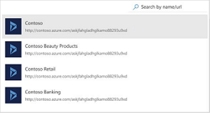
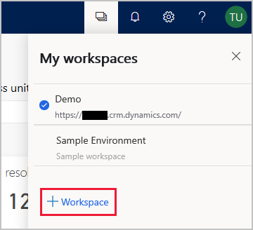
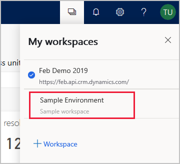
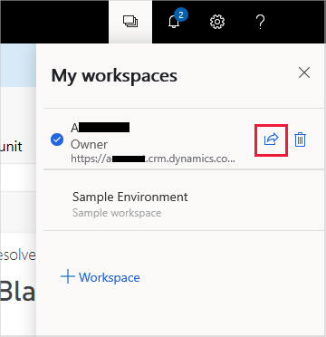

# Use and manage workspaces to connect to different customer service environments

[!INCLUDE [public-preview](../includes/public-preview.md)]

When you work with the dashboards in Customer Service Insights, you have a choice of connecting to a live customer service environment or exploring the dashboards using sample data in the demo workspace. You can then create additional workspaces to gain insights into different customer service environments and switch between the workspaces.

You can use and manage workspaces in a variety of ways, including:

* [Creating a workspace](#creating-a-workspace)
* [Opening the demo workspace](#opening-the-demo-workspace)
* [Switching between workspaces](#switching-between-workspaces)
* [Deleting a workspace](#deleting-a-workspace)

## Creating a workspace

To launch Customer Service Insights, navigate to [https://csi.ai.dynamics.com](https://csi.ai.dynamics.com) in your browser. Customer Service Insights opens the **Connect your data** screen so you can create a workspace by connecting to a data source.

> 

Each workspace displays customer service data from a specific customer service data environment. To connect to a Dynamics 365 for Customer Service Insights environment, select **Dynamics 365** to display the **Choose an environment** screen.

> 

You can gain insights into multiple sets of customer service data by creating workspaces that each connect to a different environment. For example, you could create different workspaces for environments containing customer support information for specific areas, such as beauty products, retail, or banking.

> 

To configure the workspace, select the environment you want to use. Customer Service Insights opens the workspace and displays that environment's customer support data in the dashboards.

You can also create a new workspace by selecting the **Workspaces** icon on the Customer Service Insights title bar and then selecting **+Workspace**.

  > 

## Opening the demo workspace

By default, Customer Service Insights displays sample customer support data in a demo workspace. To open the demo workspace, select **demo workspace** on the **Connect your data** screen, or close the **Connect your data** screen.

> 

## Switching between workspaces

Once you have created one or more workspaces, you can easily switch between workspaces, including the demo workspace.

To switch to a different workspace, select the **Workspaces** icon on the Customer Service Insights title bar. Customer Service Insights opens the **My workspaces** pane. The current workspace is marked with a check mark. Select a different workspace to make it the current workspace.

> 

Customer Service Insights opens the workspace and displays the customer service data associated with the workspace in the dashboards.

## Deleting a workspace

If you no longer want Customer Service Insights to display a workspace in the list of current workspaces, you can delete it.

To delete a workspace, select the **Workspaces** icon on the Customer Service Insights title bar to open the **My workspaces** pane. Hover over the workspace you want to delete to display the **Delete** icon, and then select the icon.

> 
<!---
## Sharing a workspace

If you want other users to have access to your workspace, you can share it.

To share a workspace, select the **Workspaces** icon on the Customer Service Insights title bar to open the **My workspaces** pane. Hover over the workspace you want to delete to display the **Share** icon, and then select the icon.

> 

On the **Share** tab of the **Share this workspace** dialog box, enter the email address of a user to share the workspace.

1.	Users can see sharing icon from my workspaces
2.	Add email address (within the tenant)
3.	Optional message
4.	Share will send user an email with link to access
5.	To access shared workspace user would need a license 

Managing access to workspaces

1.	See users with access
2.	Ability to revoke access 
3.	Learn more page about roles and permissions, it’s a fwlink that we can link to this specific documentation page. 

•	Owner: creator of a workspace. 
 o	Every user who’s using our product before the sharing feature are owners of their workspaces.
 o	They can manage access for their workspaces.
•	Viewer: new read-only role introduced with the sharing feature. 
 o	They can access workspaces created and shared by the owner. 
 o	They will need a CSI license to see the workspace.
 o	They cannot customize any settings or contribute to any AI feedback on the Topics page.

-->