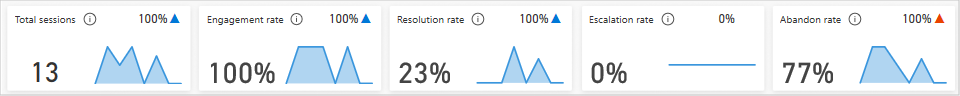

# Summary page

   > 

The Summary dashboard gives you a broad overview of your bot's performance. It uses artificial intelligence (AI) technology to show you which topics are having the greatest impact on support case escalation rate, abandon rate, and resolution rate.

The Summary dashboard includes a variety of charts with graphical views of your bot's key performance indicators. For information about each chart, select the link for the chart in the following list, or scroll to find the section about the chart later in this topic.

* [Summary charts](#summary-charts)
* [Escalation rate drivers](#escalation-rate-drivers-chart)
* [Abandon rate drivers](#abandon-rate-drivers-chart)
* [Resolution rate drivers](#resolution-rate-drivers-chart)
* [Session outcomes over time chart](#session-outcomes-over-time-chart)
* [Engagement over time chart](#engagement-over-time-chart)

The Engagement rate drivers, Abandon rate drivers, and Resolution rate drivers charts use natural language understanding to group support cases as topics. These charts show you the topics that are having the most impact on the performance of your bot.
 
By default, the dashboard shows you key performance indicators for the last seven days. To change the time period to the last 30 days, select **Last 30 days** from the drop-down list at the top of the dashboard.

## Summary charts

   > 

The Summary charts summarize the key performance indicators for the specified time period and the percent change over the period.

Description | Details
----------- | -------
Total sessions | The total number of sessions within the specified time period.
Engagement rate | The percentage of total sessions that are engaged sessions. An engaged session is a session in which a user-created topic (as opposed to system topic) is triggered, or the session ends in escalation. Engaged sessions can have one of three outcomes--they are either resolved, escalated, or abandoned.
Resolution rate | The percentage of engaged sessions that are resolved. A resolved session is an engaged session in which the user receives a customer satisfaction (CSAT) survey and either does not respond or responds *Yes*.
Escalation rate | The percentage of engaged sessions that are escalated. An escalated session is an engaged session that is escalated to a human agent.
Abandon rate | The percentage of engaged sessions that are abandoned. An abandoned session is an engaged session that is neither resolved nor escalated after one hour from the beginning of the session.
Average CSAT | The graphical view of the average of customer satisfaction (CSAT) scores for sessions in which customers respond to an end-of-session request to take the survey.

A blue up-and-down indicator next to the value indicates the percent change in a positive direction. A red indicator indicates the percent change in a negative direction.

## Escalation rate drivers chart

The Escalation rate drivers chart displays topics in order of their impact on the escalation rate over the specified time period.

Description | Details
----------- | -------
Topic | A Virtual Agent topic.
Rate | The percentage of engaged sessions for the topic that are escalated. An escalated session is an engaged session that is escalated to a human agent.
Impact | The topic's escalation rate impact score. The escalation rate impact score is the overall escalation rate including the topic minus the overall escalation rate excluding the topic.

The chart displays the impact as a red or blue bar. A red bar indicates that the topic's escalation rate is larger than the average escalation rate, resulting in a negative impact on overall escalation rate. A blue bar indicates that the escalation rate is smaller, resulting in a positive impact on overall escalation rate performance.

Lowering the escalation rate for the top escalation-rate topics in red has the greatest impact on improving the overall escalation rate.

To see additional information about each topic, select the Detail link to display the Topic details dashboard. For more information, see [Topic details dashboard](analytics-topic-details.md).

## Abandon rate drivers chart

The abandon rate drivers chart displays topics in order of their impact on the abandon rate over the specified time period.

Description | Details
----------- | -------
Topic | A Virtual Agent topic.
Rate | The percentage of engaged sessions for the topic that are abandoned. An abandoned session is an engaged session that is neither resolved nor escalated after one hour from the beginning of the interaction.
Impact | The topic's abandon-rate impact score. The abandon-rate impact score is the overall abandon rate including the topic minus the overall abandon rate excluding the topic.

The chart displays the impact as a red or blue bar. A red bar indicates that the topic's abandon rate is larger than the average abandon rate, resulting in a negative impact on overall abandon rate. A blue bar indicates that the abandon time is shorter, resulting in a positive impact on overall abandon rate performance.

Improving the abandon rate for the top abandon-rate topics in red has the greatest impact on improving the overall abandon rate.

To see additional information about each topic, select the Detail link to display the Topic details dashboard. For more information, see [Topic details dashboard](analytics-topic-details.md).

## Resolution rate drivers chart

The Resolution rate drivers chart displays topics in order of their impact on the resolution rate over the specified time period.

Description | Details
----------- | -------
Topic | A Virtual Agent topic.
Rate | The percentage of engaged sessions for the topic that are resolved. A resolved session is an engaged session in which a customer receives an end-of-session survey and either does not respond to the survey or responds *Yes*.
Impact | The topic's resolution-rate impact score. The resolution-rate impact score is the overall resolution rate including the topic minus the overall resolution rate excluding the topic.

The chart displays the impact as a red or blue bar. A red bar indicates that the topic's resolution rate is larger than the average resolution rate, resulting in a negative impact on overall resolution rate. A blue bar indicates that the resolution time is shorter, resulting in a positive impact on overall resolution rate performance.

Improving the resolution rate for the top resolution-rate topics in red has the greatest impact on improving the overall resolution rate.

To see additional information about each topic, select the Detail link to display the Topic details dashboard. For more information, see [Topic details dashboard](analytics-topic-details.md).

## Session outcomes over time chart

The Session outcomes over time chart provides a graphical view of the daily resolution rate, escalation rate, and abandon rate over the specified time period.

Description | Details
----------- | -------
Resolved | The daily rate of resolved sessions. A resolved session is an engaged session in which the user receives a customer satisfaction (CSAT) survey and either does not respond or responds *Yes*.
Escalated | The daily rate of escalated sessions. An escalated session is an engaged session that is escalated to a human agent.
Abandoned | The daily rate of abandoned sessions. An abandoned session is an engaged session that is neither resolved nor escalated after one hour from the beginning of the session.

## Engagement over time chart

The Engagement over time chart provides a graphical view of the number of engaged and unengaged sessions over time. An engaged session is a session in which a user-created topic is triggered, or the session ends in escalation.

Description | Details
----------- | -------
Engaged | The daily number of engaged sessions.
Unengaged | The daily number of unengaged sessions.