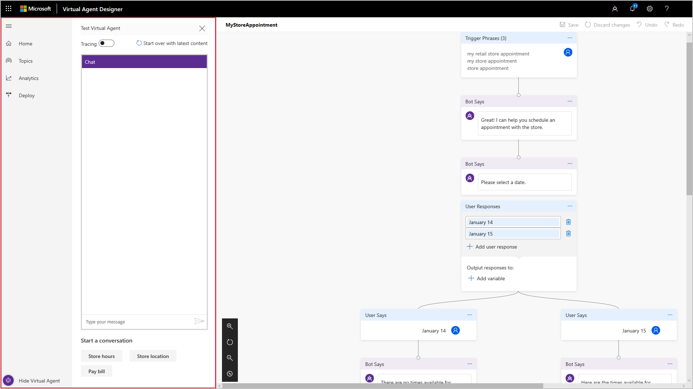
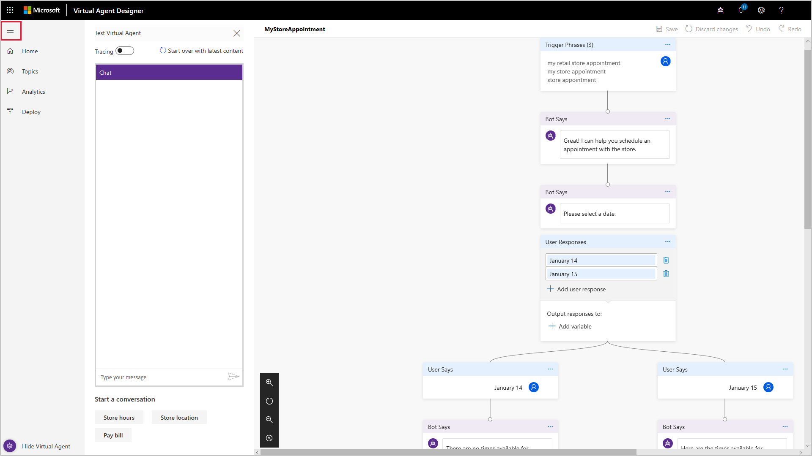
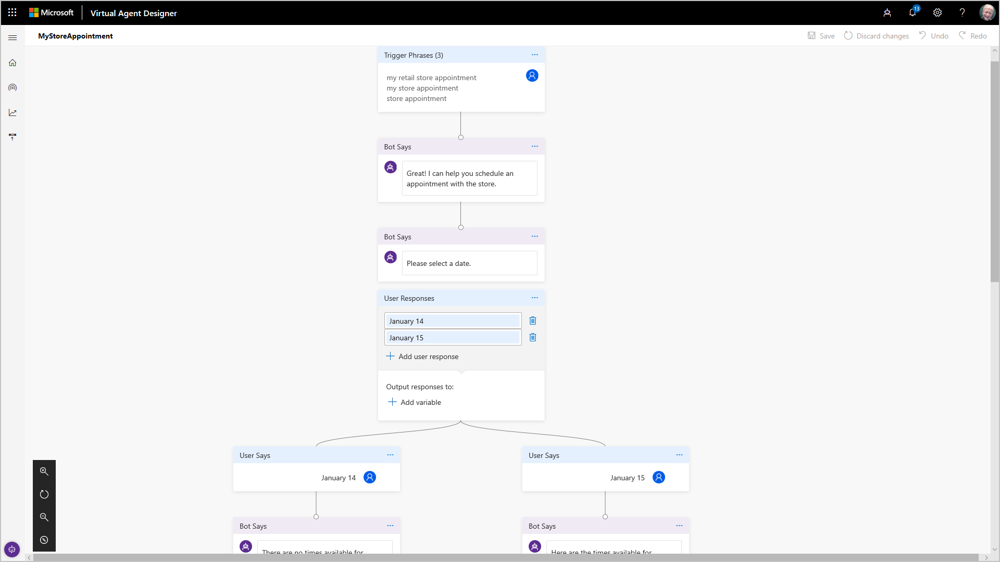

# Working with the conversation editor design canvas

As you design the conversation path for your virtual agent in the conversation editor, you often create a conversation path with multiple nodes and branches based on a customer's response to the options you specify. As the conversation path becomes more complex, it can become challenging to view and work with it in the conversation editor design canvas.

To help you work with a complex conversation path, Virtual Agent Designer provides a variety of tools to make it easier to work with the conversation editor design canvas. You can:

* Increase the size of the design canvas by hiding the Test Virtual Agent and navigation pane.
* Adjust the position of the design canvas using the horizontal scroll bar.
* Use the conversation editor's **Zoom in** 8and **Zoom out** buttons to zoom in and out of the design canvas.
* Use the conversation's **Mini-map** button to orient the current view of the conversation path in the conversation path as a whole.

## Increase the size of the design canvas

When you open a topic in the conversation editor, Virtual Agent Designer by default displays the Test Virtual Agent and navigation panes along with the conversation editor design canvas.

   > 

To increase the size of the conversation editor design canvas, you can hide the Test Virtual Agent and navigation panes.

To hide the Test Virtual Agent, select **Hide Virtual Agent** in the lower left corner of the Virtual Agent Designer.

   > 

To hide the navigation pane, select the navigation pane icon in the upper left corner of the Virtual Agent Designer.

   > 

After you hide the Test Virtual Agent and navigation panes, the conversation editor design canvas uses the full Virtual Agent Designer screen.

   > 

To restore the Test Virtual Agent, select **Show Virtual Agent** or the Show Virtual Agent icon. To restore the navigation pane, select the navigation pane icon again.