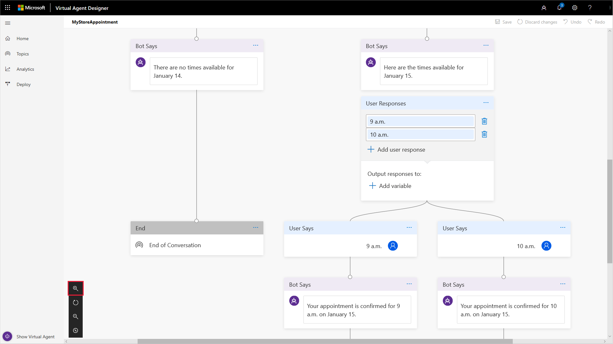
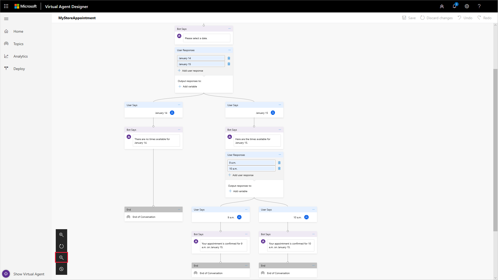
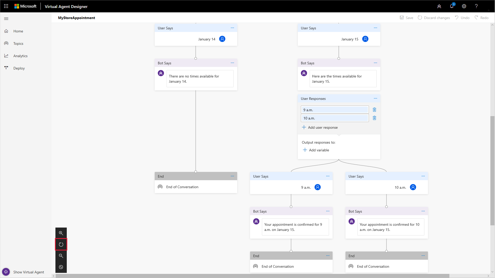
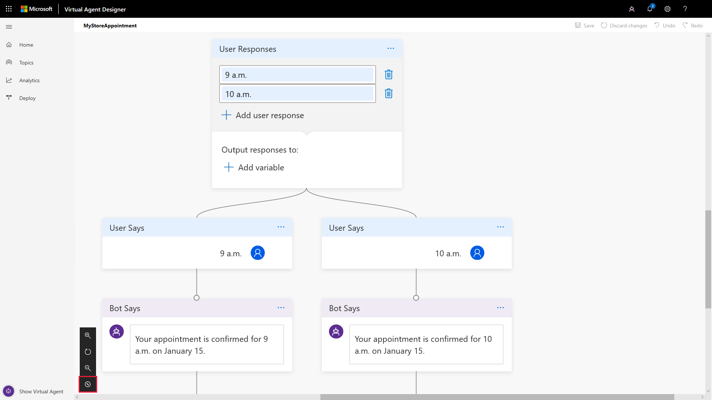
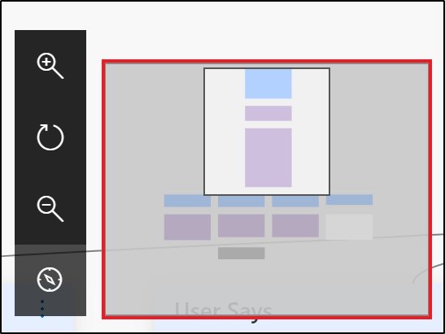

# Working with the conversation editor design canvas

As you design the conversation path for your virtual agent in the conversation editor, you often create a conversation path with multiple nodes and branches based on a customer's response to the options you specify. As the conversation path becomes more complex, it can become challenging to view and work with it in the conversation editor design canvas.

To help you work with a complex conversation path, Virtual Agent Designer provides a variety of tools to make it easier to work with the conversation editor design canvas. You can:

* [Increase the size of the design canvas](#increase-the-size-of-the-design-canvas) by hiding the Test Virtual Agent and navigation pane.
* [Adjust the position of the conversation path](#adjust-the-position-of-the-conversation-path) in the design canvas by using the horizontal scroll bar.
* [Zoom in and out of the design canvas](#zoom-in-and-out-of-the-design-canvas) by using the conversation editor's **Zoom in** and **Zoom out** buttons.
* [Orient the current view of the conversation path](#orient-the-current-view-of-the-conversation-path) within the conversation path as a whole by using the conversation editor's **Mini-map** button.

## Increase the size of the design canvas

When you open a topic in the conversation editor, Virtual Agent Designer by default displays the Test Virtual Agent and navigation panes along with the conversation editor design canvas.

   > 

To increase the size of the conversation editor design canvas, you can hide the Test Virtual Agent and navigation panes.

To hide the Test Virtual Agent, select **Hide Virtual Agent** in the lower left corner of the Virtual Agent Designer.

   > 

To hide the navigation pane, select the navigation pane icon in the upper left corner of the Virtual Agent Designer.

   > 

After you hide the Test Virtual Agent and navigation panes, the conversation editor design canvas uses the full Virtual Agent Designer screen.

   > 

To restore the Test Virtual Agent, select **Show Virtual Agent** or the Show Virtual Agent icon. To restore the navigation pane, select the navigation pane icon again.

## Adjust the position of the conversation path

If the width of your conversation path design exceeds the width of the design canvas, you can adjust the position of the conversation path in the design canvas using the conversation editor's horizontal scroll bar.

   > 

By moving the scroll bar to the right, the conversation path design can be positioned to fit in the design canvas.

   > 

## Zoom in and out of the design canvas

To help you view and navigate your conversation path, you can zoom in and out of the design canvas using the conversation editor's **Zoom in** and **Zoom out** buttons.

Select the **Zoom in** button to zoom in for a closer view of part of your conversation path.

   > 

Select the **Zoom out** button to zoom out for a big picture view of your conversation path.

   > 

To restore the design canvas to its original zoom level, select the **Reset** button.

   > 

## Orient the current view of the conversation path

To help you orient the current view of the conversation path within the conversation path as a whole, you can use the conversation editor's **Mini-map** button.

First, select the **Mini-map** button.

   > 

The conversation editor displays a graphic schematic of the conversation path with the current view highlighted.

   > 