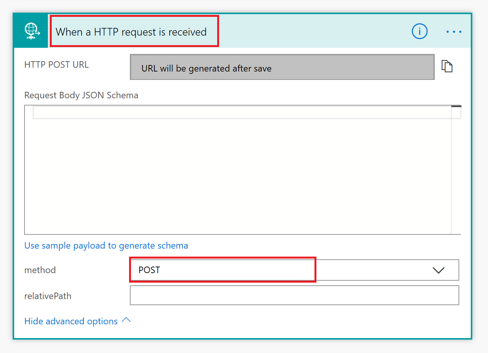

# Frequently asked questions

[!INCLUDE [cc-beta-prerelease-disclaimer](../includes/cc-beta-prerelease-disclaimer.md)]

## Known issues

### Customers from outside of the US signing up for Virtual Agent

Preview is currently only supported in the US, with data stored in US data centers. If your company is located outside of the US, you will need to create a custom environment with region set to “United States” before you can create your bot. For more information on how to create a custom PowerApps environment, see [Creating a PowerApps environment](getting-started-new-environment.md).

### Issues with Flow solutions tab

If you are a new customer to Microsoft and you visit flow.microsoft.com shortly after you have created your first bot, you might encounter two issues:
1. Missing "Solutions" tab on the left rail of flow.microsoft.com. The "Solutions" tab should appear within 24 hours. You can try refreshing the page to resolve the issue earlier.
2. Within the "Solutions" tab when you choose Common Data Services Default Solution you might get a permission error. Please note that you can still create a flow and connect it to the bot designer. However, the flow might not appear at flow.microsoft.com for up to 24 hours.

### Issues with environment permissions when creating a bot

If you experience any problems with your bot creation due to permission issues with the environment you selected, you can [try creating a new environment](getting-started-new-environment.md) and use that environment to create your bot.

### Other issues when creating a bot

See [Creating a bot](getting-started-create-bot.md) if you have any issues while creating your bot.

## General 

### What are the various browsers supported by the Virtual Agent?

Virtual Agent is supported in the latest versions of Edge, Chrome, and Fire Fox. It is not supported in Internet Explorer.
 
### Can Virtual Agent be styled and branded for an organization? What can be customized and how?

Currently we don't have any styling or brand customization (e.g. changing the default image) for the bot. But this is on the roadmap for a future release.

### Can multiple team members collaborate on a single bot instance?

We don’t have multi author support currently. It is one bot per author. However, we have this feature on the roadmap for future releases. The current mitigation is to create a service account and share it across the content authors.

### Can I sign in using my personal Microsoft account?

No, you can currently only sign in using your work or school Microsoft account.

### Virtual Agent Designer does not seem to allow us to store the user utterance that triggered the topic as a variable, is that by design?

Yes, Virtual Agent currently doesn't allow storing the user utterance that triggered the topic as a variable. This feature is on the roadmap for a future release.

### I ran into a problem. What should I do to file a bug? How quickly will you get back to me? 

You can file bugs in the in the [community forum](https://go.microsoft.com/fwlink/?linkid=2058639). We will respond within 48 hrs.

### I have a new feature idea or some ideas on how to make a feature work better. How should I submit these ideas to the product team?

That's great, we'd love to hear your thoughts. [Submit your ideas and feedback in our Idea forum](https://go.microsoft.com/fwlink/?linkid=2064961).

## Bot creation and environments

### The creation of my bot takes long time. Is that expected?

Currently, it can take up to 15 minutes to create the first bot within a tenant. While the bot is being created you can explore the portal. Note that any changes won't get saved until the bot is fully created.

### Why do I get an error that I do not have permissions to any environments?

It is possible that you do not have read/write access to any environments. In this case, you will see the error: “You do not have permissions to any environments. Please get access from an administrator.” 
To resolve this issue, follow the steps in [To create a new PowerApps environment](getting-started-new-environment.md) to create a new environment. Use that environment to create your bot.

### Why do I get "An unexpected server error occurred"?

This might be an issue with your current environment. If refreshing your browser doesn't resolve the issue, follow the link to [create a new PowerApps environment](getting-started-new-environment.md). Use that environment to create your bot.

### The PowerApps environment I created does not show up in the drop down menu of Virtual Agent, why?

Your environment might not show up in the drop down due to the following reasons:
 - The environment doesn't have a database created. To resolve this, go to [admin.powerapps.com](https://admin.powerapps.com) and create a database in your environment.
 - The environment's region is set to non-US. To resolve this, follow the steps in [To create a new PowerApps environment](getting-started-new-environment.md) and create an environment in the US region.
 - The environment didn't finish setting up. To resolve this, retry in a few minutes

## Topic creation and management  

### What is a topic? 

A bot is a collection of topics. You can author topics by customizing a provided templates or creating new topics from scratch.  

### What is the difference between a system topic and a provided template user topic? 

A system topic is linked to predefined features like a customer survey, escalation to a live agent, or the bot greeting. Some areas of the system topics can be modified. User topics can be modified or deleted. They are for your customization to fulfill the needs of your Virtual Agent bot. 

### How do I create my own custom Topic?  

You can find all details about creating your own topics in this article: [Creating custom topics for your bot](getting-started-create-topics.md)

### How can I test topics that I've customized or created from scratch to make sure they are working properly?

Virtual Agent lets you test your bot and see how the conversation you designed in the conversation editor works in practice. 
You can test a virtual agent topic by entering a trigger phrase for the topic at the "Type your message" prompt at the bottom of the Test bot. Select any chat bubble to navigate to that point in the conversation. 

### When I test the bot, it doesn't seem to reflect my edits. What's happening? 

You need to make sure to save the topic you're editing and then select the "Start over with latest content" button in the Test bot to ensure the latest content gets updated in the chat canvas. 

### What is the green outline that appears while I'm testing my topic? 

The green outline appears around each node that is successfully tested while using the Test bot. Nodes that fail will be outlined in red. 

### What is the “Follow” control in the Test bot? 

Turn on Follow to jump between topics while testing your bot. The conversation on the right will update simultaneously. Click on any chat bubble to navigate to that point in the conversation. 

### What is Topic Checker? 

Topic Checker is where you can see a comprehensive list of all errors and warnings in your topic.  Errors and Warnings can be saved with a topic and cleared upon subsequent visits. Errors should be cleared up before deploying your bot to production. Warnings are skipped by the bot. 

### Is it possible to link multiple topics?
You can link a different topic within a topic by using the **Go To** option which appears while adding a new node in the dialog flow of a topic.

### Is it possible to launch the bot to address a specific topic from a link on the page? The scenario we have in mind is a list of links/actions on the page and a couple of them will launch a topic on the bot.

Currently we don't support context passing in the bot, so you will not be able to launch the bot or trigger a specific topic based on a link or action on the web page. 
Some inofficial workarounds you may want to consider: deploy the Bot on a custom page, and launch that page as an iframe or pop-up from the parent web page, when the link or action is launched.
For triggering specific topics you could have multiple bots, and have the Topic content added as part of the Greeting, which always appears when starting a conversation. The downside is that it will be cumbersome to maintain multiple bots for different sets of links/actions.

### What’s a variable and how do I use it? 

Variables store customer responses to Bot questions.  Variables can further be used in expressions evaluating a customer response or passed to a Flow.  Variables can also be used to confirm a customer response. 

## Flow integration 

### How do I create a Microsoft Flow action in Virtual Agent?

A: Here is a [video on how to create a Microsoft Flow action](https://go.microsoft.com/fwlink/?linkid=2079323) that can be executed from Virtual Agent.

### What license do I need to use Microsoft Flows in Virtual Agent?

Every bot author will be automatically licensed to use Microsoft Flows. No extra steps are needed, as bot authors will be assigned a P2 Plan Flow license as part of their Virtual Agent license. For details, please refer to [Microsoft Flow Plans documentation](https://flow.microsoft.com/pricing/).

### I created some new flows for actions using Microsoft Flow, but they are not visible in Virtual Agent. Why?

- The environment you are using to create your flows must be the same as the environment you are using for the bot.   
- Make sure to [create your Flows in Solutions](https://docs.microsoft.com/flow/overview-solution-flows), as the bot can't see the Flows created in My Flows tab. 
- Bots can only invoke Flows that have HTTP Request interfaces, so you need to select the right trigger for your Flow. Select **When Http Request is received** from the trigger list in the Microsoft Flow, and make sure you are using the **POST** method under advanced options in the trigger (or leave the method field empty, how it is by default):

View this video on how to [create a Flow action](https://go.microsoft.com/fwlink/?linkid=2079323) that can be used with bots. 

### I created a flow with HTTP Request trigger, and it's visible in my bot, but when I test my Topic, it fails. Why?

Please make sure this Flow is turned on (enabled) on the Flow portal. Flows which are turned off (disabled) on Flow portal are visible when editing a bot and can be incorporated into actions. However, they will fail at runtime until they are turned on in the Flow portal.

### What are the response formats that the Virtual Agent accepts, especially in the message response provided by the Flow action?

The Virtual Agent designer accepts only JSON object format in the message response. The JSON object can contain strings and numbers only. In the coming months, we will release a custom Flow connector that will make it easier to create Flows using key/value pairs rather than requiring to use JSON format.  We do not support arrays as Flow output for Bots yet, but this feature is on the roadmap. 

### Can we call a third-party API from a Flow?

Yes, an existing API or another application can be called from a Flow and the results can be passed back to the Virtual Agent as Flow output. Microsoft Flow provides hundreds of Connectors to enable you to connect to apps, data and devices in the cloud. 

Examples of popular connectors include Microsoft Common Data Service (CDS), Dynamics 365, Salesforce, Zendesk, ServiceNow, Office 365, Microsoft Teams, Slack, Facebook, Twitter, Dropbox, MailChimp, Google services, and many more. Please refer to [Microsoft Flow Connector documentation](https://docs.microsoft.com/connectors/) to see the full list of available Flow Connectors.

If there is no suitable Connector that you can use out of the box in Flow, you can use an HTTP call inside a Flow to connect to a custom 3rd-party API, like in the example below:

### Can we call a third-party API directly from the Virtual Agent action, without going through a flow?

This capability is not currently available directly from the Virtual Agent experience, but you can call any third-party API by wrapping the call in a Flow. If this feature is critical to your business, please [submit your ideas and feedback in our Idea forum](https://go.microsoft.com/fwlink/?linkid=2064961).

### How do I work with my data in Microsoft Flow?
Microsoft Flow provides [hundreds of data Connectors](https://docs.microsoft.com/connectors/) and offers many ways to manipulate you data. Please refer to the following Microsoft Flow documentation on more information on how to:
- [Use Common Data Service (CDS)](https://docs.microsoft.com/flow/connection-cds)
- [Create a flow that uses the Common Data Service](https://docs.microsoft.com/flow/common-data-model-intro)
- [Create multi-step flows](https://docs.microsoft.com/flow/multi-step-logic-flow)
- [Add condition in a flow](https://docs.microsoft.com/flow/add-condition)
- [Use expressions with conditions](https://docs.microsoft.com/flow/use-expressions-in-conditions)
- [Use functions in expressions](https://docs.microsoft.com/azure/logic-apps/workflow-definition-language-functions-reference)
- [Perform data operations](https://docs.microsoft.com/flow/data-operations)
- [Loop through your data](https://docs.microsoft.com/flow/apply-to-each)
- [Filter and copy data](https://docs.microsoft.com/flow/odata-filters)
- [Troubleshoot your flow](https://docs.microsoft.com/flow/fix-flow-failures)

### If we have authentication for the user, can we pass user authentication info to a flow?

Currently, passing end user authentication to a Flow is not supported in Virtual Agent, but we have this feature on the Roadmap and will be enabled over the coming months.  We will start with token-based authentication.  If you have specific authentication requirements that you would like us to be aware of, please [submit your ideas and feedback in our Idea forum](https://go.microsoft.com/fwlink/?linkid=2064961).

### Can I share the flows I created with other users?
You can add other users in you organization as owners of the flows you have created. Please click on the flow to open its Details page, and select "Add another owner" option in Owners section:

### How do I move or copy my flows between different environments?

You can export and import solutions containing your flows to move them between environments. Note that there is currently no way to export or import a single flow. For more information on how to import and export solutions, please refer to the Microsoft Flow documentation:
- [Export a Solution](https://docs.microsoft.com/flow/export-flow-solution)
- [Import a Solution](https://docs.microsoft.com/flow/import-flow-solution)

### Where can I find out more about Microsoft Flows?
You can find out more about the capabilities of Microsoft Flows on [Frequently asked quetsions](https://docs.microsoft.com/flow/frequently-asked-questions) page or by using [Flow documentation](https://docs.microsoft.com/flow/getting-started).
You can also learn new skills and discover the power of Microsoft Flow with step-by-step [Flow training modules](https://docs.microsoft.com/learn/browse/?products=flow).

## Deployment 

### How do I share my bot with others?

You find the details in this article: [To share your bot in the demo website](getting-started-deploy.md#to-share-your-bot-in-the-demo-website)

### How I install the bot in a Modern SharePoint site? Is there any additional work that will be required if the given Modern SharePoint restricts embedding code from external sites?

If the Modern SharePoint site allows embedding an iframe, it should be able to embed the bot. We have an iframe code snippet that you can get for your respective bot by going to the **Deploy** page. That snippet can be pasted in any html web page and from there you should see your bot appear. You can get this code to embed in your SharePoint site from **Deploy** > **Custom Website** in Virtual Agent.

## Analytics 

### What is the difference between conversation and session? How do sessions work? 

A conversation is the entire interaction between the bot and a user, starting from the user’s first message to when the chat window is closed or inactive for about an hour. Within a conversation, the user may have more than one query. 
A session is intended to capture just one query or problem within a conversation. So, a conversation can have multiple sessions. A session starts with the user’s initial query and ends when the user indicates the problem is solved (confirmed success topic) or the session is escalated (escalation topic).
