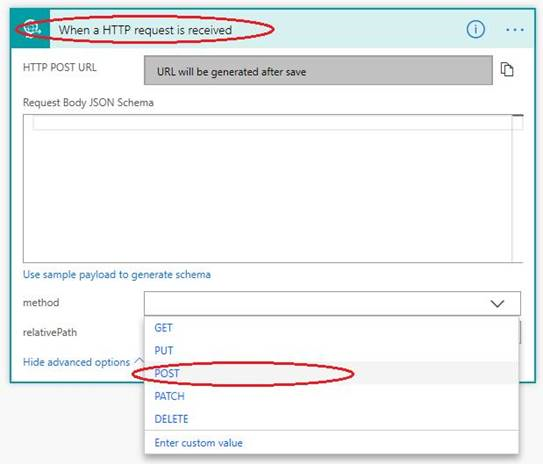

# Frequently asked questions

[!INCLUDE [cc-beta-prerelease-disclaimer](../includes/cc-beta-prerelease-disclaimer.md)]

## General 

### What are the various browsers supported by the Virtual Agent?

Virtual Agent is supported in the latest versions of Edge, Chrome, and Fire Fox. It is not supported in Internet Explorer.
 
### Can Virtual Agent be styled and branded for an organization? What can be customized and how?

Currently we don't have any styling or brand customization (e.g. changing the default image) for the bot. But this is on the roadmap for a future release.

### Can multiple team members collaborate on a single bot instance?

We don’t have multi author support currently. It is one bot per author. However, we have this feature on the roadmap for future releases. The current mitigation is to create a service account and share it across the content authors.

### Can I do end user authentication using AAD or MSA from within the bot?

We currently do not support any authentication from within the Virtual Agent. However, native support for end user authentication is on the roadmap.

### Virtual Agent Designer does not seem to allow us to store the user utterance that triggered the topic as a variable, is that by design?

Yes, Virtual Agent currently doesn't allow storing the user utterance that triggered the topic as a variable. This feature is on the roadmap for a future release.

### I ran into a problem. What should I do to file a bug?  How quickly will you get back to me? 

You can file bugs in the in the [community forum](https://go.microsoft.com/fwlink/?linkid=2058639). We will respond within 48 hrs.
### I have a new feature idea or some ideas on how to make a feature work better. How should I submit these ideas to the product team?

That's great, we'd love to hear your thoughts. [Submit your ideas and feedback in our Idea forum](https://go.microsoft.com/fwlink/?linkid=2064961).

## Bot creation and environments

### Why do I get an error that I do not have permissions to any environments?

It is possible that you do not have read/write access to any environments. In this case, you will see the error: “You do not have permissions to any environments. Please get access from an administrator.” 
To resolve this issue, follow the steps in [To create a new PowerApps environment](getting-started-new-environment.md) to create a new environment. Use that environment to create your bot.

### Why do I get "An unexpected server error occurred"?

Is it possible that you do not have sufficient priveleges for the selected environment. Ideally the region (environment) dropdown UI should only contain environments a user has read/write access to; however, the dropdown is not currently constrained to this. If you select an environment that you have has insufficient access to, you will get the following error: “An unexpected server error occurred. Please retry creating your bot.”
To resolve this issue, follow the steps in [To create a new PowerApps environment](getting-started-new-environment.md) to create a new environment. Use that environment to create your bot.

### Why does my bot creation time out after a long delay?

When creating the first bot in an environment, there is a known issue where the bot creation takes a long time and either eventually succeeds and lands the user on the Virtual Agent home screen, or errors out. If an error occurred and you are sure you had sufficient environment privileges (i.e., you created the environment as guided above), then proceed with refreshing your browser. After the refresh, in most cases, you will find that the bot creation succeeded despite the error; else retry the bot creation again.

### The PowerApps environment I created does not show up in the down menu of Virtual Agent, why?

Please check if you selected the Region as "USA" while creating the Power Apps (Common Data Service) environment. Currently we support only environments in USA. If you created an environment in other regions, it won't be shown in Virtual Agent. The workaround is to create a new environment with location as "USA" or use an existing environment that was created in "USA" region.

### What is the cost involved in using Microsoft Flow Actions in Virtual Agent?

A Flow license is per user. Users get Flow licenses automatically when they get a Bot license (which is based on number of sessions). There may be a limit for how many Bot Author (P2 Flow licenses) you can have based on the bracket of Bot license you purchased. 

Here is how the flow licensing works in the context of the bot license.
If you have 10 bot authors in your organization:
 - each of them gets a P2 Flow license
 - every P2 license comes with 15K Flow "runs" per month
Flow runs are "pooled" and the runs are anonymous - so the org actually gets 10x15K Flow runs any Flow can use. Now, this 10x15K is a big number to have for a month, and they can be used by any Flow anyone has created.
The "1 min execution throttle" only applies to "auto-run" type of Flows and does not apply to Bot Flows. This throttle is only for the Flows that are set up to run automatically in a loop, like "every 1 min, check if there are new emails in my Inbox".

## Topic creation and management  

### How do I create my own custom Topic?  

You can find all details about creating your own topics in this article: [Creating custom topics for your bot](getting-started-create-topics.md)

### How can I test topics that I've customized or created from scratch to make sure they are working properly?

Virtual Agent includes a canvas, where you can test your bot and view how the conversation you designed in the conversation editor works in practice. See [Work with the Test bot pane](how-to-test-bot.md) for more details.

### I saved my content but when I test the bot, it doesn't seem to reflect my edits. What's happening?

Make sure to save the topic you're editing and then select the **Start over with latest content** button to ensure the latest content gets updated in the chat canvas when testing your bot.

### Is it possible to link multiple topics?

You can link a different topic within a topic by using the **Go To** option which appears while adding a new node in the dialog flow of a topic.

### Is it possible to launch the bot to address a specific topic from a link on the page? The scenario we have in mind is a list of links/actions on the page and a couple of them will launch a topic on the bot.

Currently we don't support context passing in the bot, so you will not be able to launch the bot or trigger a specific topic based on a link or action on the web page. 
Some inofficial workarounds you may want to consider: deploy the Bot on a custom page, and launch that page as an iframe or pop-up from the parent web page, when the link or action is launched.
For triggering specific topics you could have multiple bots, and have the Topic content added as part of the Greeting, which always appears when starting a conversation. The downside is that it will be cumbersome to maintain multiple bots for different sets of links/actions.

## Flow integration 

### How do I create a Microsoft Flow action in Virtual Agent?

A: Here is a [video on how to create a Microsoft Flow action](https://go.microsoft.com/fwlink/?linkid=2079323) that can be executed from Virtual Agent.

### What license do I need to use Microsoft Flows in Virtual Agent?

Every bot author will be automatically licensed to use Microsoft Flows. No extra steps are needed, as bot authors will be assigned a P2 Plan Flow license as part of their Virtual Agent license. For details, please refer to [Microsoft Flow Plans documentation](https://flow.microsoft.com/en-us/pricing/).

### I created some new flows for actions using Microsoft Flow, but they are not visible in Virtual Agent. Why?

Make sure the environment you are using to create your flows is same as the environment you are using for the bot.    
Bots can only invoke Flows that have HTTP Request interfaces, so you need to select the right trigger for your Flow. Select **When Http Request is received** from the trigger list in the Microsoft Flow, and make sure you are using the **POST** method under advanced options in the trigger (or leave the method field empty, as it is by default). 

View this video on how to [create a Flow action](https://go.microsoft.com/fwlink/?linkid=2079323) that can be used with bots. 

### What are the response formats that the Virtual Agent accepts, especially in the message response provided by the Flow action?

Virtual Agent accepts exclusively JSON format in the message response. The JSON can contain strings and numbers only. We do not support arrays yet, but this feature is on the roadmap

### Can we call a third-party API from a Flow?

Yes, an existing API can be called from a Flow and the results can be passed back to the Virtual Agent as Flow output.

### Can we call a third-party API directly from the Virtual Agent action, without going through a flow?

Currently, actions in Virtual Agent only support calling third-party APIs via Flow.

### If we have authentication for the user, can we pass user authentication info to a flow?

Currently, passing end user authentication to a flow is not supported in Virtual Agent, but we have this feature on the Roadmap.

## Deployment 

### How do I share my virtual agent with others?

You find the details in this article: [To share your bot in the demo website](getting-started-deploy.md#to-share-your-bot-in-the-demo-website)

### How I install the bot in a Modern SharePoint site? Is there any additional work that will be required if the given Modern SharePoint restricts embedding code from external sites?

If the Modern SharePoint site allows embedding an iframe, it should be able to embed the bot. We have an iframe code snippet that you can get for your respective bot by going to the **Deploy** page. That snippet can be pasted in any html web page and from there you should see your bot appear. You can get this code to embed in your SharePoint site from **Deploy** > **Custom Website** in Virtual Agent.

## Analytics 

### What is the difference between conversation and session? How do sessions work? 

A conversation is the entire interaction between the bot and a user, starting from the user’s first message to when the chat window is closed or inactive for about an hour. Within a conversation, the user may have more than one query. 
A session is intended to capture just one query or problem within a conversation. So, a conversation can have multiple sessions. A session starts with the user’s initial query and ends when the user indicates the problem is solved (confirmed success topic) or the session is escalated (escalation topic).
