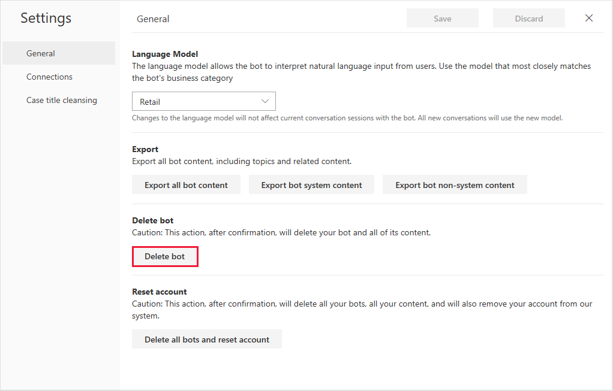

# Responding to GDPR data subject delete requests for Dynamics 365 Virtual Agent for Customer Service

The “right to erasure” by the removal of personal data from an organization’s customer data is a key protection in the General Data Protection Regulation (GDPR). Removing personal data includes removing all personal data and system-generated logs except audit log information.

## Manage delete requests

Dynamics 365 Virtual Agent for Customer Service offers the following experiences to delete personal data for a specific user:

* [Bot chat logs](#bot-chat-logs)
* [Case data connection settings](#case-data-connection-settings)
* [Delete Virtual Agent bot content](#delete-virtual-agent-bot-content)
* [Delete Virtual Agent telemetry](#delete-virtual-agent-telemetry)
* [Extracted knowledge](#extracted-knowledge)
* [Metrics](#metrics)
* [System telemetry](#system-telemetry)

### Bot chat logs

Bot chat logs are deleted when the bot is deleted.

### Case data connection settings

Case data connection settings are deleted when the bot is deleted.

### Delete Virtual Agent bot content

Follow these steps to delete a bot:

1. Open Virtual Agent in your browser.
2. On the Settings menu, select **General settings** to display the General tab of the Settings screen.

   > 

3. In the Delete bot section, select **Delete bot**.

   > [!div class="mx-imgBorder"]
   > 

All bot content is immediately deleted.

### Delete Virtual Agent telemetry

Virtual Agent telemetry data is automatically deleted within 29 days.

### Extracted knowledge

Extracted knowledge is deleted when the bot is deleted.

### Metrics

To delete metrics data, you must delete your bot. See [Delete Virtual Agent Designer bot content](#delete-virtual-agent-bot-content) for more information.

### System telemetry

System telemetry is automatically deleted within 29 days.
