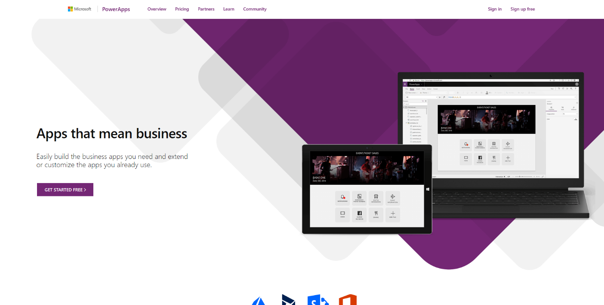
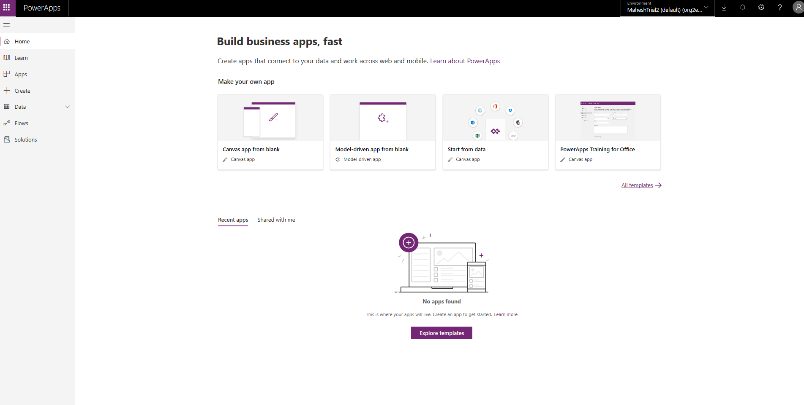
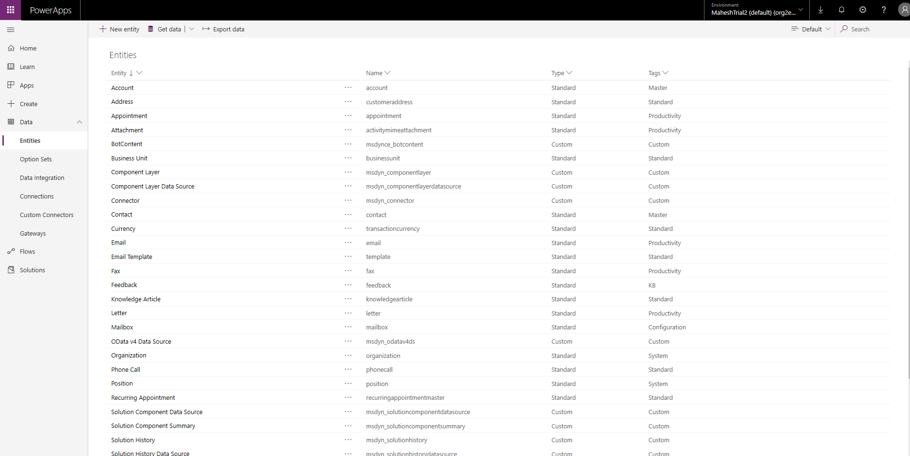
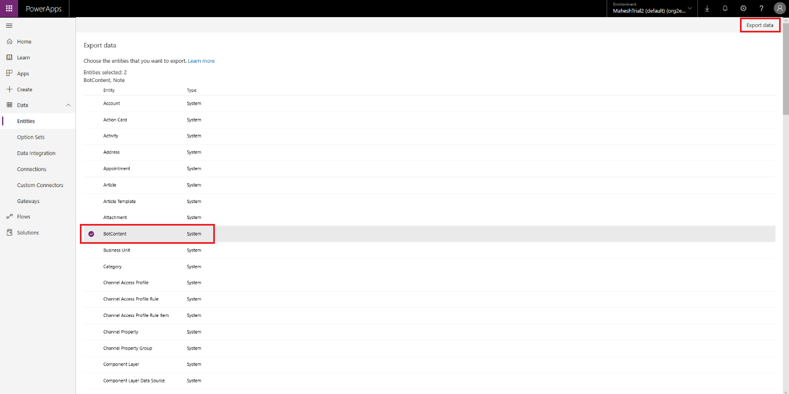
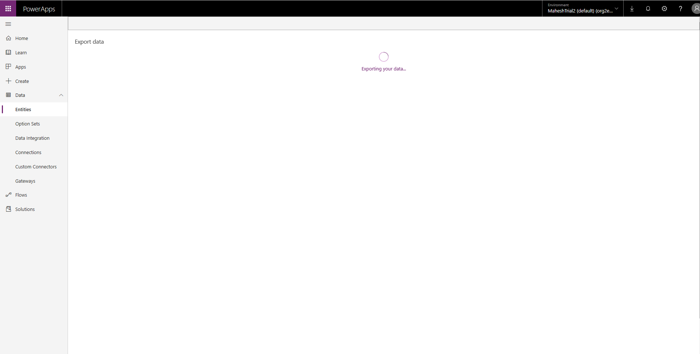
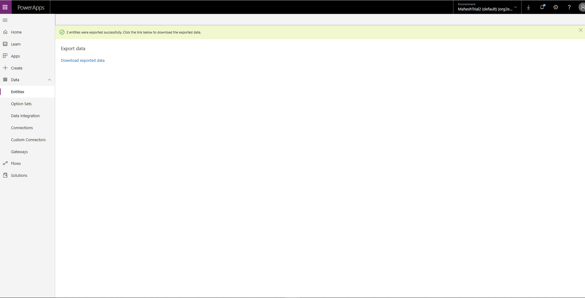

# Responding to GDPR data subject export requests in Virtual Agent for Customer Service

[!INCLUDE [cc-beta-prerelease-disclaimer](../includes/cc-beta-prerelease-disclaimer.md)]

## To export the bot content, please perform the following steps:

1. Go to [https://www.powerapps.com](https://www.powerapps.com) and sign-in with your credentials.

2. After you sign in, you will arrive to the https://make.powerapps.com portal.

3. In the left-hand navigation, expand **Data**, select **Entities**, then on the top navigation bar, click on **Export Data**.

4. Select **BotContent** and **Note** from the entity list. Click on **Export Data** on the top right navigation.

5. Your data will take a couple of minutes to be compiled for export.

6. Click on **Download exported data** to download the bot content.

