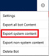
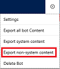

# Responding to GDPR data subject export requests for Dynamics 365 AI for Customer Service Virtual Agent

The right of data portability allows a data subject to request a copy of their personal data in an electronic format (that’s a “structured, commonly used, machine readable, and interoperable format”) that may be transmitted to another data controller.

Dynamics 365 AI for Customer Service Virtual Agent offers the following experiences to find or export personal data for a specific user:

* Export customer data – Bot Designer bot content
* Export customer data – Bot Designer system content
* Export customer data – Bot Designer non-system content

### Export customer data – Bot Designer bot content

1. Navigate to [https://bots.int.customercareintelligence.net/#/](https://bots.int.customercareintelligence.net/#/).
2. On the Settings menu, select **Export all bot content**.

    

All bot content will be immediately deleted.

### Export customer data – Bot Designer system content

1. Navigate to [https://bots.int.customercareintelligence.net/#/](https://bots.int.customercareintelligence.net/#/).
2. On the Settings menu, select **Export all system content**.

    

All system content will be immediately deleted.

### Export customer data – Bot Designer system content

1. Navigate to [https://bots.int.customercareintelligence.net/#/](https://bots.int.customercareintelligence.net/#/).
2. On the Settings menu, select **Export all non-system content**.

    

All non-system content will be immediately deleted.
