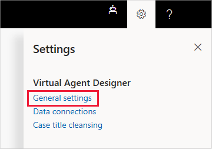

# Responding to GDPR data subject export requests in Virtual Agent for Customer Service

The right of data portability allows a data subject to request a copy of their personal data in an electronic format (that’s a “structured, commonly used, machine readable, and interoperable format”) that can be transmitted to another data controller.

## Manage export requests

Dynamics 365 Virtual Agent for Customer Service offers the following capabilities to find or export personal data for a specific user:

* Export customer data – Virtual Agent bot content
* Export customer data – Virtual Agent system content
* Export customer data – Virtual Agent non-system content
* Export customer data – Analytics data

### Export customer data – Virtual Agent bot content

1. Open Virtual Agent in your browser.
2. On the Settings menu, select **General settings** to display the General tab of the Settings window.

   

3. In the Export section, select **Export all bot content** to export all bot content, **Export bot system content** to export bot system content, or **Export bot non-system content** to export bot non-system content.

   

### Export customer data – Analytics data

1. Hover over a chart on one of the Analytics pages and select the **More options** ellipses.

   

2. From the drop-down menu, select **Export data**.

    

3. To export summarized data, select **Summarized data** and a file format, and then **Export**.

   
