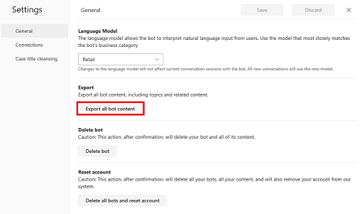
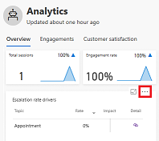
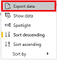
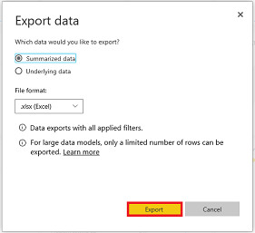

# Responding to GDPR data subject export requests for Dynamics 365 AI for Customer Service Virtual Agent

The right of data portability allows a data subject to request a copy of their personal data in an electronic format (that’s a “structured, commonly used, machine readable, and interoperable format”) that may be transmitted to another data controller.

## Manage export requests

Dynamics 365 AI for Customer Service Virtual Agent offers the following experiences to find or export personal data for a specific user:

* Export customer data – Virtual Agent Designer bot content
* Export customer data – Virtual Agent Designer system content
* Export customer data – Virtual Agent Designer non-system content
* Export customer data – Analytics data

### Export customer data – Virtual Agent Designer bot content

1. Launch the Virtual Agent Designer in your browser.
2. On the Settings menu, select **General settings** to display the General tab of the Settings window.

   > [!div class="mx-imgBorder"]
   > 

3. In the Export section, click **Export all bot content**.

   > [!div class="mx-imgBorder"]
   > 

All bot content will be immediately exported.

### Export customer data – Analytics data

1. Hover over a chart on one of the Analytics dashboards and click the **More options** elipses.

   > [!div class="mx-imgBorder"]
   > 

2. From the dropdown menu, click **Export data**.

    > [!div class="mx-imgBorder"]
    > 

3. To export summarized data, select **Summarized data** and then click **Export**.

   > [!div class="mx-imgBorder"]
   > 