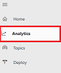
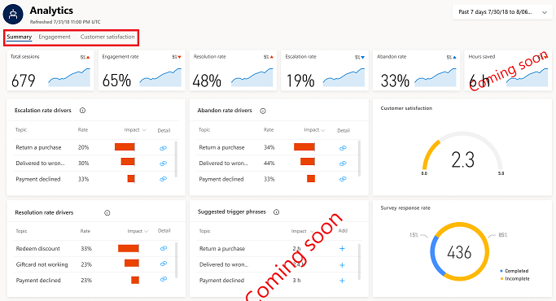
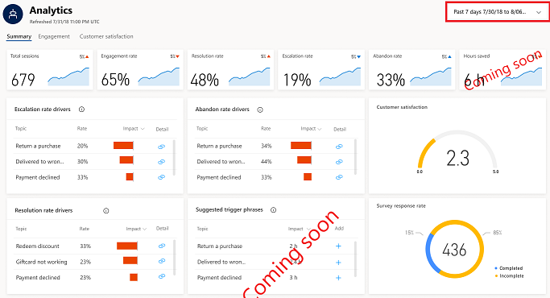

# Using analytics to improve your virtual agent

As you create and deploy your Virtual Agent Designer virtual agent, you can use analytics to see how your virtual agent is performing. Virtual Agent Designer includes built-in dashboards, interactive charts, and visual filters that give you actionable insights into critical performance metrics, operational data, and emerging trends.

To view the analytics dashboards, click **Analytics** in the navigation pane to open the Analytics page.

   > [!div class="mx-imgBorder"]
   > 

You can display [Summary](analytics-summary.md), [Engagement](analytics-engagement.md), and [Customer satisfaction](analytics-csat.md) dashboards by clicking the tab for each dashboard on the Analytics page. The Summary dashboard is the default AI for Customer Service Virtual Agent dashboard.

   > [!div class="mx-imgBorder"]
   > 

Some key features of the dashboards include:

* Filters to let you view customer service data for a specific time period.
* Key performance indicator charts that give you the basics of how your system is performing.
* Graphical charts showing trends and breakdowns of cases from a variety of views.
* Impact charts that use language understanding artificial intelligence technology to show the impact and trends of cases related to specific support topics.

## Dashboard filters

Filters on each dashboard let you view information for support cases for a specific time period.

   > [!div class="mx-imgBorder"]
   > 

By default, dashboards display information for the last seven days, but you also display information for the last 30 days by selecting **Last 30 Days**.

## Key performance indicator charts

Key performance indicator charts give you a view of the key performance data for your virtual agent and customer service system for the specified time period. For example, the key performance indicator charts on the Summary summary dashboard show you:

Abandon rate | The percentage of engaged sessions that are abandoned. An abandoned session is an engaged session that is neither resolved nor escalated after one hour from the beginning of the session.

* The total number of sessions during the period.
* The percentage of total sessions during the period that are engaged sessions.
* The percentage of engaged sessions during the period that are resolved.
* The percentage of engaged sessions during the period that are escalated.
* The percentage of engaged sessions during the period that are abandoned.

    > [!div class="mx-imgBorder"]
    > 

Each key performance indicator chart includes an up and down indicator next the value that indicates the percent change in a positive or negative direction.

## Graphical trend and breakdown charts

The dashboards include a variety of graphical charts that give you views of different trends, and the breakdown of cases by key criteria such as customer satisfaction, survey response rate, outcomes over time, engagement over time, and daily topic volume.

   > [!div class="mx-imgBorder"]
   > 

## Impact charts

Impact charts use artificial intelligence technology to show you the topics that are having the greatest impact, both positive and negative, on the performance of your virtual agent.

   > [!div class="mx-imgBorder"]
   > 

For details on AI for Customer Service Virtual Agent analytics, see the following topics:

* [Analytics overview](analytics-overview.md)
* [Summary dashboard](analytics-summary.md)
* [Engagement dashboard](analytics-engagement.md)
* [Customer satisfaction dashboard](analytics-CSAT.md)
* [Topic details dashboard](analytics-topic-details.md)
* [Download sessions page](analytics-sessions.md)