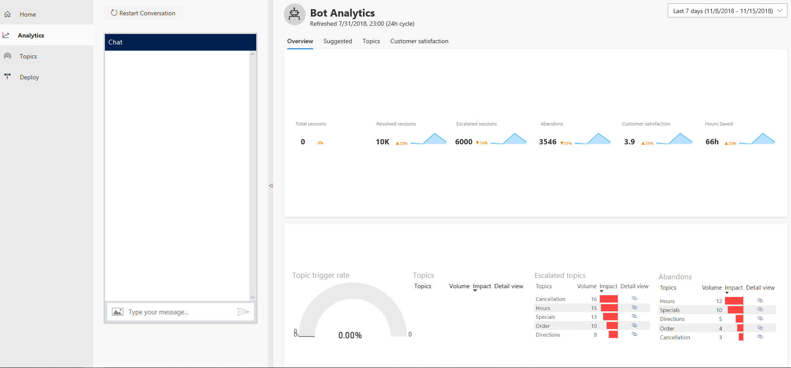

# Working with the Bot Designer

The AI for Customer Insights Virtual Agent Bot Designer provides a variety of tools that make it easy to create a powerful custom virtual agent. You can add topics to your bot to help you design a conversation path to resolve customer support issues, and then deploy the bot to a support channel. You can also view analytics information to help you improve the bot and the overall customer experience.

The Bot Designer is composed of several pages designed for different tasks. You can navigate to the different pages by clicking in the navigation pane.

   > [!div class="mx-imgBorder"]
   > 

## Home page

   > [!div class="mx-imgBorder"]
   > 

The Home page provides a summary of the performance of your bot once it has been deployed, showing:

* The total number of support sessions that used the bot.
* The number and percent of resolved sessions.
* Tne number and percent of escalated sessions.
* The number and percent of sessions that were abandoned.
* The average customer satisfaction score of cases that use the bot.
* The hours saved as a result of using the bot.

## Analytics page

   > [!div class="mx-imgBorder"]
   > 

The Analytics page provides a variety of dashboards and charts showing key performance indicators for your bot.

For more information about using the Analytics page, see [Using bot analytics to improve your bot](getting-started-analytics.md).

## Topics page

   > [!div class="mx-imgBorder"]
   > 

The Topics page is the central location for creating and managing bot topics, the building blocks you use to design a conversation path. The Bot Designer includes several built-in system topics, as well as additional built-in topics specific to the template you used to create your bot.

You can revise those topics and create your own custom topics to design a conversation path that leads each customer to a resolution of the customer's support issue. You can then test the bot in the test bot pane, and refine it as necessary.

For more information about using the Topics page to create topics, see [Creating topics for your bot](getting-started-create-topics.md).

## Deploy page

   > [!div class="mx-imgBorder"]
   > 

The Deploy page is where you deploy your completed bot to a support channel. As part of the deployment, you can specify a custom welcome message and any suggested conversation starters to help customers get started using your bot.

For more information about using the Deploy page to deploy your bot, see [Deploying your bot](getting-started-deploy.md).

## Test bot

Each page includes a test bot pane, where you can test your bot and view how the bot's conversation path works in practice.

You can test a bot topic by entering a trigger phrase for the topic at the **Type your message** prompt at the bottom of the test bot pane.

   > [!div class="mx-imgBorder"]
   > 

    The trigger phrase starts the topic's conversation, and the test bot displays the bot responses and user response choices you specified when you created the topic on the Topics page.

   > [!div class="mx-imgBorder"]
   > 