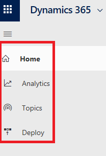
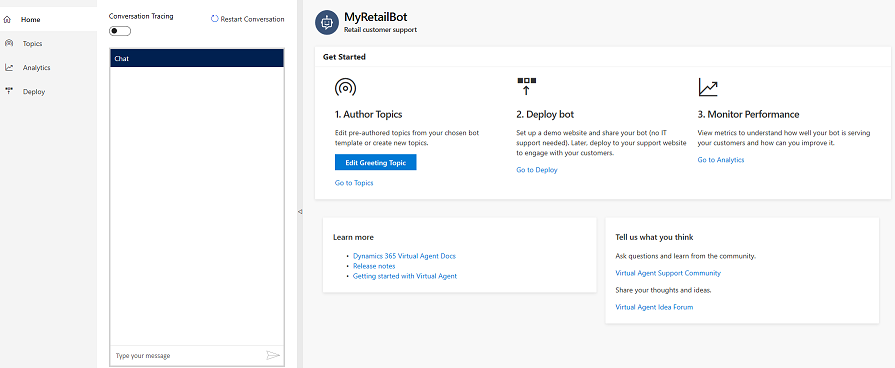
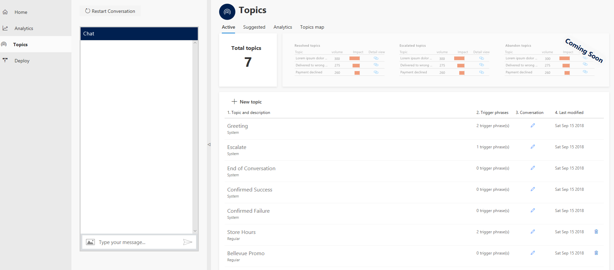
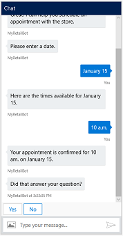

# Working with the Virtual Agent Designer

The Dynamics 365 AI for Customer Service Virtual Agent Designer provides a variety of tools that make it easy to create a powerful custom virtual agent. You can add topics to your virtual agent to help you design a conversation path to resolve customer support issues, and then deploy the virtual agent to a support channel. You can also view analytics information to help you improve the virtual agent and the overall customer experience.

The Virtual Agent Designer is composed of several pages designed for different tasks. You can access the pages through the navigation pane.

   > [!div class="mx-imgBorder"]
   > 

## Home page

   > [!div class="mx-imgBorder"]
   > 

The Home page provides links to the Topics, Deploy, and Analytics pages.  An **Edit Greeting Topic** button lets you revise the built-in virtual agent greeting topic. The Home page also includes a **Learn more** section with links to documentation, and a **Tell us what you think** section with links to the Virtual Agent Designer support community and the Virtual Agent idea forum.

## Topics page

   > [!div class="mx-imgBorder"]
   > 

The Topics page is the central location for creating and managing virtual agent topics. The Virtual Agent Designer includes several built-in system topics, as well as additional built-in topics specific to the template you use to create your virtual agent.

You can revise the template topics and also create your own custom topics to design a conversation path that leads each customer to a resolution of the customer's support issue. You can then test the virtual agent in the Test Bot and refine it as necessary.

For more information about using the Topics page to create topics, see [Creating topics for your virtual agent](getting-started-create-topics.md).

## Analytics page

   > [!div class="mx-imgBorder"]
   > 

The Analytics page provides a variety of dashboards and charts showing key performance indicators for your virtual agent.

For more information about using the Analytics page, see [Using analytics to improve your virtual agent](getting-started-analytics.md).

## Deploy page

   > [!div class="mx-imgBorder"]
   > 

The Deploy page is where you deploy your completed virtual agent to a demo website or your own custom website. The demo website provides a sandbox environment for your team to test the virtual agent and give you feedback.

As part of the deployment to the demo website, you can specify a custom welcome message and any suggested conversation starters to help team members get started testing your virtual agent.

If you choose to deploy your virtual agent to your own custom website, you can copy and share the Virtual Agent code, which needs to be added to your custom website.

For more information about using the Deploy page to deploy your virtual agent, see [Deploying your virtual agent](getting-started-deploy.md).

## Test Bot

The Virtual Agent Designer includes a Test Bot, where you can test your virtual agent and view how the conversation with the virtual agent works in practice. You can hide the Test Bot by selecting the arrow on the right edge of the Test Bot pane.

   > [!div class="mx-imgBorder"]
   > 

If the Test Bot is hidden, you can display it by selecting the arrow on the right edge of the navigation pane.

   > [!div class="mx-imgBorder"]
   > 

You can test a virtual agent topic by entering a trigger phrase for the topic at the **Type your message** prompt at the bottom of the Test Bot.

   > [!div class="mx-imgBorder"]
   > 

The trigger phrase starts the topic's conversation, and the Test Bot displays the virtual agent responses and user response choices you specified when you created the topic on the Topics page.

   > [!div class="mx-imgBorder"]
   > 
