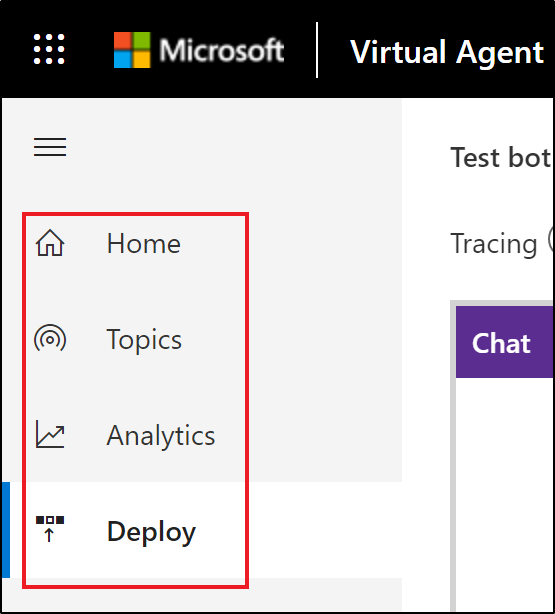
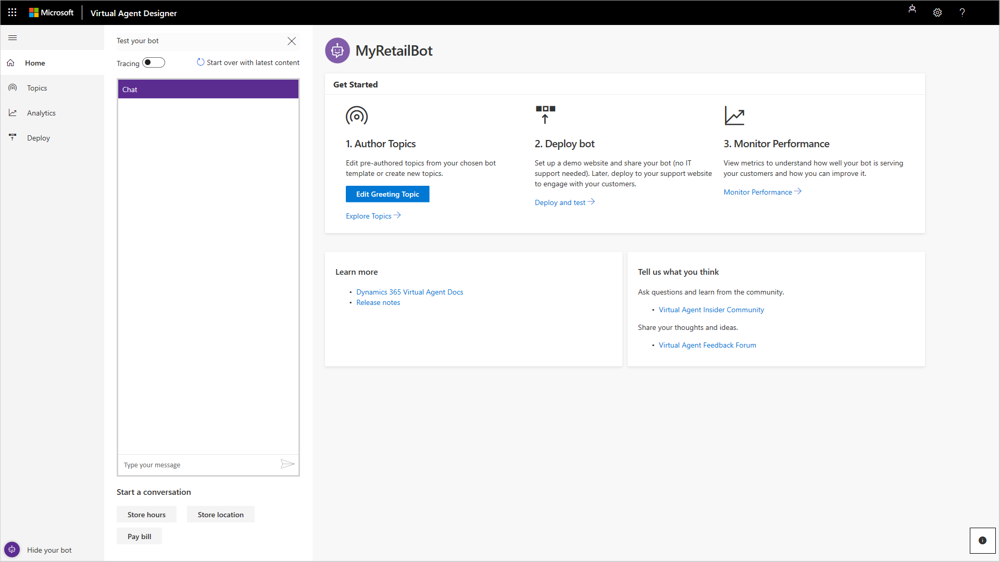
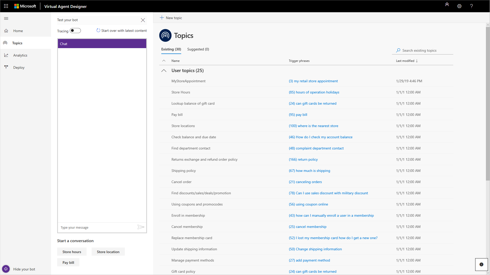
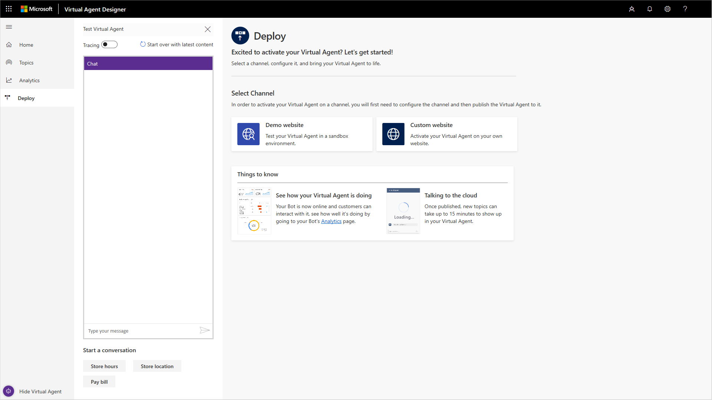
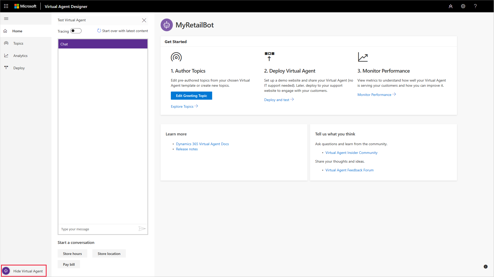
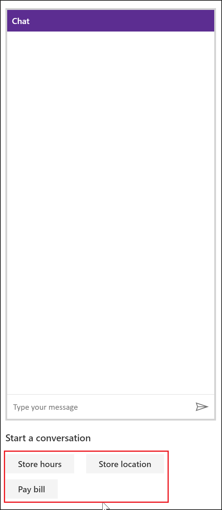
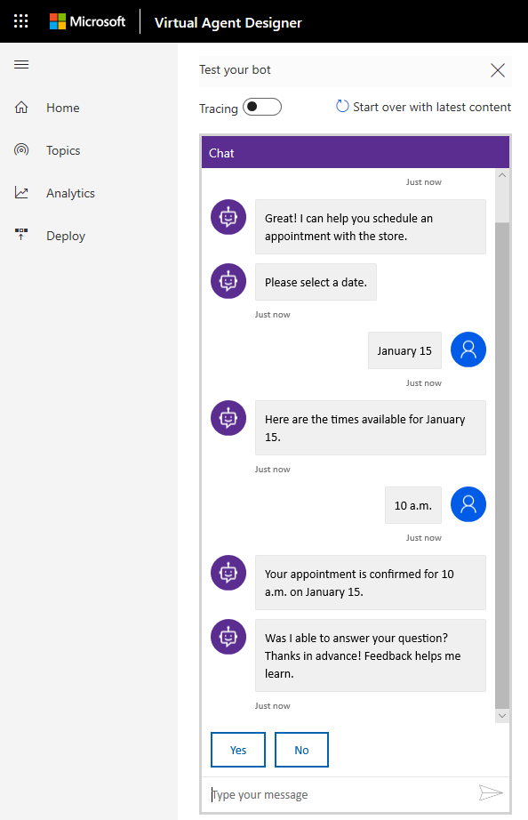

# Working with the Virtual Agent Designer

The Virtual Agent Designer provides a variety of tools to create a powerful custom virtual agent. You can add topics to your virtual agent to help you design a conversation path to resolve customer support issues, and then deploy the virtual agent to a web channel. You can also view analytics information to help you improve the virtual agent and the overall customer experience.

The Virtual Agent Designer is composed of several pages designed for different tasks. You can access the pages through the navigation pane.

   > 

## Home page

   > 

The Home page provides links to the Topics, Analytics, and Deploy pages.  An **Edit Greeting Topic** button lets you revise the built-in virtual agent greeting topic. The Home page also includes a **Learn more** section with links to documentation, and a **Tell us what you think** section with links to the Virtual Agent Insider Community and the Virtual Agent Feedback Forum.

## Topics page

   > 

The Topics page is the central location for creating and managing virtual agent topics. The Virtual Agent Designer includes several built-in system topics, as well as additional built-in topics specific to the template you use to create your virtual agent.

You can revise the template topics and also create your own custom topics to design a conversation path that leads each customer to a resolution of the customer's support issue. You can then test the virtual agent in the Test Virtual Agent and refine it as necessary.

For more information about using the Topics page to create topics, see [Creating topics for your virtual agent](getting-started-create-topics.md).

## Analytics page

   > 

The Analytics page provides a variety of dashboards and charts showing key performance indicators for your virtual agent.

For more information about using the Analytics page, see [Using analytics to improve your virtual agent](getting-started-analytics.md).

## Deploy page

   > 

The Deploy page is where you deploy your completed virtual agent to a demo website or your own custom website. The demo website provides a sandbox environment for your team to test the virtual agent and give you feedback.

As part of the deployment to the demo website, you can specify a custom welcome message and any suggested conversation starters to help team members get started testing your virtual agent.

If you choose to deploy your virtual agent to your own custom website, you can copy and share the Virtual Agent code, which needs to be added to your custom website.

For more information about using the Deploy page to deploy your virtual agent, see [Deploying your virtual agent](getting-started-deploy.md).

## Test Virtual Agent

The Virtual Agent Designer includes a Test Virtual Agent, where you can test how the conversation with the virtual agent works in practice. You can hide the Test Virtual Agent by selecting **Hide Virtual Agent** on the lower left corner of the Virtual Agent Designer.

   > 

When the Test Virtual Agent is hidden, **Hide Virtual Agent** changes to **Show Virtual Agent**. Select **Show Virtual Agent** to restore the Test Virtual Agent.

You can test a virtual agent topic by entering a trigger phrase for the topic at the **Type your message** prompt at the bottom of the Test Virtual Agent.

   > 

The trigger phrase starts the topic's conversation, and the Test Virtual Agent displays the virtual agent responses and user response choices you specified when you created the topic on the Topics page.

   > 
