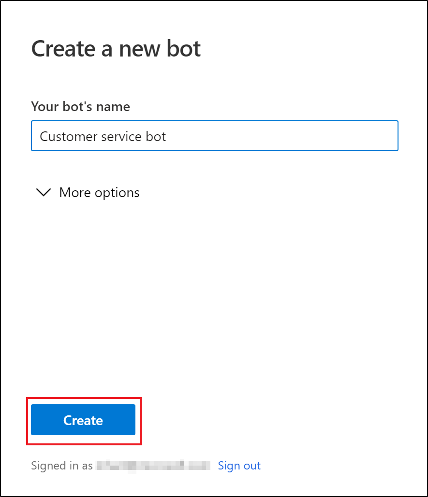
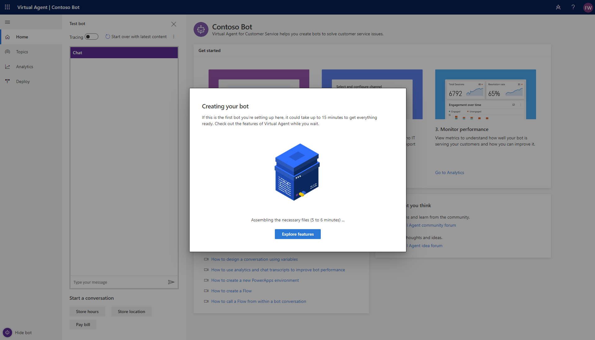

# Creating a bot

[!INCLUDE [cc-beta-prerelease-disclaimer](../includes/cc-beta-prerelease-disclaimer.md)]

You can use Virtual Agent to create a powerful custom bot. Virtual Agent makes it easy to create bots that address common support issues. You can design a conversation path that leads each customer to a resolution.

To help get you started and tailor the bot to your specific needs, Virtual Agent lets you create a bot using built-in content building blocks containing topics, trigger phrases, and pre-authored conversation paths. These built-in topics can also be useful as a model for building your own conversations for similar customer-support issues. For more information, see [Work with built-in topics](how-to-templates.md).

## To create your first bot

If you encounter an issue while creating your bot, see [Known issues with creating a bot](#known-issues-with-creating-a-bot).

Watch the [step-by-step video](http://go.microsoft.com/fwlink/?linkid=2062988) or follow the steps below.

1. Navigate to [aka.ms/virtual-agent](http://aka.ms/virtual-agent) and select "Try Preview". Sign using your work account.

   
    
   You will then be presented with several license agreements and terms of service screens. When you agree to these terms, you will get licenses assigned that allow you to access the Preview.
    
2. In the **Create a new bot** dialog, you’ll name your bot.  This can be something generic to your company or specific to the scenario you would like to tailor your bot towards.

   

   By default, your virtual agent will be created in the default PowerApps environment that was created for you in the prior step.  For most users, this is sufficient – however if you want to specify a custom PowerApps environment for your virtual agent, you can do so by expanding the “More options” menu and selecting a different environment.

   >[!NOTE]
   >Preview is currently only supported in the US, with data stored in US data centers.  If your company is domiciled outside of the US, you will need to create a custom environment with Region set to “United States” before you can create your virtual agent. For more information on how to create a custom PowerApps environment, see [Creating a PowerApps environment](getting-started-new-environment.md).
  

    
3. Once you select “Create”, the next process can take up to 15 minutes for the first bot created within a new environment.  

    

   > [!NOTE]
   >
   > Here are some things you can do to use this time and explore some features of Virtual Agent.
   > - [Chat with a test bot](how-to-test-bot.md#work-with-the-test-bot-pane)
   > - [Trace your conversation in the authoring canvas](how-to-test-bot.md#to-trace-through-the-topics-conversation-path)
   > - [View and edit topics](getting-started-bot-designer.md#topics-page) (but not save them)
   > - [Watch product videos](virtual-agent-videos.md)
   >
   > When everything is set up, you'll see a message confirming that your bot is ready. At this point, you will have all functionality available to you. 
   
   
4.	When the bot creation process completes, you’ll see the banner change. You now have full functionality in the bot and can modify topics, test your changes, or deploy your bot.

## Creating additional bots

If you have already created a bot, you can create a new bot by selecting the **Bot** icon on the title bar, then selecting **New bot**.

   

## Known issues with creating a bot

When you are creating your bot, you may encounter the following issues

### No read/write access to any environment

In this case, you will see this error: “You do not have permissions to any environments. Please get access from an administrator.”

To resolve this issue, follow the steps in [To create a new PowerApps environment](getting-started-new-environment.md) to create a new environment. Use that environment to create your bot.

### Insufficient permissions for the selected environment

If the user selects an environment that she has insufficient access to, she will get the following error: “An unexpected server error occurred. Please retry creating your bot.”

To resolve this issue, follow the steps in [To create a new PowerApps environment](getting-started-new-environment.md) to create a new environment. Use that environment to create your bot.

### The PowerApps environment I created does not show up in the drop down menu of Virtual Agent

Your environment might not show up in the drop down due to the following reasons:
 - The enviroment doesn't have a database created. To resolve this, go to [admin.powerapps.com](https://admin.powerapps.com) to create a database in your environment.
 - The envornment's region is set to non-US. To resolve this, follow the steps in [To create a new PowerApps environment](getting-started-new-environment.md)
 - The enviroment didn't finish setting up. To resolve this, retry in a few minutes
