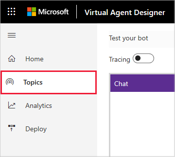
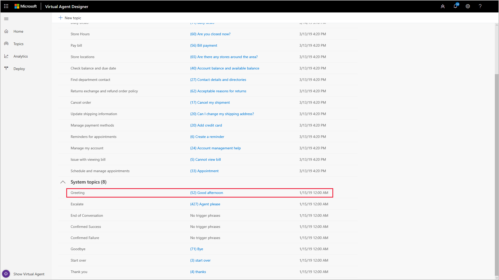

# Creating a custom greeting for your virtual agent

A customer can start a conversation with a virtual agent by entering any trigger phrase that starts a conversation defined by a topic. In many cases, the conversation starts with a simple greeting, such as *hello* or *good morning*. To help you handle this common situation, Virtual Agent Designer automatically includes a built-in Greeting system topic when you create a virtual agent, which you can customize.

Customizing your greeting gives you an opportunity to let the customer know that they are interesting with virtual agent rather than a human agent, and to tailor the virtual agent to reflect your organization's personality.

For information on creating a custom topic, see [Creating custom topics for your virtual agent](getting-started-create-topics.md).

## To create a custom greeting

1. Select **Topics** in the navigation pane to open the Topics page.

   > 

2. Scroll to the **System topics** section and select **Greeting** to open the Greeting topic.

   > 

    The Greeting topic by default is named *Greeting* and includes a built-in description and trigger phrases, which can't be edited, but you can customize the greeting by editing the topic's conversation path.

3. To edit the Greeting topic's conversation path, select **Edit**.