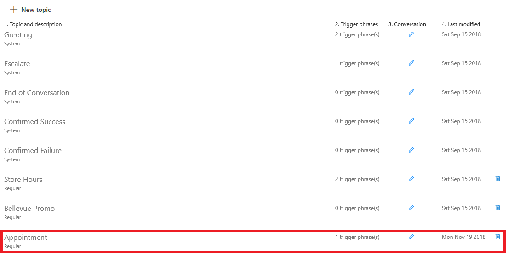
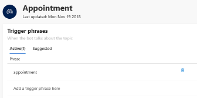
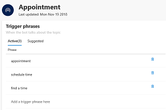

# Creating topics for your bot

Topics define the conversation path used by your virtual agent bot. They can also be used as building blocks for designing the conversation path.

When you create a bot, AI for Customer Service Virtual Agent automatically includes several system topics that help you address common situations in a conversation: A customer greeting, escalation to a live agent, the end of the conversation, a confirmed success, and a confirmed failure. In addition, the Virtual Agent environment includes industry-specific topics depending on the template you used to create your bot. For example, the Retail template includes topics for specifying store hours or highlighting a promotion:

   > [!div class="mx-imgBorder"]
   > 

## To create your own topic

1. On the Topics page, click **New topic** to display the **Create a new topic** screen.

   > [!div class="mx-imgBorder"]
   > 

2. Specify a name, description, and one of more trigger phrases for the topic.

    A trigger phrase is a phrase that a customer enters in the chat window to start a conversation with the virtual agent. You can specify more than one trigger phrase for a topic. Once the conversation is started, the conversation follows the path you define for the topic.

   > [!div class="mx-imgBorder"]
   > 

3. Click **Save** to add the topic to the topics list.

   > [!div class="mx-imgBorder"]
   > 

## To add additional trigger phrases for the topic

1. Click the topic in the topics list to open the Trigger phrases screen.

   > [!div class="mx-imgBorder"]
   > 

2. Add additional phrases that a customer might enter in the chat window to trigger the conversation.

   > [!div class="mx-imgBorder"]
   > 

3. Click **Save topic** to save the changes.

   > [!div class="mx-imgBorder"]
   > 

## To edit the topic's conversation

1. Select the topic in the topics list and click the edit icon.

   > [!div class="mx-imgBorder"]
   > 

    AI for Customer Service Virtual Agent opens the topic in the design canvas, and displays the topic's trigger phrases. The design canvas is where you define the conversation path between a customer and virtual agent.

   > [!div class="mx-imgBorder"]
   > 

2. Enter the virtual agent's response to the trigger phrase in the **Bot says** box.

   > [!div class="mx-imgBorder"]
   > 

3. To specify an additional response by the virtual agent, select **Bot says**.

   > [!div class="mx-imgBorder"]
   > 

4. Then enter the additional response in the **Bot says** box.

   > [!div class="mx-imgBorder"]
   > 

5. To specify a response by the customer, select **User says**.

   > [!div class="mx-imgBorder"]
   > 

6. Then enter the response in the **User says** box.

   > [!div class="mx-imgBorder"]
   > 

7. To give the customer a choice between different responses, select **Add user response**

   > [!div class="mx-imgBorder"]
   > 

8. Then specify the additional response in the **User says** box.

   > [!div class="mx-imgBorder"]
   > 

    The design canvas creates separate paths in the conversation, depending on the customer's response. You can design the conversation so that the virtual agent can then lead the customer to the appropriate resolution.