# Creating topics for your virtual agent

A topic defines a conversation path with the virtual agent for a specific customer intent. You specify a trigger phrase that prompts the virtual agent to start the conversation. Then create a conversation path in the Virtual Agent Designer's conversation editor to lead customers to a resolution of their support issue. You can see how the conversation path works in practice by testing it in the Test Bot and continue to fine-tune the topic until you are ready to deploy it.

## To create your own topic

1. Select **Topics** in the navigation pane to open the Topics page.

   > [!div class="mx-imgBorder"]
   > 

    The Topics page displays a list of your virtual agent's current topics, including a variety of built-in topics.

    The Virtual Agent Designer includes industry-specific topics, depending on the template you used to create your virtual agent. For example, the Retail template includes topics for enrolling in a membership, looking up the balance of a gift card, or finding store hours.

   > [!div class="mx-imgBorder"]
   > 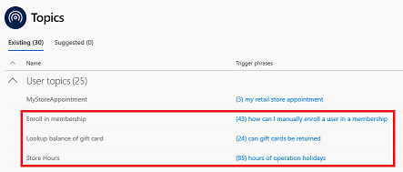

    The Virtual Agent Designer also includes several system topics that help you address common situations--a customer greeting, escalation to a live agent, the end of the conversation, a confirmed success, or a confirmed failure.

2. On the Topics page, select **New topic**.

   > [!div class="mx-imgBorder"]
   > 

3. Specify a name, description, and one or more trigger phrases for the topic.

    A trigger phrase is a phrase that a customer enters in the chat window to start a conversation with the virtual agent. Once the conversation is started, the conversation follows the path you define. You can specify more than one trigger phrase for a topic.

    **Tip:**   Having at least 20 trigger phrases can improve the usage of your topic.

    Then select **Save topic** to add the topic to the topics list.

   > [!div class="mx-imgBorder"]
   > 

## To design the topic's conversation path

1. Select **Edit** to open the conversation editor.

   > [!div class="mx-imgBorder"]
   > 

    The Virtual Agent Designer opens the topic in the conversation editor and displays the topic's trigger phrases. The conversation editor is where you define the conversation path between a customer and the virtual agent.

   > [!div class="mx-imgBorder"]
   > 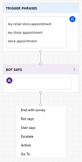

2. Enter the virtual agent's response to the trigger phrase in the **Bot says** box.

   > [!div class="mx-imgBorder"]
   > 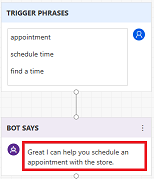

3. To specify an additional response by the virtual agent, select **Bot says**.

   > [!div class="mx-imgBorder"]
   > 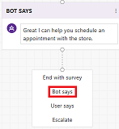

    Then enter the additional response in the **Bot says** box.

   > [!div class="mx-imgBorder"]
   > 

4. To specify a response by the customer, select **User says**.

    You can provide several options for the user’s response. The options display as clickable buttons.

   > [!div class="mx-imgBorder"]
   > 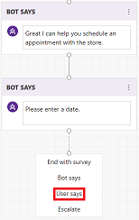

    Enter a response in the **User responses** box.

   > [!div class="mx-imgBorder"]
   > 

    To give the customer a choice between different responses, select **Add user response**.

   > [!div class="mx-imgBorder"]
   > 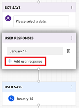

    Then specify the additional response in the **User responses** box.

   > [!div class="mx-imgBorder"]
   > 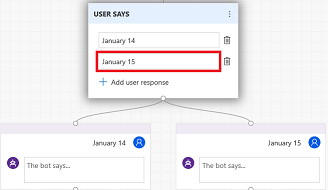

    The conversation editor creates separate paths in the conversation, depending on the customer's response. The conversation path leads the customer to the appropriate resolution for each user response.

5. Add additional bot and user responses to complete the conversation path.

   > [!div class="mx-imgBorder"]
   > 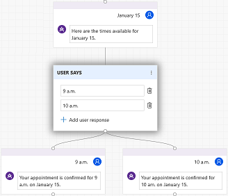

6. To add a customer satisfaction survey at the end of a response that resolves the customer issue, select **End with survey**.

   > [!div class="mx-imgBorder"]
   > 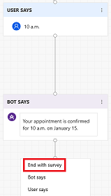

   Then select **Save** to save the conversation path.

As you design your topic's conversation path, you can use the Test Bot to see how the virtual agent leads the customer through a conversation with the virtual agent.

## To test the topic in the Test Bot

1. At the **Type your message** prompt at the bottom of the Test Bot pane, enter a trigger phrase for the topic.

   > [!div class="mx-imgBorder"]
   > 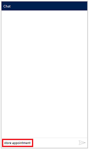

    The trigger phrase starts the topic's conversation. The Test Bot displays the bot and user responses that you specified in the conversation editor.

   > [!div class="mx-imgBorder"]
   > 

2. Continue the conversation path until you complete the conversation.

   > [!div class="mx-imgBorder"]
   > 

3. To restart the conversation, select **Start over with latest content** at the top of the Test Bot pane.

   > [!div class="mx-imgBorder"]
   > 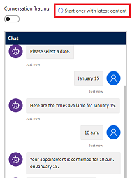

You can return to the conversation editor at any time to revise the topic's conversation path and continue to fine-tune the virtual agent until you are ready to deploy it. For information on deploying your virtual agent, see [Deploying your virtual agent](getting-started-deploy.md).

For more information on using the Test Bot, see [Work with the Test Bot](how-to-test-bot.md).
