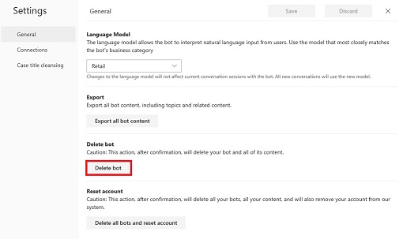

# Deleting a virtual agent

If you want to remove your virtual agent from the Virtual Agent Designer environment, you can delete it using the **Delete Bot** command on the **Settings** menu.

## To delete a virtual agent

1. Select the **Settings** button on the Virtual Agent Designer title bar and then select **General settings** to display the General pane of the Settings window.

   > [!div class="mx-imgBorder"]
   > 

2. On the General pane, click **Delete bot**.

   > [!div class="mx-imgBorder"]
   > 

Virtual Agent Designer removes your virtual agent from the system and opens the **Create a new bot** screen, giving you the opportunity to create a new virtual agent.

   > [!div class="mx-imgBorder"]
   > 

For information about creating a virtual agent, see [Creating a virtual agent](getting-started-create-bot.md).