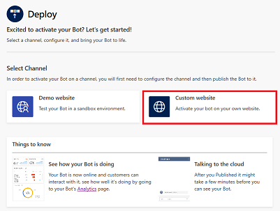
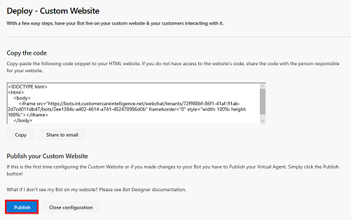

# Deploying your virtual agent bot

Once you have finished designing you virtual agent bot, you can deploy it to a demo environment on the web, or to your live web site.

## To deploy your bot

1. Click **Deploy** in the navigation pane to open the Deploy page.

   > [!div class="mx-imgBorder"]
   > 

2. To deploy the bot to the demo web site, click **Demo website** on the Deploy page.

   > [!div class="mx-imgBorder"]
   > 

    On the Deploy - Demo Website page, enter a welcome message for your bot and some examples of topic triggers to use as conversation starters for customers interacting with your bot, and then click **Publish**.

   > [!div class="mx-imgBorder"]
   > 

3. To deploy your bot to your own custom web site, click **Custom website** on the Deploy page.

   > [!div class="mx-imgBorder"]
   > 

   On the Deploy - Custom Website page, you can copy and share the Virtual Agent code to add to your custom web site. If this is the first time you are configuring the custom web site, or if you made changes to your bot, click **Publish** to publish the bot.

   > [!div class="mx-imgBorder"]
   > 

## To share your bot in the demo environment

1. When you deploy your bot, the Virtual Agent Designer adds a **Share your bot** section to the Deploy page that includes the URL for the bot's demo web environment. Click **Copy** to copy the URL.

   > [!div class="mx-imgBorder"]
   > 

    Users can open the web test environment and test the bot by pasting the URL into their browser.

2. Test the bot in the test web environment. Enter a trigger phrase at the **Type your message** prompt, and then follow the conversation path.

   > [!div class="mx-imgBorder"]
   > 