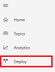
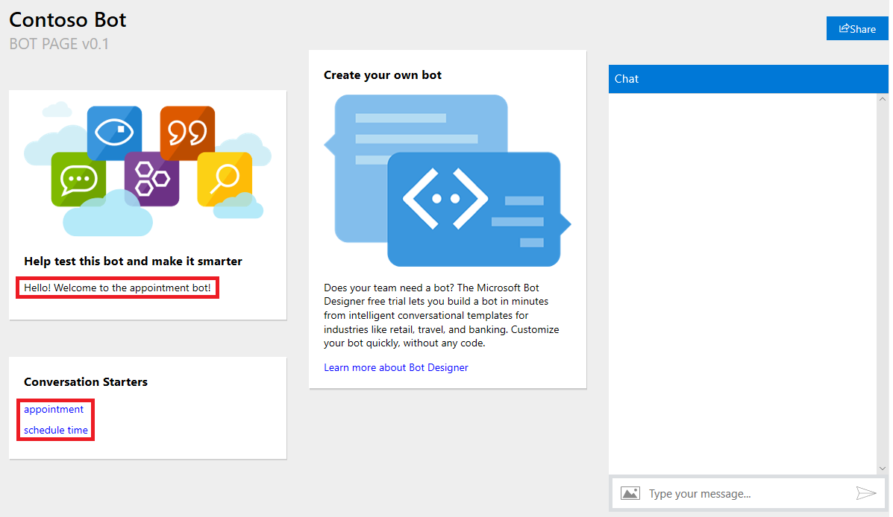
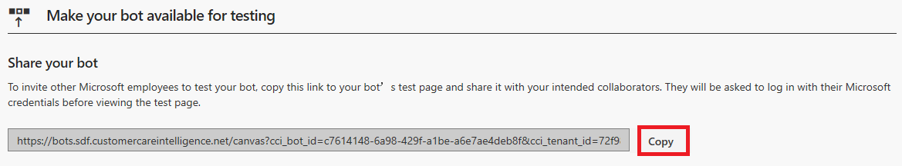
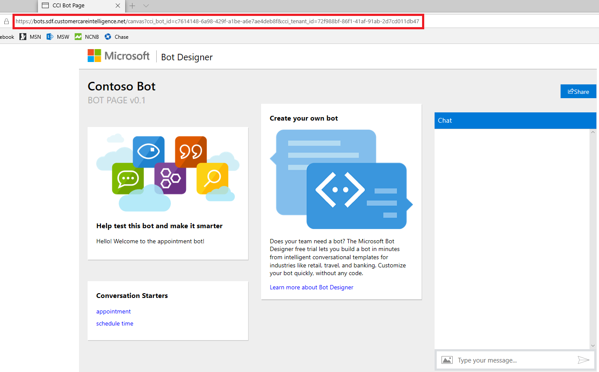

# Deploying your bot

Once you have finished designing you bot, including its topics and conversation path, you can deploy it. You can deploy a bot to a test environment on the web, or to your live web site.

## To deploy your bot to a test environment on the web

1. Click **Deploy** in the navigation pane to open the Deploy page.

   > [!div class="mx-imgBorder"]
   > 

2. Enter a welcome message for your bot and some examples of topic triggers to use as conversation starters, and then click the **Deploy** button.

   > [!div class="mx-imgBorder"]
   > 

3. AI for Customer Service Virtual Agent opens the bot test environment web page with the welcome message and conversation starters you specified.

   > [!div class="mx-imgBorder"]
   > 

4. To test the bot, enter a trigger phrase at the **Type your message** prompt, and then follow the conversation path.

   > [!div class="mx-imgBorder"]
   > 

## To share your bot in the web test environment

1. In the **Share your bot** section on the Deploy page in the Bot Designer, click **Copy** to copy the URL for the bot test environment web page.

   > [!div class="mx-imgBorder"]
   > 

2. You can then distribute the URL. Users can open the web test environment by pasting the URL into their browser.

   > [!div class="mx-imgBorder"]
   > 
