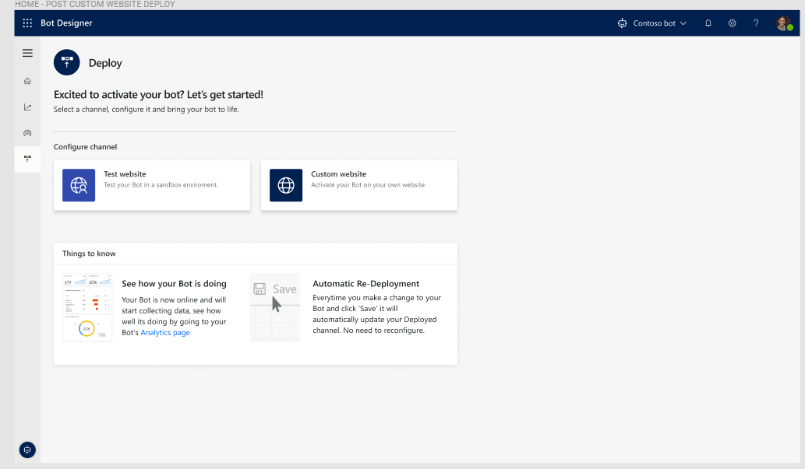

# Deploying your bot

Once you have finished designing you bot, including its topics and dialogs, you can deploy it. You can deploy a bot to a test environment on the web, or to your live web site.

## To deploy your bot to a test environment on the web

1. Click **Deploy** in the navigation pane to open the Deploy page.

   > [!div class="mx-imgBorder"]
   > 

2. The Deploy page is where you activate your completed bot to a support channel. This is where you can select the web channel for your bot. You can choose either the out-of-the-box test web page or your own custom web site.

   > [!div class="mx-imgBorder"]
   > 

3. As part of the deployment to the test web page, you can specify a custom welcome message and any suggested conversation starters to help customers get started using your bot.

   > [!div class="mx-imgBorder"]
   > 

4. If you choose to deploy your bot to your own custom web site, you will be able to copy and share the Virtual Agent code which needs to be added to your custom web site.

   > [!div class="mx-imgBorder"]
   > 

5. Virtual Agent Designer opens the bot test environment web page with the welcome message and conversation starters you specified.

    To test the bot, enter a trigger phrase at the **Type your message** prompt, and then follow the conversation path.

   > [!div class="mx-imgBorder"]
   > 

## To share your bot in the web test environment

1. Click **Share** to copy the URL for the bot test environment web page.

   > [!div class="mx-imgBorder"]
   > 

2. You can then distribute the URL. Users can open the web test environment by pasting the URL into their browser.

   > [!div class="mx-imgBorder"]
   > 
