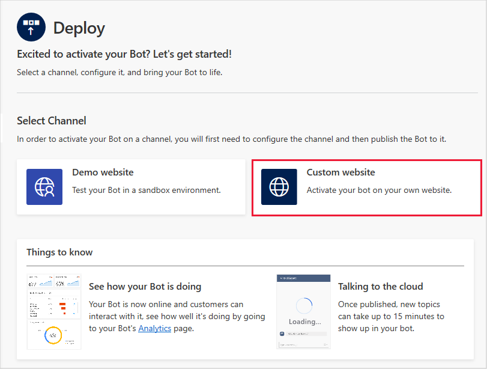
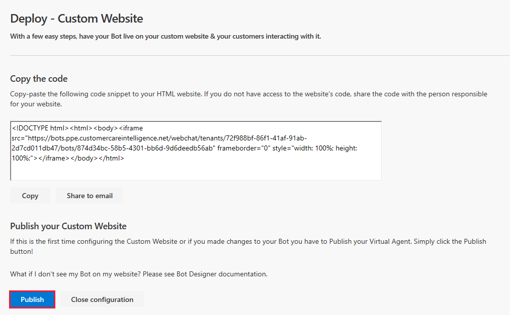

# Deploying your virtual agent

Once you have finished designing you virtual agent, you can deploy it to a demo environment on the web or to your live website.

## To deploy your virtual agent

1. Select **Deploy** in the navigation pane to open the Deploy page.

   > 

2. To deploy the bot to the demo website, select **Demo website** on the Deploy page. The demo website provides a sandbox environment for your team to test the virtual agent and give you feedback.

   > 

    On the Deploy - Demo Website page, enter a welcome message for your bot and some examples of topic triggers to use as conversation starters for team members testing your bot, and then select **Publish**.

   > 

3. To deploy your bot to your own custom website, select **Custom website** on the Deploy page.

   > 

   On the Deploy - Custom Website page, copy the Virtual Agent code for the custom website and share it with your website administrator to add to the site. If you have admin permissions to the site, you can do it yourself.

   Then select **Publish** to publish the virtual agent. Publishing the code ensures that your website displays the most current virtual agent content.

   > 

## To share your virtual agent in the demo website

1. When you deploy your virtual agent, the Virtual Agent Designer adds a **Share your bot** section to the Deploy page that includes the URL for the virtual agent's demo website. Select **Copy** to copy the URL.

   > 

    Users can open the demo website and test the virtual agent by pasting the URL into their browser.

2. Test the virtual agent in the demo website. Enter a trigger phrase at the **Type your message** prompt, and then follow the conversation path.

   > 
