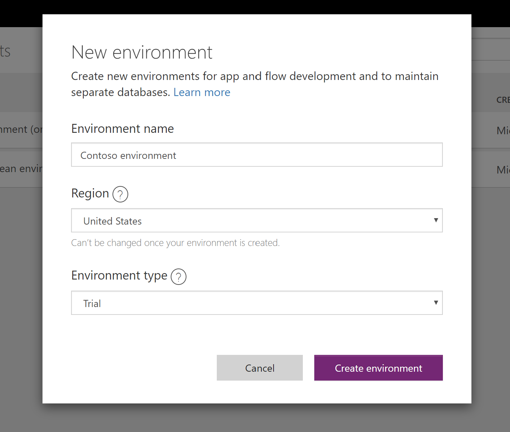
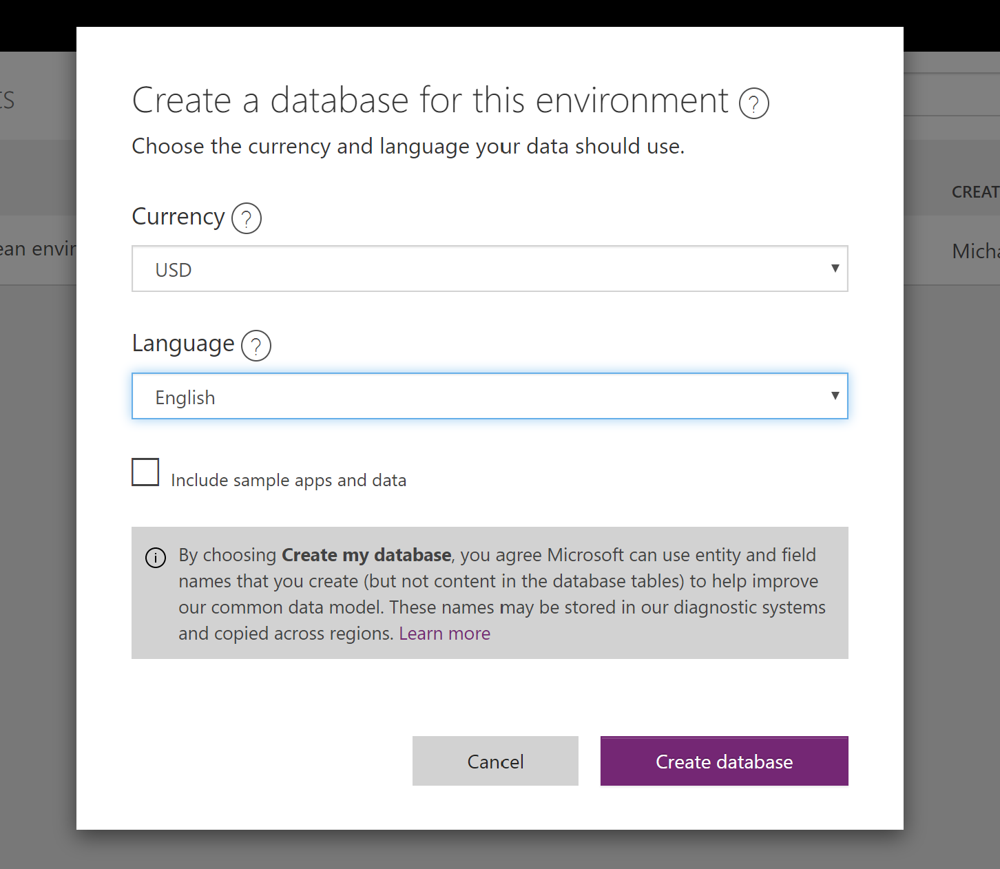
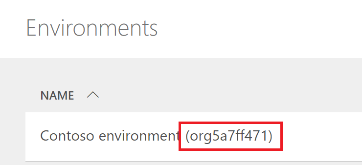

# Creating a PowerApps environment

[!INCLUDE [cc-beta-prerelease-disclaimer](../includes/cc-beta-prerelease-disclaimer.md)]

When you create a bot, you must select a PowerApps environment for the bot. You can use an existing environment or create one.

## To create a new PowerApps environment

Watch the [step-by-step video](https://go.microsoft.com/fwlink/?linkid=2079331), or follow the steps below.

1. Go to [https://admin.powerapps.com](https://admin.powerapps.com) and sign in using your work or school account.

2. Select **New environment** to open the New environment dialog.

    Specify a unique name for the environment, select **United States** as the region, and the environment type. Then select **Create environment**.
    
  >[!NOTE]
  >Please note that the environment needs to be created with region set to **United states**, otherwise you won't be able to use it when creating a bot.
  >Trial environments expire after 30 days. You'll lose any bots created after the trial environment expires.

    

    PowerApps creates the environment and displays a prompt asking if you want to create a database.

3. Select **Create database** to display the **Create a database for this environment** screen.

   

4. Select your currency, language, and uncheck the checkbox for "Include sample apps and data" and then select **Create database**.

>[!NOTE]
>Unselecting "Include sample apps and data" will speed up the process of environment creation.

   

> [!NOTE]
> Creating a database and environment and making it available in Virtual Agent can take couple of minutes.

5. You will know that the environment is ready when you see an id string in parenthesis after the environment name. It might take up to 5 minutes before you are ready to use the environment when [creating a new bot](getting-started-create-bot.md).

    

