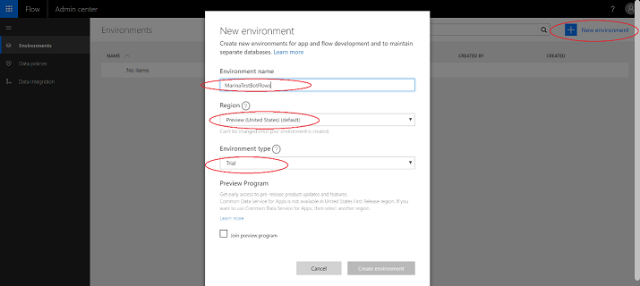
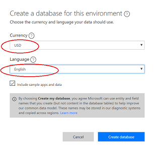

# Creating a PowerApps environment

When you create a virtual agent, you must select a PowerApps environment for the virtual agent. You can use an existing environment or create one.

## To create a new PowerApps environment

1. Enter [https://admin.powerapps.com](https://admin.powerapps.com) in your browser to open the PowerApps Admin center.

2. Select **New environment** to open the New environment screen.

    Specify a unique name for the environment, *United States* as the region, and *Trial* as the environment type. Then select **Create environment**.

   > 

    PowerApps creates the environment and displays a prompt asking if you want to create a database.

3. Select **Create database** to display the **Create a database for this environment** screen.

   > [!div class="mx-imgBorder"]
   > 

4. Select your currency type and language, and then select **Create database**.

   > [!div class="mx-imgBorder"]
   > 

> [!NOTE]
> Creating a database and environment can take some time.
