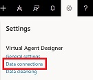

# Connect to your customer service data

The Virtual Agent Designer lets you quickly connect to your existing Dynamics 365 customer service data to give you insights that can help you improve your virtual agent. The Virtual Agent Designer uses artificial intelligence technology to group related support case titles as topics, and then give you suggested trigger phrases that you can use when you are designing your virtual agent.

1. You can connect to your data either on the Suggested tab of the Topics page or using the **Settings** button on the Virtual Agent title bar.

    To connect to your data on the Suggested tab of the Topics page, click **Connect data** to display the **Connect your data** screen.

   > [!div class="mx-imgBorder"]
   > 

    To connect to your data using the **Settings** button on the Virtual Agent Designer title bar, select **Data Connections** to display the Current connections pane of the Settings window.

   > [!div class="mx-imgBorder"]
   > 

    Then click **Create new** to display the **Connect your data** screen.

   > [!div class="mx-imgBorder"]
   > 

2. Select **Dynamics 365** to create a workspace using Dynamics 365 customer service data.

   > [!div class="mx-imgBorder"]
   > 

3. On the **Choose an environment** screen, click the Dynamics 365 environment that contains the customer service data that you want to use.

   > [!div class="mx-imgBorder"]
   > 

AI for Customer Service Virtual Agent configures the workspace to use the environment you selected.