# Use Microsoft Flow with your virtual agent

You can enable you virtual agent to perform an action by invoking a Microsoft Flow. Use a flow that shares the same CDS environment as the virtual agent. First, create Microsoft PowerApps and Microsoft Flow environments, and then create your flow. You can then create a virtual agent that invokes your flow.

## To create Microsoft PowerApps and Flow environments

1. If you have not already created a PowerApps environment, create one. You must select an environment when you create your virtual agent.

    For more information about creating a PowerApps environment, see [Creating a PowerApps environment](getting-started-new-environment.md).

2. If you do not already have a Microsoft Flow environment, log in to the Flow admin portal to create one. Enter [https://flow.microsoft.com]( https://flow.microsoft.com) in your browser to open the Flow portal.

3. Select your User icon in the upper-right corner of the screen, and then select the PowerApps environment you created from the list.

   > [!div class="mx-imgBorder"]
   > 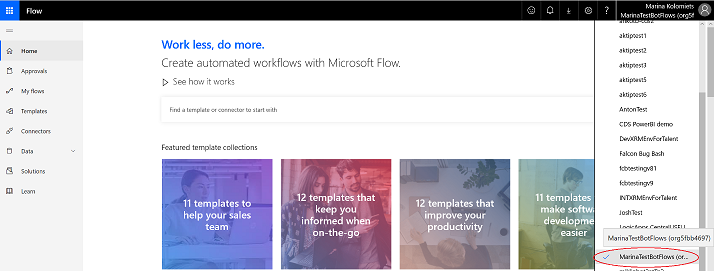

4. Verify that the PowerApps environment database was created correctly. Select **Solutions** in the navigation pane to display the **Solutions** page, and then verify that the Solutions list includes **Common Data Services Default Solution**.

   > [!div class="mx-imgBorder"]
   > 
   > [!NOTE]
   > Since creating a new environment can take some time, the new solution might not immediately appear in the list. Log out and check again in 30 to 60 minutes.

   Once you have created your environment, return to the Flow portal and switch to the newly created environment to create your flow.

## To create a flow

1. Select **Common Data Services Default Solution** to open the solution.

2. On the **Common Data Services Default Solution** page, select **+New**, and then select **Flow** from the list.

   > [!div class="mx-imgBorder"]
   > 

    You can create a variety of flows for your solution. For example, you could create a simple flow that takes an email address as an input parameter, sends an email message to that address, and returns a message that the email was successfully sent to a virtual agent as output.

3. Select a trigger for your flow. A Virtual Agent Designer virtual agent can only invoke flows that have HTTP request interfaces. Enter **HTTP** in the Search box, and select **When HTTP request is received** to create a flow with an HTTP request trigger.

   > [!div class="mx-imgBorder"]
   > 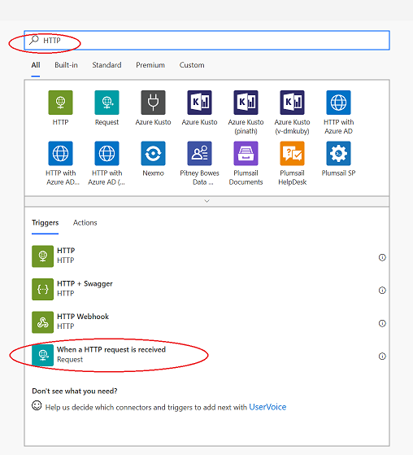

4. Add the following JSON code in the **Request Body JSON Schema** box. The code specifies that the flow expects an email address to receive one string input parameter. Then select **New Step**.

    ``` JSON
        {  
        "type": "object",  
            "properties": {  
                "to": {  
                    "type": "string"  
                }  
            }  
        }
    ```

   > [!div class="mx-imgBorder"]
   > 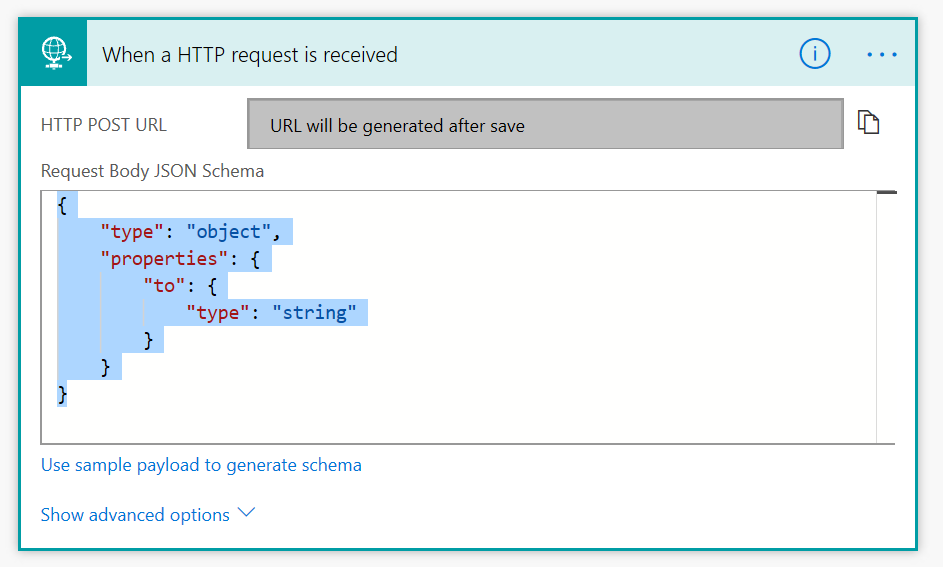

5. Specify that an email message should be sent to the email address specified in the input. Enter **Outlook** in the Search box and select **Send an email** to create a connection to Microsoft Outlook using your Outlook credentials to send the message.

   > [!div class="mx-imgBorder"]
   > 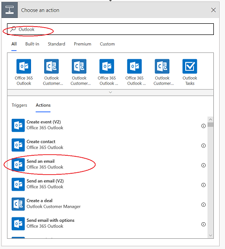

6. Specify an email address for the message, and fill in the Subject and Body fields.

    You can specify a Flow input variable (“to”) as the recipient address using Dynamic Content. Select **See more** to see all dynamic variables.

   > [!div class="mx-imgBorder"]
   > 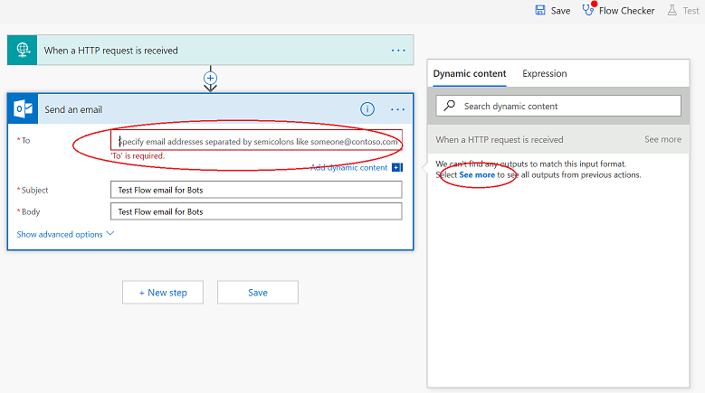

7. If you specify the “to” variable as the recipient address, select **New step** to return a message to the flow.

   > [!div class="mx-imgBorder"]
   > 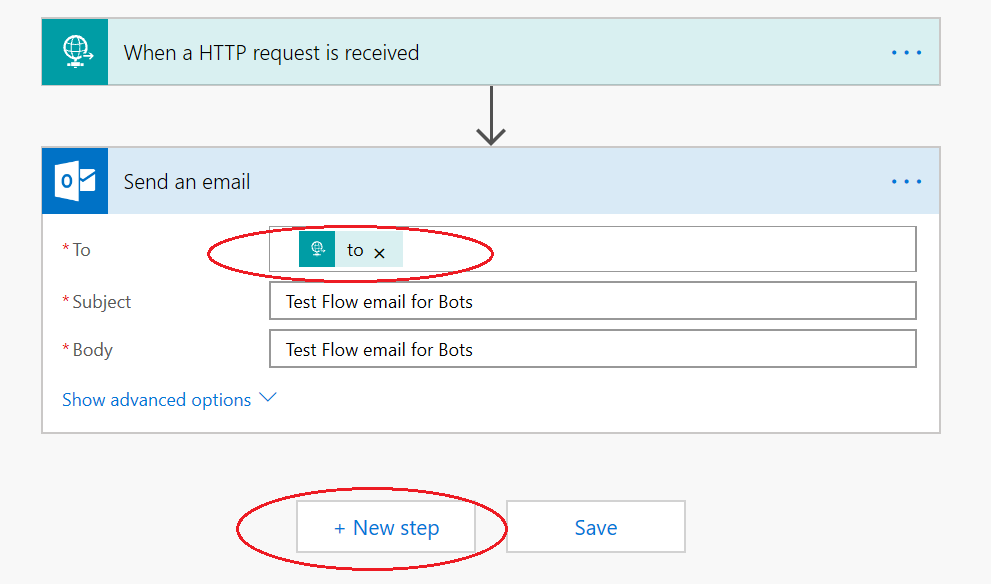

8. Use an HTTP Response to return a variable to the virtual agent. Enter **Response** in the search box, and select the **Response** action in the search results list.

   > [!div class="mx-imgBorder"]
   > 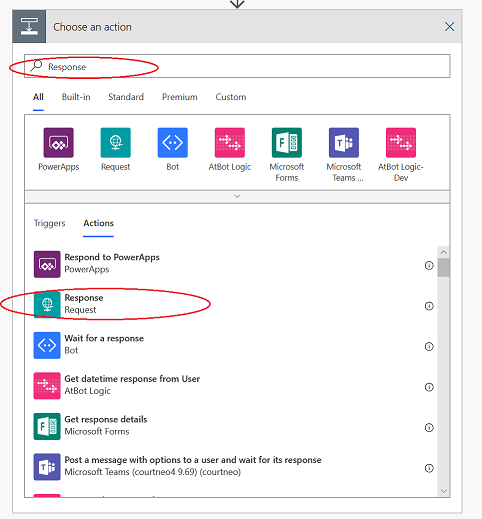

9. Specify the following information for the Response action, and then select **Save** to save your flow.

   > [!div class="mx-imgBorder"]
   > 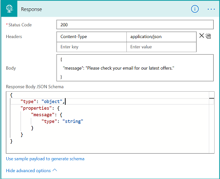

## To create a virtual agent that invokes a flow

1. Log in to the Dynamics 365 Customer Service Virtual Agent portal [https://va.ai.dynamics.com](https://va.ai.dynamics.com), and create a new virtual agent in the same environment as your flow. To create a new virtual agent, select the **+** button on the Virtual Agent Designer title bar.

   > [!div class="mx-imgBorder"]
   > 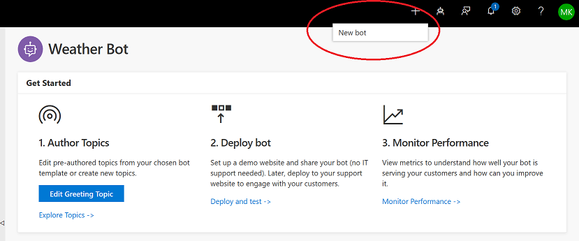

    For more information about creating a virtual agent, see [Creating a virtual agent](getting-started-create-bot.md).

2. On the **Create a new bot** screen, specify a template, a unique name for your virtual agent, and the environment where your flow was created.

   > [!div class="mx-imgBorder"]
   > 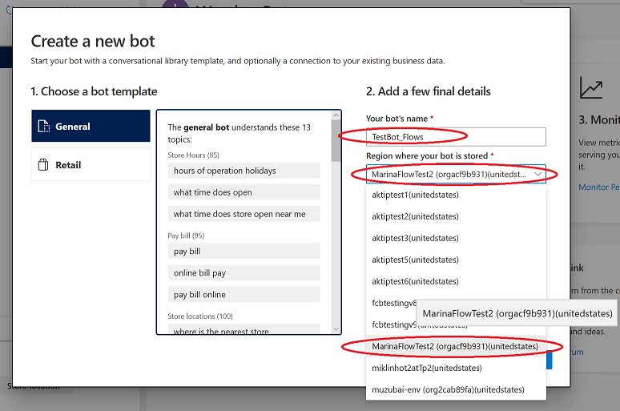

    Then select **Create**.

3. Once you have created your virtual agent, create a topic that uses the flow. Select **Topics** in the navigation pane to open the **Topics** page, and then select **New topic**.

   > [!div class="mx-imgBorder"]
   > 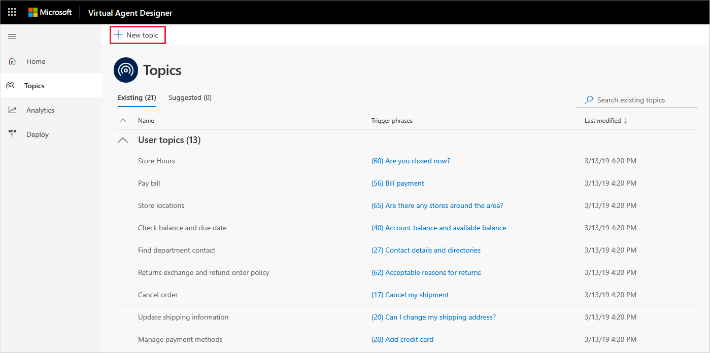

    For more information about creating a topic, see [Creating topics for your virtual agent](getting-started-create-topics.md).

4. Specify trigger phrases for the topic. For example, for a "Daily Deals" topic you could specify the following trigger phrases:

    - daily deals
    - deal of the day
    - current deals
    - today’s deals
    - current offers
    - today’s specials
    - current specials
    - special offers
    - today’s coupons
    - current coupons
    - today’s offers

    Then select **Save topic** to save the topic.

   > [!div class="mx-imgBorder"]
   > 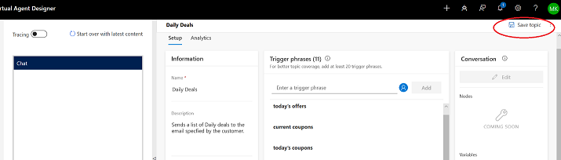

5. Once you have created the topic, you can create a conversation path that uses your flow. Select **Edit** to open the conversation editor, enter a virtual agent response in the **Bot says** box, and then select **User says** to display the **User response** node.

   > [!div class="mx-imgBorder"]
   > 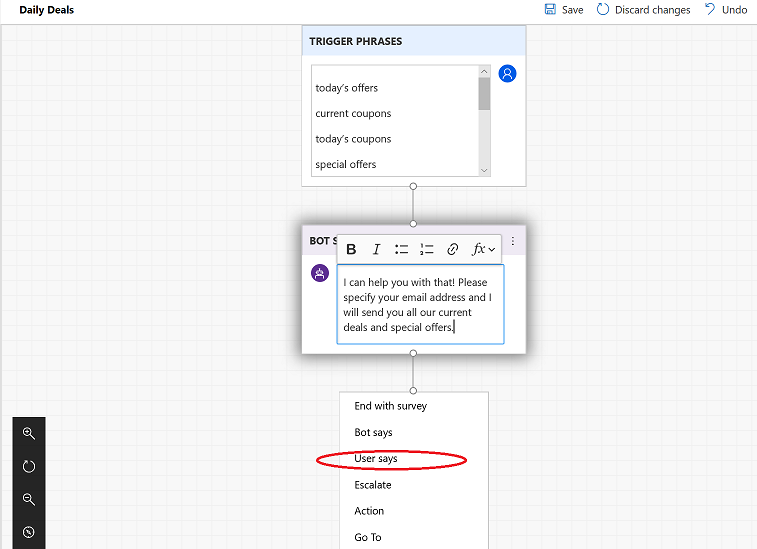

    In the user response, select **Add Variable** to add a variable to save a customer's email address. In the Properties pane, select **Create variable** to display the **Create new variable** screen.

   > [!div class="mx-imgBorder"]
   > 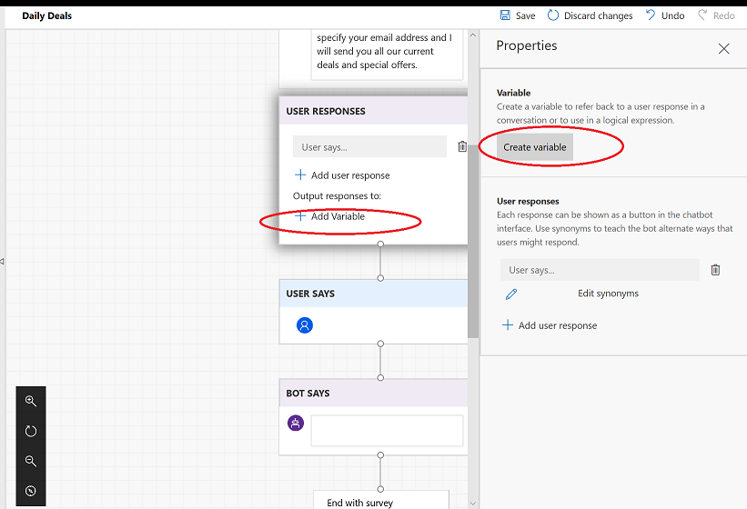

    For more information on creating variables, see [Work with variables](how-to-variables.md).

6. Specify a variable name and type. For example, you could create a text variable named **User_Email**.  Select **Done** to save the variable.

   > [!div class="mx-imgBorder"]
   > 

    The Virtual Agent Designer creates an **Expression** node that can be deleted if you do not want to do any validation.

   > [!div class="mx-imgBorder"]
   > 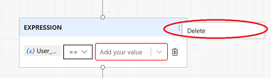

7. Add another **Bot says** node with text confirming that the email will be sent. You can choose to display the email address that the User has specified by selecting the rightmost icon and then selecting the variable you created.

   > [!div class="mx-imgBorder"]
   > 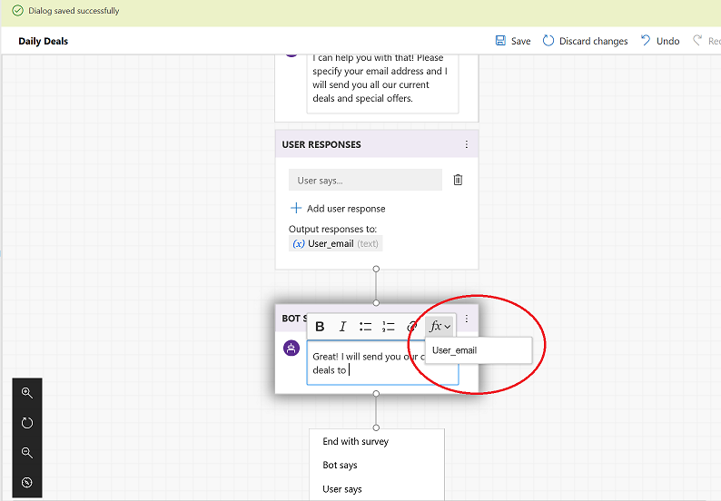

8. To send an email message to the address specified by the customer, select **Action** to display the list of available actions, and then select the flow action you created.

    > [!div class="mx-imgBorder"]
    > 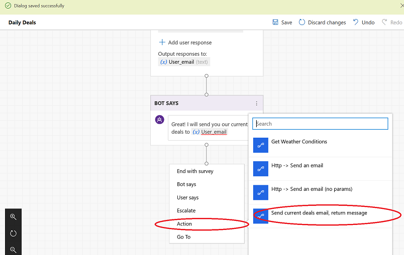
    > [!NOTE]
    > The Flows and virtual agent must be created in the same environment. Otherwise, the flow action does not appear in the list of available actions.

    The Virtual Agent Designer creates an **Action** node indicating that the action has one required input and one output. Select the variable you created from the list to pass it as input.

   > [!div class="mx-imgBorder"]
   > 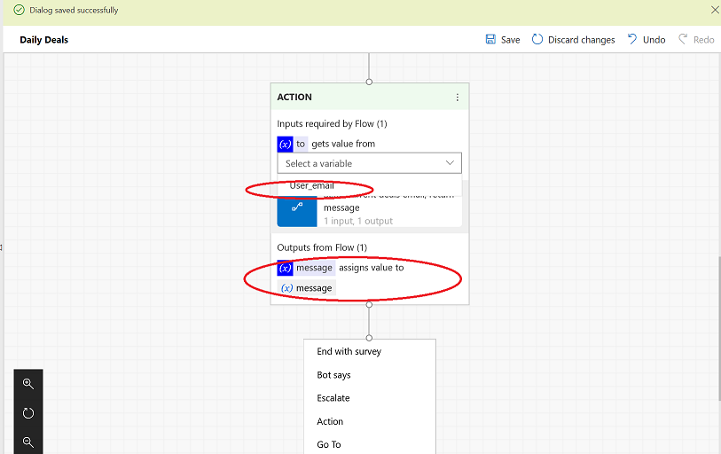

9. Add another **Bot says** node to display the message from the flow to the customer and end your conversation with a survey, and then select **Save** to save the topic.

   > [!div class="mx-imgBorder"]
   > 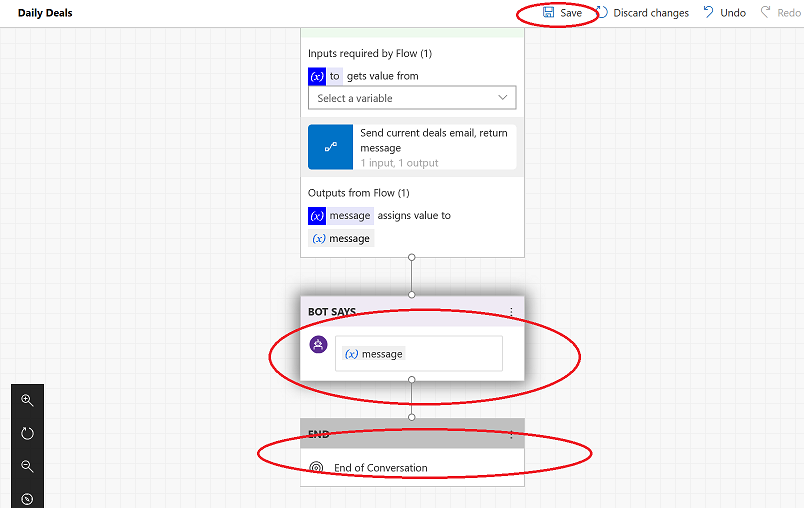

## To test the flow

1. In the Test Bot, select **Start over with latest conversation**. Then specify a trigger phrase for the topic that contains the flow.

2. Enter your email address at the prompt.

   > [!div class="mx-imgBorder"]
   > 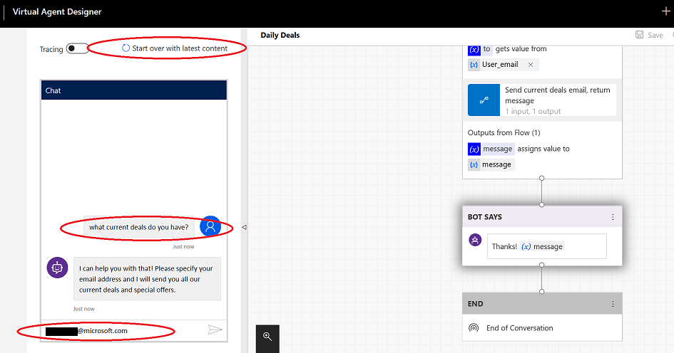

    After you specify the email address, the flow sends an email message and returns the message to the virtual agent. The Virtual Agent Designer stores the message in the **(x) message** variable and displays it to the customer.

   > [!div class="mx-imgBorder"]
   > 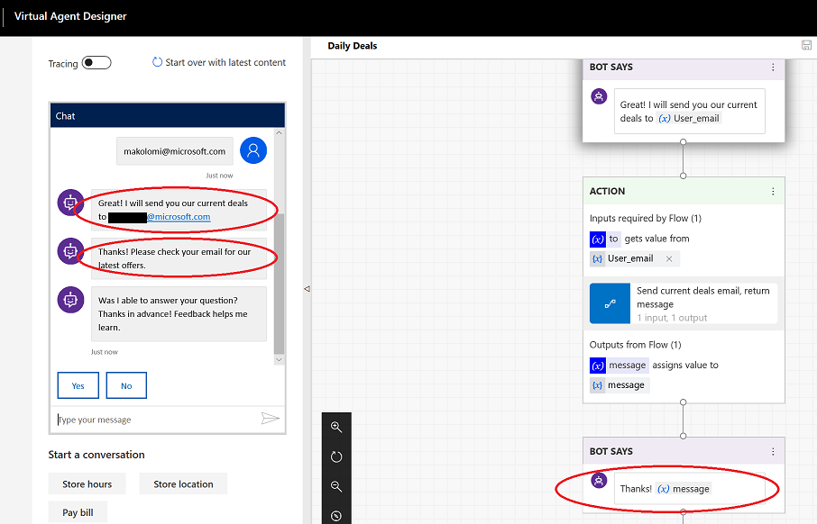
