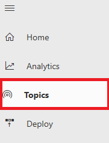
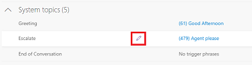
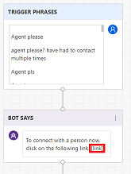
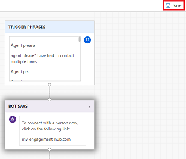
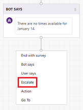
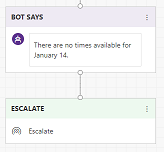
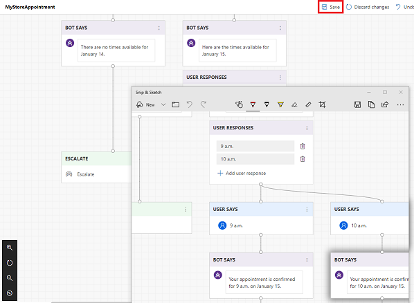
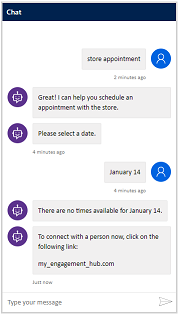

# Hand off a virtual agent conversation to a live agent

A virtual agent can resolve many customer support issues, but there might be times when an issue requires a live agent. As you design the conversation path for your virtual agent's topics, you can include a handoff to a live agent by using the Escalate system topic.

## To add a handoff to a live agent

1. Select **Topics** in the navigation pane to open the Topics page.

   > [!div class="mx-imgBorder"]
   > 

2. Hover over the Escalate system topic, and then select the **Edit** icon to open the topic in the conversation editor.

   > [!div class="mx-imgBorder"]
   > 

3. In the **Bot Says** box, replace the *[link]* placeholder with a link to your engagement hub chat canvas.

   > [!div class="mx-imgBorder"]
   > 

4. Select **Save** to save the topic.

   > [!div class="mx-imgBorder"]
   > 

5. Open the topic where you want to add the handoff in the conversation editor. Navigate to where you want to add the handoff, and then select **Escalate**.

   > [!div class="mx-imgBorder"]
   > 

    The Virtual Agent Designer adds an **Escalate** node to the conversation path.

   > [!div class="mx-imgBorder"]
   > 

6. Select **Save** to save the topic.

   > [!div class="mx-imgBorder"]
   > 

7. Test your virtual agent in the Test Bot to see how the handoff works for customers.

   > [!div class="mx-imgBorder"]
   > 
