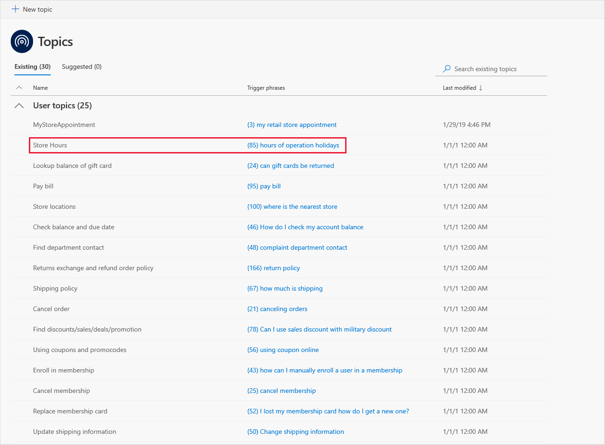
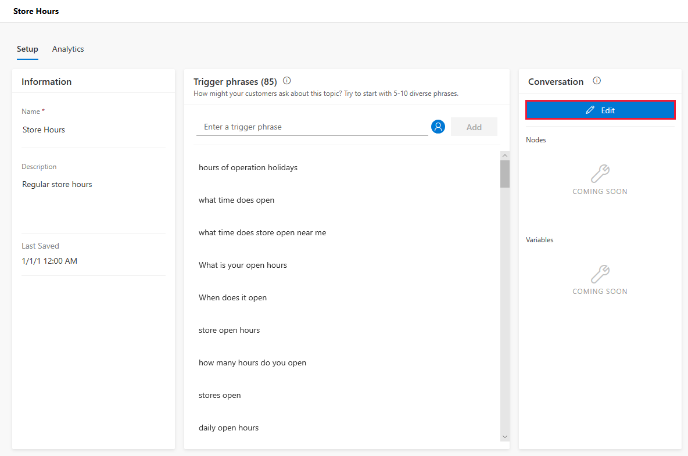

# Work with templates

To help you create your custom bot, Virtual Agent includes templates that provide built-in building blocks for developing the bot's conversation path.

Each template comes with an artificial intelligence model for a specific industry and built-in system topics, as well as topics tailored to that industry. For example, Virtual Agent includes a template to help you create a bot for a retail business.

The built-in topics supplied by the template can also be useful as a model for building your conversation path. Virtual Agent currently supports Retail and General customer-support templates.

## Using templates to create your bot

Virtual Agent templates provide a variety of built-in features that give you a head start on developing your bot. For example, each template includes several system topics that you need to handle some key scenarios within the bot. These include:

* A customer greeting.
* Escalation to a live agent.
* The end of the conversation.
* A confirmed success.
* A confirmed failure.

Virtual Agent includes a General template, which you can use to create any type of bot for customer support, and a Retail template, which provides a variety of topics specific to a retail business. These topics come with built-in content to help you visualize and test a conversation path related to a specific customer question. These include topics related to:

* Looking up store hours.
* Finding store locations.
* Paying a bill.
* Canceling an order.

For more information about using templates to create a bot, see [Creating a bot](getting-started-create-bot.md).

## Using template topics as a model for building your conversation path

A good starting point for creating a bot and designing its conversation path is to view the built-in topics that come with a template.

For example, to see how you might build a conversation path for helping customers find specific store information, view the Store Hours topic that is included with the Retail template.

   > 

To view the topic's conversation path, select the Store Hours topic in the Topics list to open the topic, and then select the **Edit** button to open the conversation editor.

   > 

You can view the trigger phrases and conversation path design in the Store Hours topic and use similar techniques in your own topics.

   > 

For more information about creating topics, see [Creating custom topics for your bot](getting-started-create-topics.md).
