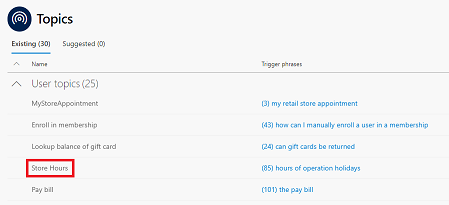
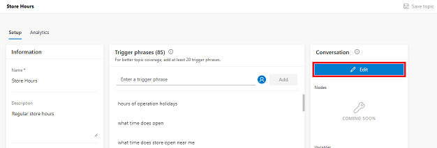
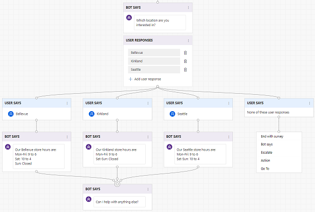

# Work with templates

To help give you a jump start on creating and developing your virtual agent, the Virtual Agent Designer includes templates that provide built-in building blocks to help you develop your virtual agent's conversation path.

Each template comes with an enhanced artificial intelligence model for a specific industry, and built-in topics that you can use to build a conversation path tailored to that industry. For example, the Virtual Agent Designer includes a template to help you create a virtual agent for a retail business.

The built-in topics supplied by the template can also be useful as a model for building your conversation path.

## Using industry-specific templates to create your virtual agent

The Virtual Agent Designer includes a Retail template that provides a variety of topics specific to a retail business. These include topics related to:

* Looking up store hours
* Finding store locations
* Paying a bill
* Cancelling an order

The Virtual Agent Designer also includes a General template that you can use to create any type of virtual agent.

In addition, Virtual Agent Designer includes several system topics that are included with either template that help you address common situations. These include:

* A customer greeting
* Escalation to a live agent
* The end of the conversation
* A confirmed success
* A confirmed failure

For more information about using templates to create a virtual agent, see [Creating a virtual agent](getting-started-create-bot.md)

## Using template topics as a model for building your conversation path

A good starting point for creating a virtual agent and designing its conversation path is to view the built-in topics that come with a template.

For example, to see how you might build a conversation path for helping customers find specific store information, view the Store Hours topic that is included with the Retail template.

   > [!div class="mx-imgBorder"]
   > 

To view the topic's conversation path, select the Store Hours topic in the Topics list to open the topic, and then click the **Edit** button to open the conversation editor.

   > [!div class="mx-imgBorder"]
   > 

You can view the trigger phrases and conversation path design in the Store Hours topic, and use similar techniques in your own topics.

   > [!div class="mx-imgBorder"]
   > 
