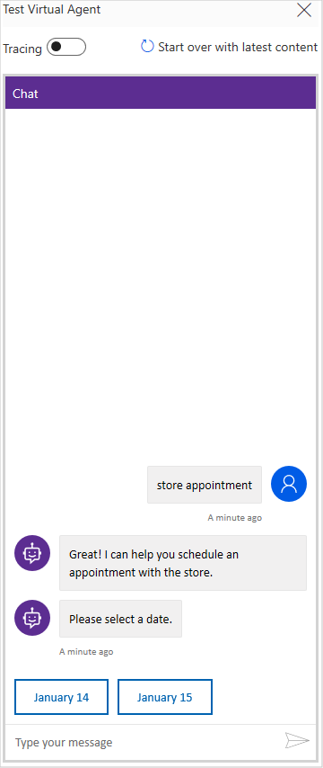
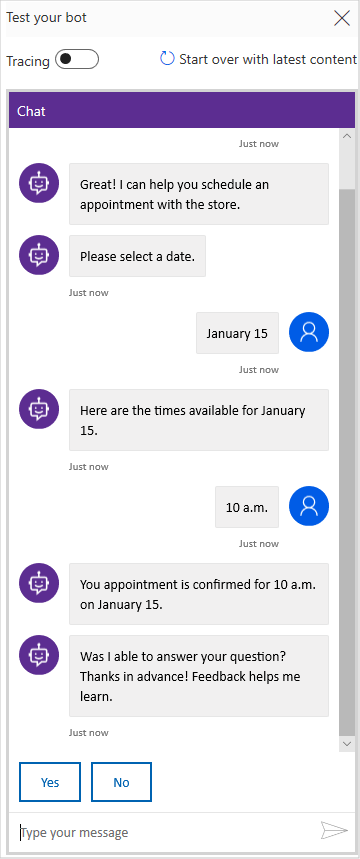
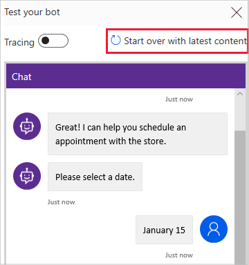
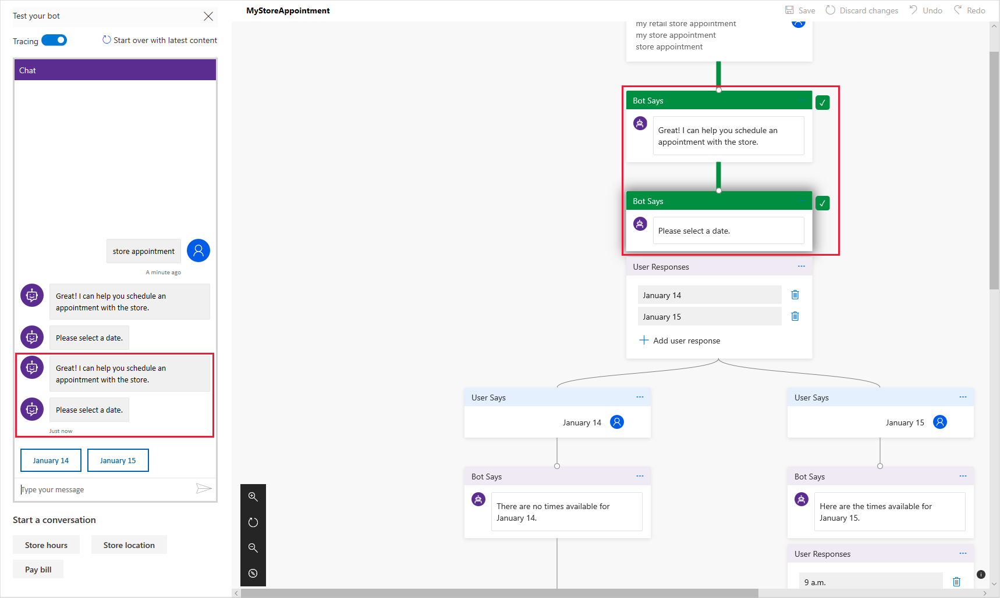

# Work with the Test Bot

As you design your virtual agent in the Virtual Agent Designer, you can use the Test Bot to see how the virtual agent leads a customer through the virtual agent's conversation path. To help you find and fix unexpected behavior, you can enable tracing to take you through the conversation path step by step, and navigate to the corresponding node in the conversation editor.

## To test a topic in the Test Bot

1. At the **Type your message** prompt at the bottom of the Test Bot pane, enter a trigger phrase for the topic.

   > 

    The trigger phrase starts the topic's conversation, and the Test Bot displays the bot responses and user response choices you specified.

   > 

2. Continue the conversation path until you complete the conversation.

   > 

3. To restart the conversation, select **Start over with latest content** at the top of the Test Bot pane.

   > 

You can return to the conversation editor at any time to revise the topic's conversation path.

As you fine-tune your virtual agent, it can be useful to enable tracing to take you through the conversation path step by step.

## To trace through the topic's conversation path

1. In the upper-left corner of the Test Bot, select the **Conversation Tracing** toggle button to enable tracing.

   > 

2. Follow the steps discussed earlier to [test your topic in the Test Bot](#to-test-a-topic-in-the-test-bot).

3. As you move through the conversation in the Test Bot, the conversation editor highlights the current place in the conversation path. The conversation editor displays highlighted nodes in green with check marks.

   > 

4. To navigate to an earlier place in the conversation path in the conversation editor, select it in the Test Bot.

If the conversation path in the Test Bot moves from one topic to another topic, the conversation editor refreshes and moves between topics to the appropriate highlighted nodes.
